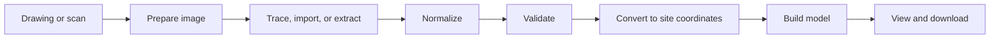
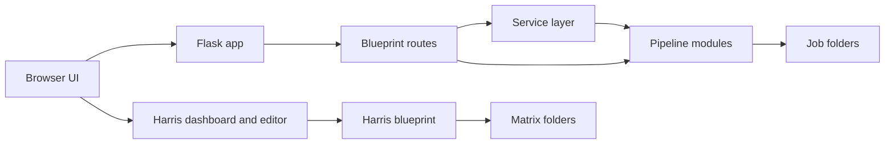
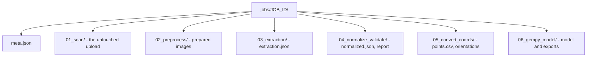

# Trench Digitization Pipeline

Turn a drawing of a vertical trench wall — an archival illustrator sheet or a
modern field recording sheet — into structured, reviewable data, and from there
into a 3D geological model.


Everything runs through a local web application in `poggio_webapp/`. Nothing is
uploaded anywhere: your drawings, your data, and your models stay on your
machine.

**New here? Read [what this project does](docs/start-here/what-this-project-does.md),
then follow the [quickstart](docs/start-here/quickstart.md).**

> This README is a complete illustrated tour. The **documentation guide** is the
> manual — same material, with search, cross-links, and interactive components.
> Read it at <https://jennarbates.github.io/StratigraphyGenerator/>, or from
> [`docs/index.md`](docs/index.md) in this repository.

---

## The 60-second version



- You **trace boundaries** on a drawing, or import an extraction, or have an AI
  read it. Manual tracing is the supported path and needs no API key.
- Three **calibration clicks** plus one real measurement turn pixels into
  metres.
- Four **registration values** per face place those metres on the excavation
  site.
- The model **interpolates** between your recorded points. It is a hypothesis
  shaped by evidence, not a measurement.
- Every stage writes its own artifact, so nothing is a black box and any step
  can be re-run.

---

## Start here

Install the core dependencies and launch the application. No API key, no GemPy,
no PDF support needed for a first run.

Run these **from the repository root**. The first line builds a private Python
environment in `.venv/` so this project's packages never touch the rest of your
system.

```bash
python3 -m venv .venv
source .venv/bin/activate
python -m pip install -r poggio_webapp/requirements.txt
```

Then start the application:

```bash
make run
```

Leave that running and open <http://localhost:5000>. Stop it with
<kbd>Ctrl</kbd>+<kbd>C</kbd>.

> There is **one** virtual environment, at the repository root. Every `make`
> target uses it, so keep it there — a `.venv` created anywhere else will leave
> `make test` and `make docs` unable to find their tools.

`make` shows what else it can do:

| Command | Does |
|---|---|
| `make run` | Start the app on <http://localhost:5000> |
| `make test` | Run the Python test suite |
| `make lint` | Check style and import hygiene |
| `make check` | Lint, docs checks, both test suites, diagrams — what CI runs |
| `make demo` | Seed the two demonstration trenches (one refuses, one builds) |
| `make docs` | Build this documentation site |
| `make help` | List every target |

| Dependency group | Needed first run? | Install with |
|---|---|---|
| Flask, image processing, the supported manual path | **Yes** | `pip install -r poggio_webapp/requirements.txt` |
| `pytest`, `ruff` — needed by `make test`, `make lint` | No | `pip install pytest ruff` |
| Building the documentation site (`make docs`) | No | `pip install -r requirements-docs.txt` |
| Poppler — reading PDF pages | No | System package manager, not pip |
| `gempy`, `gempy_viewer` — the 3D model build | No | `pip install gempy gempy_viewer` (heavy) |

<!-- screenshot slot: quickstart-first-screen — see docs/assets/visual-manifest.yml -->

Never used it before? The demo card in the application's sidebar loads a
demonstration trench with nothing to trace or type — one trench the build
refuses, one it completes. [Run the demo](docs/start-here/demo.md) explains
the pair; `make demo` seeds the same two from the command line.

Next: [choose your path](docs/start-here/choose-your-path.md) tells you which
route suits your drawing, and
[the first model tutorial](docs/start-here/first-model.md) walks one all the way
through using synthetic data.

### The vocabulary

Nearly every term this project uses is visible on one trench section.


Full definitions: [glossary](docs/start-here/glossary.md).

---

## Workflows

The numbered path covers **one sheet**. Each step is documented in full, with
what it creates and what commonly goes wrong.

| # | Step | What it does |
|---|---|---|
| 01 | [Add a drawing](docs/workflows/01-add-drawing.md) | Upload a PNG, JPEG, TIFF, or PDF and pick the sheet type |
| 02 | [Prepare the image](docs/workflows/02-prepare-image.md) | Upscale, deskew, and clean it up |
| 03 | [Trace the layers](docs/workflows/03-trace-layers.md) | Calibrate, then click along each boundary |
| — | [Import or AI extraction](docs/workflows/03-alternative-import-and-ai.md) | Optional alternatives to tracing by hand |
| — | [Markers and features](docs/workflows/03-markers-and-features.md) | Scale references and inclusions |
| 04 | [Clean up the data](docs/workflows/04-clean-data.md) | Normalize formatting, never geometry |
| 05 | [Check for problems](docs/workflows/05-check-problems.md) | Validate; errors block, warnings do not |
| 06 | [Place on site](docs/workflows/06-place-on-site.md) | Enter surveyed registration per face |
| 07 | [Create the model](docs/workflows/07-create-model.md) | Build with GemPy |
| 08 | [View and download](docs/workflows/08-view-and-download.md) | Inspect in 2D and 3D, export |
| 09 | [Combine walls into one trench](docs/workflows/09-multi-wall-trench.md) | Merge several walls into one model |

Two more workflows sit outside the numbered path:
[build a Harris Matrix](docs/workflows/harris-matrix.md) and
[log a find](docs/workflows/logging-finds.md).

<!-- screenshot slots: w08-viewer-3d, first-model-result — see docs/assets/visual-manifest.yml -->

### The two source drawing types


They use different extraction schemas because they record material differently,
but both converge on the same coordinate conversion and model build.

- **Trench 23** (Poggio Civitate, 1980) — an illustrator sheet with a
  hatch-pattern legend and three faces, scanned well below the 300 DPI the
  drawing guidelines recommend.
- **T104, southern baulk wall** (2025 field sheet) — hand-drawn on graph paper,
  using locus numbers and Munsell colour instead of a legend, one wall only.

More: [source drawing types](docs/concepts/source-drawing-types.md) and the
[drawing guidelines](docs/reference/drawing-guidelines.md).

### Combining walls into one trench

A field sheet records one wall, so a whole trench spans several jobs joined
only by a shared trench label.


This build **refuses** rather than guessing — most importantly, it refuses to
run on the starter placeholder registration:


Identical placeholders lay every wall along the same bearing, producing a row of
parallel walls instead of walls around a pit: a confident-looking model of
nothing. Full detail:
[combine walls into one trench](docs/workflows/09-multi-wall-trench.md).

> **The page is easy to miss.** The demo card links to it once a demonstration
> is seeded; otherwise open `/trenches` directly — like the finds page, it
> works and is tested, but you have to know the address.

### Harris matrices

A trench-level chronology, built separately from any drawing job. It can import
units from several finished jobs without changing them.


Relationships run from younger to older, so the youngest units sit at the top.
Correlation — the interpretation that two units are the same deposit — is
separate and always human-confirmed; equal labels never merge on their own.
Every proposal must be individually accepted or rejected.

The matrix is an archaeological interpretation, not an automatically verified
result. See [build and review a Harris Matrix](docs/workflows/harris-matrix.md).

<!-- screenshot slot: wh-matrix-editor — see docs/assets/visual-manifest.yml -->

---

## Worked example

The workflow pages each cover one step. The worked example covers one **trench**
— eight loci, a sounding, a Harris matrix and 26 findspots — and shows what the
application does with a record that is complete in some places and simply absent
in others.


The trench is **T905**, and it is invented — but not invented tidily. The
[synthetic fixtures](docs/fixtures/README.md) are clean examples that show what
a well-formed input looks like. T905 is modelled on the shape of a real season's
paperwork instead, with the gaps, transposed digits and contradictions that
field records actually have, because a pipeline demonstrated only on clean input
has never been shown to refuse anything.

Three results come out of it:

- **One of the four walls cannot be registered.** Its origin corner sat inside a
  previous season's backfilled trench, so no opening elevation was ever measured
  there. The application will not invent one, and the build stops.
- **The record agrees with itself more often than it disagrees.** Four vertices
  recorded twice on different loci match exactly; the sounding's four surfaces
  chain without a gap. That is what makes the disagreements worth noticing.
- **Five of the 26 findspots contradict their locus**, and no single check
  catches all five — two fail on plan position, one only on elevation, one on
  both.

Start at [a trench, end to end](docs/worked-example/index.md).

---

## Concepts

Why the system works the way it does. Each page is reachable from the workflow
step where it matters.

The one that causes the most confusion is **coordinate spaces** — a point can be
correct in one space and meaningless in another.


The documentation site has a **live converter** on that page: enter a pixel
coordinate, a calibration, and a registration, and watch the metres and site
coordinates update. Its arithmetic is pinned by tests to the application's own
Python.

- [From archaeology to 3D](docs/concepts/archaeology-to-3d.md)
- [Source drawing types](docs/concepts/source-drawing-types.md)
- [Jobs, sheets, and trenches](docs/concepts/jobs-sheets-and-trenches.md)
- [Layers and boundaries](docs/concepts/layers-and-boundaries.md)
- [Coordinate spaces](docs/concepts/coordinate-spaces.md)
- [Accuracy and provenance](docs/concepts/accuracy-and-provenance.md)
- [Geometric normalization](docs/concepts/geometric-normalization.md)
- [Markers, features, and finds](docs/concepts/markers-features-and-finds.md)

### The honesty problem

An extraction can look immaculate and be invented.


A boundary that does not lie on ink is fabricated by definition. Statistical
signatures — suspiciously even spacing, implausible smoothness — are hints;
overlap with actual ink pixels would be direct evidence, and automating that
check is on the [roadmap](docs/project/roadmap.md).

---

## Architecture



- **Routes** own request handling and persistence.
- **Services** chain several pipeline stages together.
- **Pipeline modules** stay focused on transformation.
- **`storage.py`** is a leaf module defining every writable root, so both layers
  can depend on it without inverting the dependency direction.

Pages: [system overview](docs/architecture/system-overview.md) ·
[job lifecycle](docs/architecture/job-lifecycle.md) ·
[frontend](docs/architecture/frontend.md) ·
[backend](docs/architecture/backend.md) ·
[pipeline](docs/architecture/pipeline.md) ·
[asynchronous tasks](docs/architecture/asynchronous-tasks.md) ·
[files and artifacts](docs/architecture/files-and-artifacts.md)

The pipeline page carries an **interactive stage explorer**: click any stage to
see its module, input, output, and route.

The [algorithm index](docs/architecture/algorithm-index.md) lists what is in
each module, so you can start from a file you are reading rather than from a
concept you already know the name of.

### What lands on disk



Each stage writes into its own subfolder, so a failure in one cannot erase
earlier output. `jobs/`, `trenches/`, and `matrices/` are all gitignored: a
fresh clone has none of them.

---

## Computer science

Every algorithm, data structure, and engineering principle in this repository
has its own page: what the idea is, where this project uses it, and **why that
technique rather than the obvious alternative**.

Start at the [concept catalogue](docs/cs/index.md), which groups them by
subject, or at the [algorithm index](docs/architecture/algorithm-index.md),
which groups them by source module.

The pages are written for someone who knows the archaeology and not the
computer science. [Union-Find](docs/cs/union-find.md) is a worked example — it
is how this project decides whether four separately drawn walls actually
enclose a pit, and how it collapses correlated units into one node of a Harris
Matrix.

---

## Archaeology

Every archaeological term this project uses has a reference page that goes
further than the [glossary](docs/start-here/glossary.md): what the term means
in excavation practice, why the practice exists, which schema field holds it,
and which neighbouring term it is constantly confused with.

That last part matters. This application makes distinctions a drawing does
not — a marker is not a feature, a feature is not a find, and a layer is not
always a locus — and recording one as another produces data that validates
cleanly and means something else.

Start at the [term catalogue](docs/archaeology/index.md).
[Locus](docs/archaeology/locus.md) is a worked example, including the
one-line shift that silently moves every unit in the model down by one — and
[locus numbering epochs](docs/archaeology/locus-numbering-epochs.md) explains
why a trench reopened after a gap cannot simply be merged with its earlier
seasons.

---

## Reference

- [Data schemas](docs/reference/data-schemas.md) — the two extraction formats
- [Validation rules](docs/reference/validation-rules.md) — every error and warning code
- [API routes](docs/reference/api-routes.md) — every endpoint, with its status
- [Output files](docs/reference/output-files.md) — what each stage writes
- [Configuration](docs/reference/configuration.md) — environment variables and paths
- [Drawing guidelines](docs/reference/drawing-guidelines.md) — how to draw an extractable sheet
- [Running the tests](docs/reference/running-the-tests.md)
- [Troubleshooting](docs/reference/troubleshooting.md)
- [Synthetic fixtures](docs/fixtures/README.md) — safe, invented example data

### Running the tests

The Python suite, from the repository root:

```bash
make test
```

The browser-side suite, which needs Node rather than Python:

```bash
node --test "poggio_webapp/static/**/*.test.mjs" "docs/javascripts/**/*.test.mjs"
```

The documentation checks — links and front matter, module coverage, the
visual manifest, README synchronisation, and a strict site build:

```bash
make check-docs
```

None of these needs GemPy, an API key, or network access.

---

## Learning course

The documentation is also a syllabus. Two self-paced courses read it end to
end, in an order where nothing is needed before it is taught.

- The [study plan](docs/learning/plan.md) covers all ~225 pages in ten phases,
  archaeology and computer science together, for someone who has taken one
  basic programming course and knows neither field. Roughly 65–80 hours.
- The [CS study plan](docs/learning/cs-plan.md) takes the 128 technique pages
  alone, in ten units, and skips the archaeology entirely.

Each has its own assessment pack — a pre-reading quiz, programming assignment,
research paper, midterm, and final for every phase or unit, with answer keys in
collapsed blocks: [assessments](docs/learning/assessments.md) and
[CS assessments](docs/learning/cs-assessments.md). The quizzes and exams face
the documentation; the assignments deliberately face away from it, applying the
same ideas to recipes, jogging routes, and photo libraries, because transfer is
the test of understanding.

---

## Project

### Known limitations

Stated plainly, because a model that looks convincing and is wrong is the main
risk this project carries.

- **Registration is the binding constraint.** The starter values `0, 0, 100, 90`
  are smoke-test placeholders. The config now declares
  `"source": "placeholder"` and the multi-wall build refuses it, but a
  single-sheet build still accepts it, and nothing marks the resulting model
  as unsurveyed.
- **AI extraction is experimental.** It needs a key and network access, has no
  end-to-end test, and its output must be compared against the drawing by a
  human.
- **Marker detection and feature detection are backend-only.** The routes
  exist and are tested; no browser control reaches them. The multi-wall
  trenches page works and is tested, but only the demo card links to it.
- **Task state is in memory.** Restarting the server loses the status of a
  running build, though the files it already wrote survive.
- **A single face is extrapolated** across the whole model extent, so confidence
  falls off away from recorded points.
- **Single-sheet builds use apparent dips**, which are systematically too
  shallow. `true_dip.py` corrects this on *merged* trenches only — one wall
  cannot determine a surface's true orientation, so there is nothing to correct
  from. See [apparent and true dip](docs/archaeology/apparent-and-true-dip.md).

The authoritative, per-capability record is
[capability status](docs/project/capability-status.md), which labels every
capability `supported`, `experimental`, `backend-only`, `blocked`, or
`historical` and cites the source for each.

### Where this is going

The [roadmap](docs/project/roadmap.md) is ordered by leverage: make the existing
results scientifically valid first, then make the pipeline trustworthy, then
make it general.

### History

The pipeline began as numbered folders (`02_preprocess` … `07_visualizer`) run
by hand. They were retired in the `webapp` commit; every stage's logic is now an
importable module under `poggio_webapp/pipeline/`. The old scripts and outputs
are all recoverable from git history — see
[project history](docs/project/history.md).

### Contributing to the documentation

Every page names the source files it describes and the commit it was verified
against, and five checks run over the corpus: links and front matter, module
coverage, the visual manifest, README synchronisation, and a strict site
build. See [contributing to the docs](docs/project/contributing-docs.md).

---

## Repository layout

```
Makefile                 one documented command per task — run `make help`
mkdocs.yml               configuration for the documentation site
pyproject.toml           dependencies, test settings, and lint rules
.venv/                   the one virtual environment (you create this)

scans/                   raw drawings
local/                   real excavation records — gitignored, never committed
docs/                    the documentation guide (MkDocs)
tools/docs/              documentation checkers and asset generators
tests/                   the Python test suite
poggio_webapp/           the pipeline and browser application  <- start here
  app.py                 application entry point
  storage.py             the single definition of where things live on disk
  backend/routes/        one blueprint per concern
  backend/services/      work that chains several pipeline stages
  pipeline/              preprocess, extract, normalize, validate, convert,
                         merge_walls, build_gempy, and the rest
  demo/                  the seedable demonstration trenches (`make demo`)
  static/, templates/    the browser interface
  jobs/                  created at runtime, one folder per sheet
  trenches/              created at runtime, merged multi-wall output
  matrices/              created at runtime, Harris matrix workspaces
```

The three runtime folders hold **your** working files and are never committed,
so a fresh clone has none of them. The application recreates whichever it needs
on startup.
