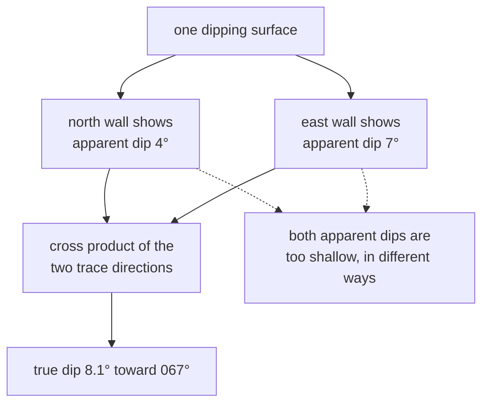

# Apparent and true dip

How steeply a surface tilts. A section shows the tilt **in its own plane**, which
is always shallower than the real one — and the correction needs two walls.

## What it is

A dipping surface has one true steepness, in one direction. A vertical section
through it shows a line, and how steep that line looks depends on the angle
between the section and the dip direction.

- **True dip** — the maximum slope of the surface, measured down its steepest
  line, with the compass direction it descends toward.
- **Apparent dip** — the slope seen in any section not aligned with the true dip
  direction.

The relationship:

```
tan(apparent) = tan(true) × cos(angle between the section and the dip direction)
```

Since `cos ≤ 1`, **an apparent dip is never steeper than the true dip.** A
section perpendicular to the dip direction shows a horizontal line — zero
apparent dip — through a surface that is genuinely tilted.

The bias is **systematic**, not random. Averaging apparent dips does not recover
the true one; it produces a value that is still too shallow.

Two non-parallel sections fix it: each gives a direction lying in the surface,
and two directions determine the plane.

## The picture



## Why it matters here

The dip is what tells the interpolator **how a surface leaves the wall**. Without
it, a boundary traced on one wall says only where the surface is *there*.

The failure is spelled out in `poggio_webapp/pipeline/true_dip.py`:

> On a merged trench it is wrong in a systematic way: one surface arrives
> carrying a seed that dips toward the north wall's bearing and another that
> dips toward the east wall's, and an apparent dip is always shallower than the
> true dip, so GemPy fits a compromise plane that matches neither drawing.

Two disagreeing, both-too-shallow constraints on one surface. The model splits
the difference and matches neither.

## How this project stores it

### The apparent dip, on one wall

`poggio_webapp/pipeline/convert_coords.py`:

```python
def slope_to_orientation(slope: float, face_bearing: float) -> tuple[float, float]:
    """
    Convert a signed section slope into GemPy dip and azimuth values.

    A positive slope dips in the direction of face_bearing.
    A negative slope dips in the opposite direction.
    """
    ...
    dip = math.degrees(math.atan(abs(slope)))

    if slope >= 0:
        azimuth = face_bearing % 360.0
    else:
        azimuth = (face_bearing + 180.0) % 360.0

    return dip, azimuth
```

On one wall, the azimuth can only be *along the wall* — there is no information
about any other direction. The slope comes from
[least squares](../cs/ordinary-least-squares.md) over the whole trace, not from
the endpoints.

### The true dip, from two walls

Each wall's trace gives a direction in space:

```python
def _wall_direction(points):
    """(direction, ordered points) for one wall's trace, or (None, ordered).

    The direction is (sin bearing, cos bearing, dZ/ds): one step along the wall
    moves that far horizontally and dZ/ds vertically. The slope is ordinary
    least squares over the whole trace rather than an endpoint difference, so
    one badly placed vertex cannot swing it.
    """
```

and two directions determine the plane, via the
[cross product](../cs/cross-product.md):

```python
normal = (
    (a[1] * b[2]) - (a[2] * b[1]),
    (a[2] * b[0]) - (a[0] * b[2]),
    (a[0] * b[1]) - (a[1] * b[0]),
)
solved = _dip_from_normal(normal)
```

The module docstring states the geometry:

> Two walls that are not parallel pin the plane down exactly. Each wall's trace
> gives a direction in space -- along the wall, tilted by that wall's apparent
> slope -- and the plane containing both directions has one normal, hence one
> true dip and one dip azimuth.

### It refuses rather than guessing

Walls too near parallel cannot condition the solve:

```python
def _best_pair(faces, bearings, threshold):
    """The two faces whose bearings are furthest from parallel, or None.

    Pairs are scored by |sin(difference)|: 1 for perpendicular walls, 0 for
    parallel ones. ...
    """
```

with a 10° minimum, and the refusal is explained:

> A plausible-looking invented orientation would be worse than the apparent dips
> already in the CSV, because it would look like an improvement.

A surface on one wall keeps its apparent dip, and is told so:

```python
notes.append(
    f"surface {surface!r} is only on face {faces[0]!r}; its "
    "dip stays the apparent dip measured on that one wall, "
    "which is always shallower than the true dip")
```

### And it records what it changed

```python
notes.append(
    f"surface {surface!r}: replaced the per-wall apparent dips "
    f"({'; '.join(before)}) with one true dip of "
    f"{round(solved['dip'], 2)} toward {round(solved['azimuth'], 2)}, "
    f"solved from {' and '.join(solved['faces'])}")
```

"so a reader can see the change rather than discovering the numbers moved."

### Only on merged trenches

`poggio_webapp/backend/services/trench_builder.py`:

```python
# Only merged trenches can do this: one wall alone can measure the dip in
# its own plane and nothing more, and an apparent dip is always shallower
# than the true one. With two walls the plane is determined, so every seed
# for a surface can carry the same real orientation instead of two
# disagreeing shadows of it. Single-sheet builds never come through here.
notes.extend(true_dip.apply_true_dip(
    conversion["points_csv"], conversion["orientations_csv"], grid))
```

## What it is not

| Not a… | Because |
|---|---|
| **[Bearing](bearing-and-azimuth.md)** | A bearing is a horizontal direction. Dip is a vertical angle; dip *azimuth* is the bearing it descends toward. |
| **Strike** | The horizontal line in the dipping plane, 90° from the dip azimuth. Traditional in field geology; GemPy wants dip azimuth. |
| **A measurement** | Apparent dip is fitted from traced points; true dip is solved from two fits. Both are derived. |
| **Recoverable by averaging** | The bias is systematic. The average of two too-shallow apparent dips is still too shallow. |
| **Constant across a surface** | A real boundary is curved. The solved dip is the best single-plane summary. |

## Getting it wrong

**Using apparent dips on a merged trench.** Two disagreeing constraints, both too
shallow. This is the default until `true_dip` runs, and it is why it exists.

**Averaging apparent dips.** Intuitive and wrong.

**Solving from near-parallel walls.** The [cross product](../cs/cross-product.md)
degenerates and the direction becomes noise — refused at 10°.

**Reading a single-wall dip as the real one.** It is the apparent dip, always
shallower, and the note says so.

**Expecting a solve where a surface appears on one wall only.** Nothing is
emitted. Two non-parallel sections are the minimum.

## Related pages

- [Orientation seed](orientation-seed.md) — what carries dip and azimuth.
- [Bearing and azimuth](bearing-and-azimuth.md) — the horizontal convention.
- [Cross product](../cs/cross-product.md) and
  [plane normals](../cs/plane-normals.md) — the solve.
- [Ordinary least squares](../cs/ordinary-least-squares.md) — how each slope is
  fitted.
- [Fail-closed design](../cs/fail-closed-design.md) — why it refuses.
- [Combine walls into one trench](../workflows/09-multi-wall-trench.md) — where
  it runs.
