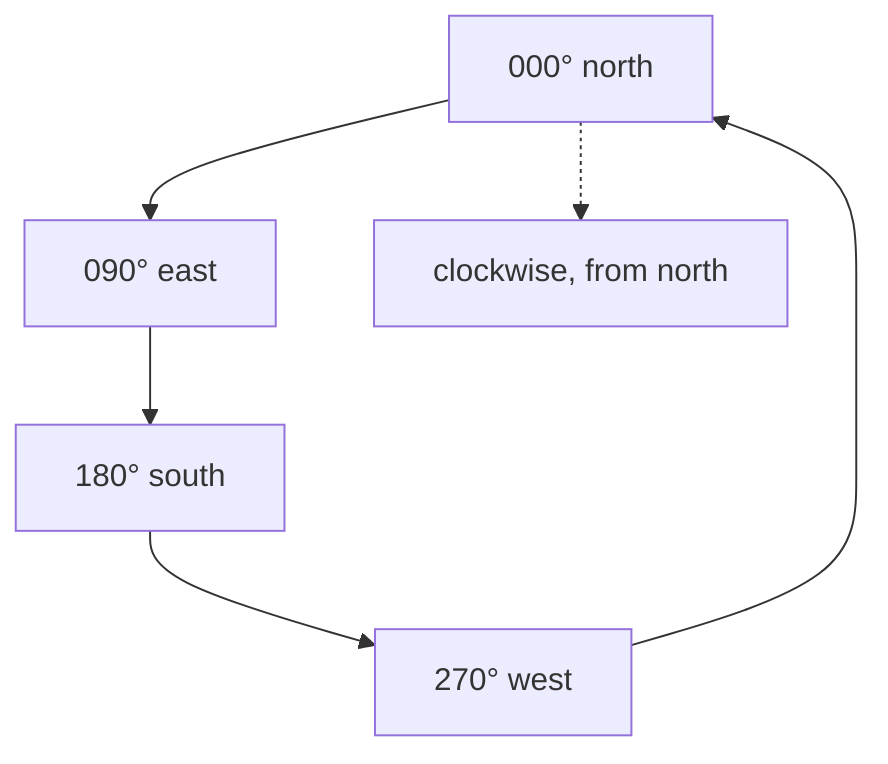

# Bearing and azimuth

A compass direction, measured clockwise from north. The convention every angle in
this project follows — and the one that disagrees with what `sin` and `cos`
assume.

## What it is

A **bearing** is a horizontal direction expressed as an angle clockwise from
north:

```
000°  north
090°  east
180°  south
270°  west
```

**Azimuth** is used interchangeably in most survey and geological contexts. Where
they are distinguished, azimuth is the full 0–360° measure while "bearing" can
mean a quadrant form like `N45°E`. This project uses the full-circle sense
throughout.

Two bearings are recorded here, for different things:

- **`bearing_deg`** on a [face](face.md) — the direction the wall's local **+x**
  axis points.
- **`azimuth`** on an [orientation seed](orientation-seed.md) — the direction a
  surface **dips downhill**.

The trap is that mathematics measures angles **counter-clockwise from east**,
which is what `sin`, `cos`, and `atan2(y, x)` assume. Compass and mathematical
conventions differ in both the zero direction and the rotation sense — see
[compass bearings versus mathematical angles](../cs/compass-bearings-vs-mathematical-angles.md).

## The picture



The practical rules:

| | Mathematical | **Compass** |
|---|---|---|
| East component | `cos θ` | **`sin θ`** |
| North component | `sin θ` | **`cos θ`** |
| From components | `atan2(y, x)` | **`atan2(east, north)`** |

## Why survey records it

A bearing is what a compass, a total station, and a site grid all speak. Surveyors
record it clockwise from north because that is how the instruments read, and
because navigation has done so for centuries.

For this project the bearing is what turns a wall's *shape* into a wall's
*orientation*. Without it a traced face could be laid down in any direction.

## How this project stores it

### On a face

```json
{
  "southern baulk": {
    "originX": 512.30,
    "originY": 1043.75,
    "surfaceZ": 271.44,
    "bearing_deg": 92.5
  }
}
```

with the starter config defining it:

> bearing_deg = compass direction (clockwise from north) that the face's local
> +x axis points.

### Used, with `sin` and `cos` swapped

`poggio_webapp/pipeline/convert_coords.py`:

```python
th = math.radians(cfg["bearing_deg"])
sin_t, cos_t = math.sin(th), math.cos(th)

def to_site(x, depth, X0=X0, Y0=Y0, Z0=Z0, sin_t=sin_t, cos_t=cos_t):
    X = X0 + x * sin_t
    Y = Y0 + x * cos_t
    Z = Z0 - depth
    return X, Y, Z
```

`sin` on X, `cos` on Y. The convention is restated wherever it recurs —
`poggio_webapp/pipeline/merge_walls.py`:

```python
def face_endpoints(face_cfg, length_m):
    """The face's two ends in site coordinates: ((X0, Y0), (X1, Y1)).

    Uses convert()'s axis convention exactly -- X = X0 + x*sin(bearing),
    Y = Y0 + x*cos(bearing), bearing in degrees clockwise from north -- so
    bearing 90 puts all displacement into X and none into Y.
    """
```

That last clause is a **worked check anyone can verify by eye**: bearing 90 is
due east, so all displacement should be in X. A convention that can only be
confirmed by re-deriving it will eventually be got wrong.

### Recovered from components, with the argument order flipped

`poggio_webapp/pipeline/true_dip.py`:

```python
def _dip_from_normal(normal):
    """(dip_degrees, azimuth_degrees) for a plane normal, pointing upward.

    For an upward normal the downhill horizontal direction is (n_x, n_y), and a
    compass bearing is atan2(east, north) -- not the mathematical atan2(y, x).
    """
    ...
    return dip, math.degrees(math.atan2(x, y)) % 360.0
```

`atan2(x, y)`, not the habitual `atan2(y, x)` — and the docstring says so,
because it is exactly the line someone tidying up would "fix".

### Used as a quality measure

`true_dip._best_pair` scores wall pairs by how far from parallel they are:

```python
score = abs(math.sin(math.radians(bearings[a] - bearings[b])))
```

1 for perpendicular, 0 for parallel. Walls within 10° of parallel cannot condition
a [true-dip](apparent-and-true-dip.md) solve, and the module refuses rather than
solving badly.

### Validated at the boundary

`poggio_webapp/pipeline/editor/validation.py`:

```python
bearing = registration.get("bearing_deg")
if (
    "bearing_deg" not in missing_fields
    and not 0 <= bearing <= 360
):
    missing_fields.append("bearing_deg")
```

## What it is not

| Not a… | Because |
|---|---|
| **A mathematical angle** | Different zero, opposite rotation sense. Mixing them reflects the geometry. |
| **[Dip](apparent-and-true-dip.md)** | Dip is how steeply a surface tilts; azimuth is which horizontal direction it tilts *toward*. Two numbers describing one orientation. |
| **Strike** | Strike is the horizontal line *in* a dipping plane, 90° from the dip azimuth. Traditional in field geology; GemPy wants dip azimuth. |
| **Magnetic bearing** | Unless stated. Magnetic north differs from grid north by a declination that changes with time and place. |
| **A face's normal** | `bearing_deg` is where the wall's **+x axis** points — along the wall, not perpendicular to it. |

## Getting it wrong

**Supplying a mathematical angle.** A bearing of 0° means north; a mathematical
0° means east. The whole wall is rotated 90°, and the model looks plausible in
the wrong orientation.

**Swapping `sin` and `cos`.** The same reflection, arrived at through code rather
than data. Hence the convention being restated in three docstrings with a worked
check.

**Recording the perpendicular.** `bearing_deg` is along the wall, not the
direction the wall faces.

**Using magnetic north.** Grid north and magnetic north differ. Mixing them
across seasons introduces a systematic rotation.

**Reversing the face's direction.** Bearing 90 and bearing 270 describe the same
line, and they place `originX/Y` at opposite ends. Register the wrong end and the
wall is mirrored along its length.

## Related pages

- [Grid registration](grid-registration.md) — where `bearing_deg` is entered.
- [Site coordinates](site-coordinates.md) — the space it maps into.
- [Apparent and true dip](apparent-and-true-dip.md) — where azimuth appears.
- [Orientation seed](orientation-seed.md) — what carries a dip azimuth.
- [Compass bearings versus mathematical angles](../cs/compass-bearings-vs-mathematical-angles.md) —
  the full treatment.
