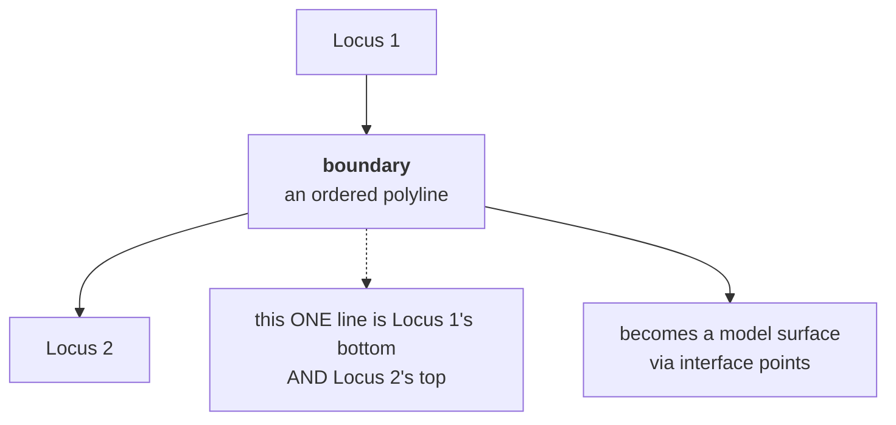

# Boundary

The line where one deposit ends and the next begins. Recorded as an ordered
sequence of measured points, and the single most important geometry in this
application — every model surface comes from one.

## What it is

A boundary — also called an **interface** — is the surface separating two
stratigraphic units. In a [profile](trench-profile.md) drawing it appears as a
line.

Recorded as an ordered list of points:

```
(0.00, 0.31) → (0.42, 0.34) → (0.85, 0.38) → (1.30, 0.36)
```

with `x` along the [face](face.md) and depth down from its top edge. Between the
points, a straight line — see
[piecewise-linear functions](../cs/piecewise-linear-functions.md).

An interface is a **moment**, not a thing. It is the surface that existed when
one deposit stopped accumulating and before the next began. It has no thickness
and no material of its own.

## The picture



## Why excavation records it

The boundary is where the archaeology is. That one deposit lies above another is
the [law of superposition](law-of-superposition.md) in action, and the boundary
is the observation.

Its **shape** carries information too: flat suggests gradual accumulation,
undulating suggests an old ground surface, sharp and steep suggests a
[cut](cut.md).

And it is what a 3D model needs. Interpolating between boundaries recorded on
several walls is exactly what GemPy does.

## How this project stores it

```json
"topBoundary": [
  { "xMeters": 0.00, "depthMeters": 0.31,
    "confidence": "human-traced", "sourcePixel": [412, 883] },
  { "xMeters": 0.85, "depthMeters": 0.38,
    "confidence": "human-traced", "sourcePixel": [1109, 901] }
]
```

Four fields per point. `confidence` records **how it was obtained**;
`sourcePixel` keeps the pixel it was clicked at, so the browser overlay redraws
it exactly rather than round-tripping through metres.

Illustrator sheets use `xCoordinateMeters` / `yCoordinateMeters` for the same
thing. Readers accept either:

```python
def get_x(p):
    """x along the face. Illustrator sheets say xCoordinateMeters; field
    sheets say xMeters."""
    if p.get("xCoordinateMeters") is not None:
        return p["xCoordinateMeters"]
    return p.get("xMeters")
```

### One line, two roles

The line between Locus 1 and Locus 2 is Locus 1's `bottomBoundary` **and** Locus
2's `topBoundary`. The manual tracer builds both from one traced polyline:

```python
bands = [
    (top["points"], tops[i + 1]["points"] if i + 1 < len(tops) else base)
    for i, top in enumerate(tops)
]
```

Which line gets named is a recording convention, and getting it backwards shifts
every locus by one — see [locus](locus.md).

### Points are sorted along the face

```python
converted.sort(key=lambda converted_point: converted_point[0])
```

Because a boundary is a function of position along the wall, the points must run
left to right. The validator warns when they do not:

```python
xs = [x for x, _ in cleaned]
if xs != sorted(xs):
    report.warn(where, f"x-coordinates not left-to-right: {xs}")
```

`detect_markers` sorts by the **corrected** section-local x rather than raw image
x, so a tilted photograph still yields a left-to-right boundary:

```python
# Sort by the corrected section-local x coordinate rather than raw image
# x. This remains left-to-right even when the photograph is tilted.
```

### Null coordinates need a reason

```python
if (x is None or y is None) and not conf:
    report.err(f"{where}[{i}]",
               "null coordinate with no confidence note explaining why")
```

A point the recorder could not read is legitimate — a point that is simply
missing is not. **Null means "not recorded", never zero.**

### Boundaries become interface points

```python
for x, d in pts:
    X, Y, Z = to_site(x, d)
    rows.append({"X": round(X, 4), "Y": round(Y, 4), "Z": round(Z, 4),
                 "surface": surface, "face": fname})
```

and their overall slope becomes an
[orientation seed](orientation-seed.md) via
[least squares](../cs/ordinary-least-squares.md).

## What it is not

| Not a… | Because |
|---|---|
| **[Layer](layer.md)** | The layer is the band; the boundary is the line bounding it. |
| **[Marker](marker.md)** | A marker is one pencil dot at one measured vertex. Many markers describe one boundary. |
| **[Cut](cut.md)** | A cut is an *interface produced by removal*. All cuts are interfaces; most interfaces are not cuts. |
| **[Feature](feature.md)** | A feature is inside a layer and never defines its edge. |
| **Model surface** | The surface is interpolated from the boundary's points across the whole extent. The boundary is measured; the surface is inferred. |

## Getting it wrong

**Evenly spaced vertices.** The signature of points generated at a fixed
interval rather than read off the recorder's marks. The validator warns, using
the [coefficient of variation](../cs/coefficient-of-variation.md):

> boundary vertices are evenly spaced every 0.3 m (12 points, spacing variation
> 0.000) — this is the signature of points estimated at a fixed interval rather
> than read off the recorder's marked vertices

**One boundary copied down.** Two layers with identical shapes offset by a
constant:

> layers 'Locus 2' and 'Locus 3' have identical boundary shapes offset by a
> constant 0.12 m — almost certainly one boundary copied down, not two traced
> ones

Both checks are **skipped for manual tracing**, because a human clicking along
graph paper legitimately produces regular spacing.

**Too few points.** Two points make a straight line; a real interface undulates.
Marker assembly warns below two:

> locus 3: only 1 marker(s) on its top boundary — too few to draw a line

**Tracing beyond the drawing.** Nothing is extrapolated —
[clamping](../cs/piecewise-linear-functions.md) at the recorded ends is
deliberate.

## Related pages

- [Layer](layer.md) — what boundaries bound.
- [Marker](marker.md) — one recorded vertex.
- [Interface point](interface-point.md) — a boundary point in site coordinates.
- [Orientation seed](orientation-seed.md) — its fitted slope.
- [Layers and boundaries](../concepts/layers-and-boundaries.md) — the concept
  page.
- [Validation rules](../reference/validation-rules.md) — every check quoted
  above.
