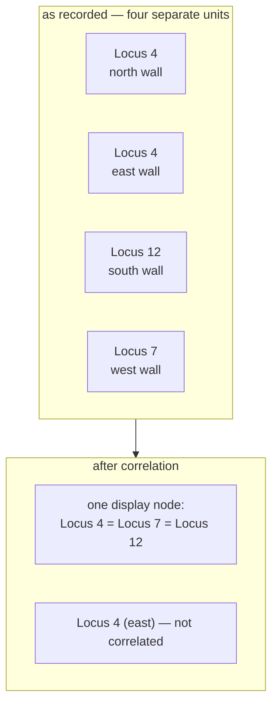

# Correlation

The judgement that two separately recorded units are the same deposit. An
interpretation, never an observation — and in this project always confirmed by a
person.

## What it is

A trench has four walls. A deposit crossing the trench is recorded on more than
one of them, as separate units with separate records. Someone has to decide they
are the same thing.

That decision is a **correlation**. Unlike a
[relationship](stratigraphic-relationships.md), it is not something anyone saw.
Nobody observes that two units are identical; they *infer* it, from similar
colour, similar texture, matching elevation, and continuity across a corner.

Correlations are **transitive**: if A is the same as B and B the same as C, then
A, B, and C are one deposit. That makes them a
[connected-components](../cs/connected-components.md) problem, solved here with
[Union-Find](../cs/union-find.md).

## The picture



## Why excavation records it

Without correlation a trench's matrix has four parallel sequences that never
meet — one per wall — and no chronology spans the trench.

The reverse error is worse. Correlating two deposits that merely *look* alike
fuses two independent records and can create a contradiction elsewhere, because
the two units may have different relationships.

So it must be recorded, and it must be recorded as an **interpretation**,
separate from observation, so a later reader can disagree with it without
disturbing the evidence.

## How this project stores it

A correlation is its own object, not a relationship —
`poggio_webapp/pipeline/harris_matrix.py`:

```python
class HarrisCorrelation(_HarrisModel):
    id: CorrelationId
    unit_ids: list[UnitId]
    notes: HumanText | None

    @model_validator(mode="after")
    def require_distinct_units(self):
        if len(set(self.unit_ids)) < 2:
            raise ValueError(
                "A correlation requires at least two distinct unit IDs."
            )
        return self
```

A set of units, not a pair — because correlation is transitive and a group is the
natural shape.

### Groups collapse for display, not in the data

```python
def correlation_components(matrix: HarrisMatrix) -> dict[str, str]:
    """Map each stored unit to its deterministic correlation representative."""
```

The units stay separate in storage; only the *display graph* collapses them:

```python
def _collapsed_graph(matrix, components):
    ...
    younger = components[relation.younger_id]
    older = components[relation.older_id]
    if younger == older:
        continue
    relation_ids_by_edge[(younger, older)].append(relation.id)
```

That separation is the point. Correlation is an interpretation; the underlying
records are evidence. Merging the records would destroy the distinction.

The renderer shows the group as one box with an equals-joined label:

```python
label = " = ".join(unit.label for unit in ordered_units)
```

### The contradiction it can create

```python
if (
    relation.younger_id in unit_ids
    and relation.older_id in unit_ids
    and relation.younger_id != relation.older_id
    and components[relation.younger_id] == components[relation.older_id]
):
    errors.append(_issue(
        "relation-within-correlation",
        f"Relation {relation.id} connects units in the same "
        "correlation component.", ...))
```

If two units are the same deposit, one cannot be younger than the other. This
error arises only from the **combination** of two individually reasonable
assertions.

Overlapping groups are also an error:

```python
errors.append(_issue(
    "overlapping-correlation",
    f"Unit {unit_id} appears in overlapping correlation groups: "
    f"{', '.join(sorted_ids)}.", [unit_id]))
```

### Suggestions are proposals, never actions

`poggio_webapp/pipeline/harris_suggestions.py`:

```python
_CORRELATION_REASON = (
    "Matching normalized labels appear in different jobs or faces."
)
```

Deliberately weak evidence — matching labels, in *different* sources — and it is
only ever a suggestion. Accepting one revalidates the entire graph and rolls back
if it would break:

```python
report = validate_matrix_graph(reviewed)
if not report["ok"]:
    raise _acceptance_error(suggestion, report)
```

The README states the policy plainly:

> Correlation — the interpretation that two units are the same deposit — is
> separate and always human-confirmed; equal labels never merge on their own.
> Every proposal must be individually accepted or rejected.

### A different sense of the word, in merging

`poggio_webapp/pipeline/merge_walls.py` uses "correlation" for a related but
distinct job: telling the merge that one deposit was numbered differently on two
walls.

```python
correlation: optional dict mapping 'wall_label:locusNumber' -> canonical
    locusNumber string, for deposits recorded under different numbers on
    different walls.
```

That one is an **input to the model build** — it renames loci so GemPy fuses them
into one surface. The Harris correlation is an interpretation recorded in a
matrix. Same word, two mechanisms, both requiring a person to assert the
equality.

## What it is not

| Not a… | Because |
|---|---|
| **[Stratigraphic relationship](stratigraphic-relationships.md)** | A relationship says *younger than*; a correlation says *the same as*. Asserting both between one pair is an error. |
| **An observation** | Nobody sees that two units are identical. It is inferred. |
| **Automatic** | Matching labels produce a suggestion, never a merge. |
| **Contemporaneity** | Two different deposits laid at the same moment are contemporaneous, not correlated. The matrix cannot express contemporaneity at all. |
| **Merging the records** | The units remain separate in storage. Only the display graph collapses. |

## Getting it wrong

**Correlating on appearance alone.** Two pits filled with similar soil are not
one deposit. Colour and texture are weak evidence; continuity across a corner is
strong.

**Assuming equal locus numbers mean the same deposit.** Across
[numbering epochs](locus-numbering-epochs.md) they certainly do not, and across
trenches they never do.

**Correlating units that have a relationship.** Caught as
`relation-within-correlation`, and the error is only visible once both
assertions exist.

**Accepting suggestions in bulk.** The interface requires each to be accepted or
rejected individually, on purpose. A suggestion's evidence — "matching
normalized labels" — is deliberately weak, and reviewing it is the work.

## Related pages

- [Stratigraphic relationships](stratigraphic-relationships.md) — the other kind
  of assertion.
- [Harris Matrix](harris-matrix.md) — where correlations collapse into one box.
- [Locus numbering epochs](locus-numbering-epochs.md) — when equal numbers are
  certainly not the same deposit.
- [Union-Find](../cs/union-find.md) — how the groups are computed.
- [Human-in-the-loop review](../cs/human-in-the-loop-review.md) — why it is never
  automatic.
- [Combine walls into one trench](../workflows/09-multi-wall-trench.md) — the
  merge-time sense.
