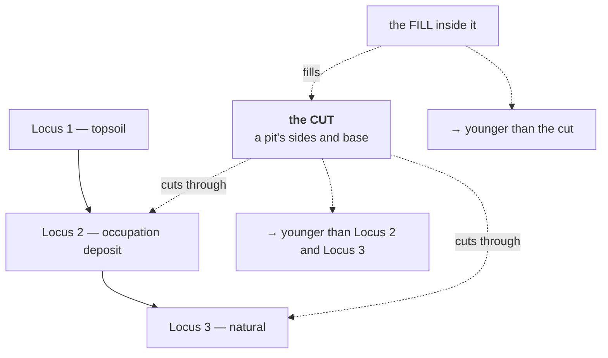

# Cut

A hole. Specifically, the surface left behind when something was removed —
a pit dug, a ditch excavated, a foundation trench opened. A cut is a
stratigraphic unit made of nothing.

## What it is

Most stratigraphic units are material that was *added*: a layer of silt, a spread
of destruction debris. A **cut** is the opposite — the record of material
*removed*.

The cut is the **surface** of the hole: its sides and base. Not the hole's
contents, which are the [fill](fill.md), and not the deposits it was dug through.

Three properties follow:

- **A cut has no material.** It is an interface, and the excavator records its
  shape, not its composition. There is no Munsell reading for a cut.
- **A cut is younger than everything it passes through.** You cannot dig a pit
  through a layer that does not exist yet. This is the single most reliable
  dating relationship in stratigraphy.
- **A cut is older than its fill.** The hole exists before anything goes into it.

## The picture



## Why excavation records it

The cut is where the chronology gets sharp. Ordinary superposition says a layer
is younger than the one below it. A cut says something stronger: it is younger
than **every** unit it passes through, however many that is, and each of those
becomes a separate dated relationship.

Recording the cut separately from its fill also separates two events. The digging
and the filling are different moments — sometimes centuries apart, as with a
robbed-out wall trench left open before silting up.

## How this project stores it

A cut is a **unit type** in the Harris Matrix vocabulary —
`poggio_webapp/pipeline/harris_matrix.py`:

```python
UnitType = Literal[
    "deposit",
    "cut",
    "structure",
    "interface",
    "natural",
    "unknown",
]
```

and a **relation kind**:

```python
RelationKind = Literal["above", "cuts", "fills", "precedes", "other"]
```

`"cuts"` and `"fills"` are separate from `"above"` because they mean something
stronger. A relation records which:

```json
{
  "id": "rel-8b2c19f04ad3",
  "younger_id": "unit-4f2a8c1e9b03",
  "older_id": "unit-77c1de90b442",
  "kind": "cuts",
  "evidence": "pit sides truncate the occupation deposit",
  "source": "manual"
}
```

`evidence` is **required** — see [JSON schema design](../cs/json-schema-design.md).
A chronological assertion without a stated reason is not something the schema
will store.

A cut is also drawable. `poggio_webapp/pipeline/site_vocab.py` includes it in the
vocabulary a recorder can mark on a section, and types it correctly:

```python
({"key": "cut", "label": "Cut", "kind": "unit", "unitType": "cut", "surveyCode": None},)
```

Note `"kind": "unit"` rather than `"material"`. The comment above the list draws
the distinction explicitly:

> `material` entries carry a bulk-find letter so a drawn shape can be matched
> to the material record. `unit` entries are stratigraphic and carry a Harris
> unit type instead -- they are contexts, not finds.

A cut has no material because there is nothing there.

The [feature detector](../cs/contour-tracing.md) proposes cuts among its
candidates, and is careful not to claim more:

> This detector intentionally does not claim that every closed contour is a
> stone. It proposes compact, closed shapes that may represent stones, cuts,
> lenses, voids, or other discrete features.

## What it is not

| Not a… | Because |
|---|---|
| **[Fill](fill.md)** | The fill is what is *in* the hole. The cut is the hole's surface. Two units, two events, two records. |
| **[Layer](layer.md)** | A layer is material added. A cut is material removed. |
| **[Boundary](boundary.md)** | All cuts are interfaces; most interfaces are not cuts. An ordinary layer boundary is where deposition changed, not where someone dug. |
| **[Feature](feature.md)** | A feature is a discrete thing drawn inside a layer. A cut is a stratigraphic unit in its own right, with its own relationships. |
| **Void** | A void is an empty space in the ground now. A cut may be entirely filled and still be a cut. `site_vocab` types `void` as `"interface"`, not `"cut"`. |

## Getting it wrong

**Recording the cut and fill as one unit.** The commonest error. It collapses two
events into one and loses the relationship between them — and the fill's contents
then appear to date the digging, which they do not.

**Missing the cut entirely.** A pit whose fill resembles the surrounding deposit
can be dug through without the cut being seen, in which case the fill's finds are
attributed to the layer it cuts. That is a dating error of potentially centuries,
and nothing in this software can detect it.

**Using `"above"` where `"cuts"` belongs.** Both are valid relations, and `cuts`
carries more information: it says the younger unit *truncated* the older, not
merely that it lies over it. The vocabulary distinguishes them so the
distinction survives.

**Expecting a Munsell reading.** There is no material to describe. A cut recorded
with a soil colour is probably its fill.

## Related pages

- [Fill](fill.md) — what goes into it.
- [Layer](layer.md) — material added rather than removed.
- [Stratigraphic relationships](stratigraphic-relationships.md) — `cuts` and
  `fills` among the others.
- [Harris Matrix](harris-matrix.md) — where the relationships are drawn.
- [Feature](feature.md) — the drawn-shape vocabulary.
- [Law of superposition](law-of-superposition.md) — what a cut strengthens.
