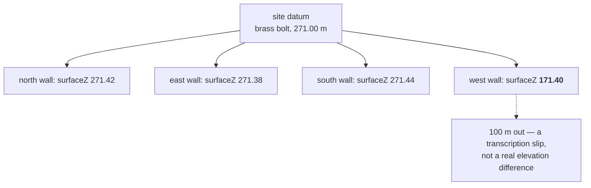

# Datum

The fixed reference point every elevation on a site is measured from. Two
measurements are only comparable if they share one — and two walls registered
against different datums produce a model that is wrong by a constant.

## What it is

A datum is a physical, permanent point of known height, established once and
used for the site's lifetime: a brass bolt in bedrock, a marked corner of a
standing structure, a driven pin.

Every [elevation](elevation.md) recorded on the site is derived from it, directly
or through a chain of transfers. That is what makes elevations comparable — a
find at 271.44 m and a boundary at 271.09 m can be compared only because both
descend from the same reference.

Two kinds:

- **A site datum** is arbitrary but consistent. "The datum is 100.00 m" is fine,
  as long as everything uses it.
- **A tied datum** is surveyed to a national height network, so the site's
  elevations mean something outside it.

The requirement is **consistency**, not absolute accuracy. A site-wide error of
half a metre is harmless for stratigraphy; a half-metre difference between two
walls of one trench is not.

## The picture



## Why excavation records it

Elevation is one of the three coordinates that locate everything. Without a
shared datum, depths recorded on different days by different people cannot be
compared, and a trench's four walls cannot be joined into one model.

It also outlives the excavation. A site revisited in ten years re-establishes
position from the datum; without one, the old records float free.

## How this project stores it

The datum itself is never stored — this application never sees it. What it stores
is `surfaceZ` per [face](face.md), which is an elevation *derived* from the
datum:

```json
{
  "faces": {
    "southern baulk": {
      "originX": 512.30,
      "originY": 1043.75,
      "surfaceZ": 271.44,
      "bearing_deg": 92.5
    }
  }
}
```

The starter config's `_comment` defines it, with the site's own vertical
frame:

> surfaceZ = ground-surface elevation at that edge, absolute, in mAE (meters
> absolute elevation) -- elevations at this site are in the twenties, not the
> hundreds.

"In the twenties, not the hundreds" is a usefully blunt way of saying the
placeholder `100.0` is not a plausible reading here.

The config also carries the vertical frame explicitly:

```python
"vertical": {
    "frame": site_elevation.MAE,
    # "absolute" or "below-datum". Below-datum readings need the datum
    # nail's own elevation before they can be resolved, and are
    # transitional by the site's own rule -- they must be corrected to
    # absolute elevations for the final record.
    "entryForm": "absolute",
    "datumNail": {"absoluteZ": None, "label": None},
},
```

`entryForm` is the interesting field. A reading taken *below a datum nail* is
not yet an elevation — it needs that nail's own absolute height before it can be
resolved, and the site's rule is that such readings are transitional and must be
corrected to absolute before the final record. The config records which kind of
number it holds rather than assuming.

and depth converts to elevation by subtraction —
`poggio_webapp/pipeline/convert_coords.py`:

```python
Z = Z0 - depth
```

`surfaceZ` is where the datum enters the model. Everything below the ground
surface is that number minus a measured depth.

### The check that catches a shared-datum failure

`poggio_webapp/pipeline/merge_walls.py`:

```python
_MAX_DATUM_SPREAD_M = 2.0
```

```python
elevations = []
for name in names:
    try:
        elevations.append(float(faces_cfg[name]["surfaceZ"]))
    except (KeyError, TypeError, ValueError):
        continue
if len(elevations) > 1:
    spread = max(elevations) - min(elevations)
    if spread > _MAX_DATUM_SPREAD_M:
        warnings.append(
            f"surfaceZ spreads {spread:.2f} m across the faces "
            f"({min(elevations):.2f} to {max(elevations):.2f}); the walls "
            "may not share a datum -- confirm all elevations come from the "
            "same benchmark")
```

The reasoning behind the threshold: the four walls of one trench are metres
apart, so their ground surfaces genuinely differ — by centimetres on flat ground,
by tens of centimetres on a slope. Two metres is well beyond that, and the
likeliest explanation is a **different reference**, not a very steep site.

It is a **warning**, not a refusal. A trench on a genuinely steep slope could
legitimately exceed it, and that is the operator's judgement to make. Compare the
placeholder-registration check, which *is* fatal — because placeholders are never
legitimate.

The message says what to check — "confirm all elevations come from the same
benchmark" — rather than merely reporting the number.

## What it is not

| Not a… | Because |
|---|---|
| **[Elevation](elevation.md)** | The datum is the reference; an elevation is a measurement from it. |
| **[Site coordinates](site-coordinates.md)** | The datum fixes the vertical; the site grid fixes the horizontal. Often established together, conceptually separate. |
| **`surfaceZ`** | `surfaceZ` is one face's ground-surface elevation, derived from the datum. The datum is the site-wide reference behind it. |
| **Sea level** | A site datum may be arbitrary. Only a tied datum relates to a national height network. |
| **A total station's setup** | A station is set up *over* or *relative to* the datum. Each day's setup is temporary; the datum is not. |

## Getting it wrong

**Two walls on different datums.** The commonest failure, and the reason for the
spread check. The model builds and every wall is internally consistent — but they
sit at different heights, so surfaces that should join do not.

**A transcription slip in `surfaceZ`.** `171.40` for `271.40` is a plausible
typo and shows up as a 100 m spread. Caught by the same check.

**Assuming the datum is sea level.** A site datum of 100.00 m is a convention. Do
not compare it against another site's elevations without knowing whether either
is tied.

**Registering with placeholders.** The starter `surfaceZ` is `100.0` for every
face, which produces *zero* spread and passes this check cleanly. The
placeholder check catches it instead — two checks for two different failures.

## Related pages

- [Elevation](elevation.md) — what is measured from it.
- [Grid registration](grid-registration.md) — where `surfaceZ` is entered.
- [Site coordinates](site-coordinates.md) — the horizontal counterpart.
- [Face](face.md) — what carries `surfaceZ`.
- [Place on site](../workflows/06-place-on-site.md) — the workflow step.
