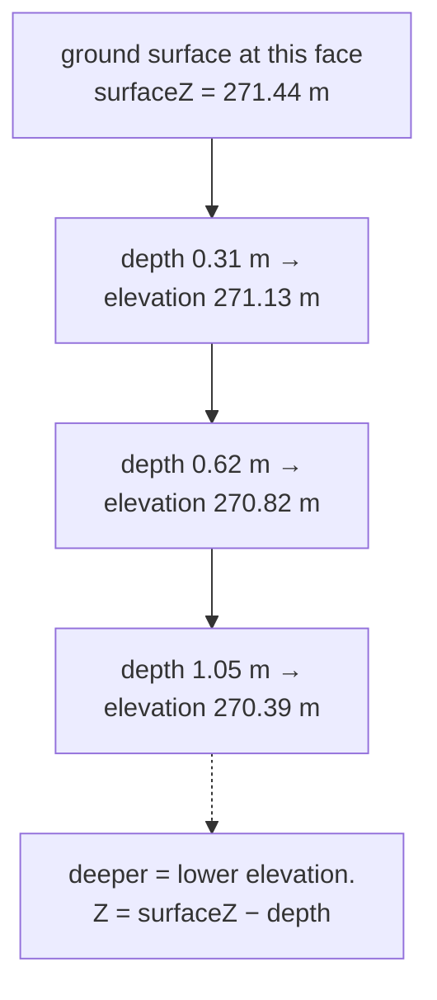

# Elevation

Height above the [datum](datum.md). The Z of site coordinates, and the axis
where this project has to reconcile two opposite conventions, because depth runs
down and elevation runs up.

## What it is

An elevation is how high something is, measured from a fixed reference. In
archaeology it is usually the third coordinate alongside northing and easting,
and it is what places a deposit in the vertical sequence.

The complication is that excavation records **depth**, not elevation. A recorder
measuring a boundary on a section measures *down* from the top of the wall,
because that is the surface they can reach and hold a tape against.

So there are two conventions in play:

| | Direction | Zero at | Used by |
|---|---|---|---|
| **Depth** | increases **downward** | the face's top edge | drawings, tracing, extraction |
| **Elevation** | increases **upward** | the site datum | survey, site coordinates, the model |

Converting is one subtraction. Getting its sign wrong inverts the entire model.

## The picture



## Why excavation records it

Elevation is what makes deposits comparable **across** a site. Two trenches
twenty metres apart cannot be related by depth (their ground surfaces are at
different heights), but their elevations are directly comparable.

It is also the axis the [law of superposition](law-of-superposition.md) operates
on, and the third coordinate for a [find](find.md), which is why `elevation` is a
required field.

## How this project stores it

### The conversion

`poggio_webapp/pipeline/convert_coords.py`:

```python
def to_site(x, depth, X0=X0, Y0=Y0, Z0=Z0, sin_t=sin_t, cos_t=cos_t):
    X = X0 + x * sin_t
    Y = Y0 + x * cos_t
    Z = Z0 - depth
    return X, Y, Z
```

`Z = Z0 - depth`. One minus sign carrying the whole convention, in the one place
the two systems meet.

`Z0` is [`surfaceZ`](grid-registration.md), the face's ground-surface elevation,
so the model's Z axis is elevation above the site datum.

### Depth is positive-down, and enforced

`poggio_webapp/pipeline/validator.py`:

```python
if y is not None and y < 0:
    report.err(f"{where}[{i}]", f"negative depth {y} (depth is positive-down)")
```

An **error**. A negative depth means the sign convention was misunderstood, and
every point in that boundary is inverted.

The manual tracer clamps rather than erroring, because a click a pixel above the
calibration edge is a mis-click rather than a convention error:

```python
"depthMeters": max(0.0, depth),
```

And an implausible depth is a warning:

```python
DEFAULT_MAX_PLAUSIBLE_DEPTH_M = 5.0
...
if y is not None and y > max_plausible_depth_m:
    report.warn(f"{where}[{i}]", f"implausibly deep ({y} m)")
```

A warning, not an error: a deep trench is possible, a 50 m one is a
scale mistake.

### Elevation as a required find field

`poggio_webapp/pipeline/editor/schema.py`:

```python
REQUIRED_FIND_FIELDS = (
    "face_id",
    "x",
    "y",
    "elevation",
    "locus",
    "description",
)
```

`elevation` is required, and separate from `y`. A find's position on a face and
its height above datum are two different facts.

### Elevation bounds the model

`poggio_webapp/pipeline/build_gempy.py`:

```python
zmin, zmax = points["Z"].min(), points["Z"].max()
...
zlo, zhi = pad(zmin, zmax, pad_z)
```

with a smaller default pad vertically (`padding_z=1.0`) than horizontally
(`padding_xy=2.0`), which is sensible, since a trench is wider than it is deep and
extrapolating vertically is the riskier direction.

The manifest declares the axis explicitly:

```python
"coordinate_system": {
    "units": "m",
    "up_axis": "Z",
},
```

and the manifest validation in
`poggio_webapp/backend/services/viewer_files.py` refuses anything else:

```python
and coordinate_system.get("units") == "m"
and coordinate_system.get("up_axis") == "Z"
```

(The browser's own loader independently requires `up_axis` to be `"Z"`.)

Stating which way is up, rather than assuming it. See
[schema versioning](../cs/schema-versioning.md).

## What it is not

| Not a… | Because |
|---|---|
| **Depth** | Opposite directions, different zeros. `Z = surfaceZ − depth`. |
| **[Datum](datum.md)** | The datum is the reference; an elevation is measured from it. |
| **`surfaceZ`** | `surfaceZ` is one specific elevation: the ground surface at a face's x=0 edge. |
| **Altitude above sea level** | Only if the datum is tied to a national height network. A site datum may be arbitrary. |
| **Stratigraphic position** | Two deposits at the same elevation in different parts of a trench are **not** contemporaneous. Elevation is geometry; sequence is [stratigraphy](stratigraphy.md). |

## Getting it wrong

**Inverting the sign.** Recording elevation where depth is expected inverts the
model. The negative-depth error catches the obvious case; a consistently inverted
but positive set would not be caught by geometry alone.

**Comparing depths across faces.** Depth is measured from *each face's own* top
edge, and those edges are at different elevations. Only after conversion are the
numbers comparable, which is the whole reason `surfaceZ` exists per face.

**Reading equal elevation as contemporaneity.** The commonest interpretive error
this data invites. Two deposits at 270.8 m on opposite sides of a trench have no
relationship unless one was recorded.

**Using depth below the *modern* surface as elevation.** Modern ground level is
not the datum, and it varies across a site.

## Related pages

- [Datum](datum.md): the reference.
- [Grid registration](grid-registration.md): where `surfaceZ` is entered.
- [Site coordinates](site-coordinates.md): the full XYZ.
- [Interface point](interface-point.md): a boundary point in site coordinates.
- [Law of superposition](law-of-superposition.md): why the vertical axis
  matters.
- [Coordinate spaces](../concepts/coordinate-spaces.md): the three spaces.
