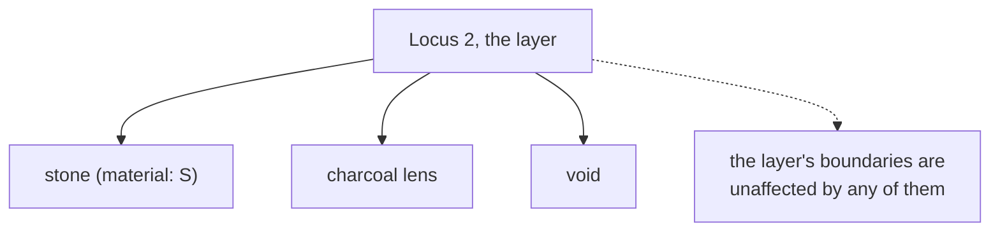

# Feature

A discrete thing drawn inside a [layer](layer.md): a stone, a lens, a void, a
patch of burning. It belongs to the layer; it never defines the layer's edge.

## What it is

A section drawing records the bands and, within them, individual things worth
noting: a large stone, a pocket of charcoal, a root void, a fragment of tile.
Each is a **feature**.

Two properties define it:

- It is inside a layer. A feature belongs to one stratigraphic unit and does
  not span the boundary between two.
- It does not define a boundary. Drawing a stone does not change where the
  layer's edges run. This is the distinction that matters most in the data model.

Beyond that, "feature" is a broad category. This project's vocabulary covers
materials (stone, tile, bone, pottery), stratigraphic things drawn in section
(wall, cut, interface, natural, void), and intrusions (a tree stump).

Note the word is used differently across archaeological traditions. In some, a
"feature" is a major non-portable structure (a hearth, a posthole). Here it means
anything discrete drawn within a layer.

## The picture



## Why excavation records it

Features carry information the layer description cannot. A layer of "silty clay"
containing three large stones and a charcoal lens tells a different story from
the same silty clay containing nothing.

Some are **evidence of process**: a burnt lens where something was fired, a void
where a timber rotted. Others are **content**: tile fragments large enough to
draw individually.

They also connect the drawing to the find record. `site_vocab` gives each
material feature type a bulk-find letter, so a drawn stone can be matched to the
material actually collected.

## How this project stores it

Inside the layer that contains it:

```json
{
  "locusNumber": "2",
  "topBoundary": [ ... ],
  "bottomBoundary": [ ... ],
  "featuresInLayer": [
    {
      "feature": "stone",
      "description": "sub-angular limestone",
      "shapePoints": [ { "xMeters": 0.42, "depthMeters": 0.44 }, ... ],
      "approxXMeters": 0.47,
      "approxDepthMeters": 0.46,
      "approxWidthMeters": 0.12,
      "approxHeightMeters": 0.08,
      "confidence": "human-traced"
    }
  ]
}
```

Either a traced outline (`shapePoints`) or an approximate box, or both. The
validator warns when neither is present:

```python
report.warn(
    fwhere,
    "no shapePoints and no approx* coords. Geometry may be "
    "trapped in the description string",
)
```

"Trapped in the description string" is a good diagnosis of a real problem.
Geometry written as prose is geometry nothing can use.

### The vocabulary is the site's, not the software's

`poggio_webapp/pipeline/site_vocab.py`:

```python
# `material` entries carry a bulk-find letter so a drawn shape can be matched
# to the material record. `unit` entries are stratigraphic and carry a Harris
# unit type instead -- they are contexts, not finds. `intrusion` is neither:
# a tree stump is modern root disturbance, and filing it as either a find or a
# deposit would misrepresent it.
DRAWN_FEATURE_TYPES = (
    {"key": "stone", "label": "Stone", "kind": "material",
     "material": "S", "surveyCode": "STONE"},
    {"key": "terracotta", "label": "Terracotta (tile)", "kind": "material",
     "material": "T", "surveyCode": None},
    ...
    {"key": "wall", "label": "Wall", "kind": "unit",
     "unitType": "structure", "surveyCode": "WALL"},
    {"key": "cut", "label": "Cut", "kind": "unit",
     "unitType": "cut", "surveyCode": None},
    ...
    {"key": "tree-stump", "label": "Tree stump", "kind": "intrusion",
     "surveyCode": None},
)
```

Three `kind` values, because three different things get drawn in a section and
filing them alike would misrepresent them. A stone is material that could be
collected; a cut is a stratigraphic context; a tree stump is modern disturbance
that is neither.

The module docstring explains why this list replaced an earlier one:

> the application previously carried its own parallel vocabularies -- a
> hand-written feature-type list in the drawing UI, and ``uuid4`` find
> identifiers -- which meant nothing it recorded could be matched against the
> project's own records without a human translating.

### Assigned to a layer by depth, not by containment

`poggio_webapp/pipeline/manual_extraction.py` places a feature in the layer whose
depth band contains its centre:

```python
low, high = sorted((top_depth, bottom_depth))
if low - 0.02 <= depth <= high + 0.02:
    chosen = i
    break
distance = min(abs(depth - low), abs(depth - high))
if distance < best_distance:
    best_distance = distance
    chosen = i
```

Nearest band if none contains it, so a feature traced slightly outside is still
recorded. See [point in polygon](../cs/point-in-polygon.md) for why containment
was not used.

### Detection proposes; a person decides

`poggio_webapp/pipeline/detect_features.py` is explicit:

> This detector intentionally does not claim that every closed contour is a
> stone. It proposes compact, closed shapes that may represent stones, cuts,
> lenses, voids, or other discrete features. A person approves, rejects, and
> labels each proposal before extraction.

### Duplicates are removed, and logged

`normalizer.dedupe_floor` drops a "floor" feature that duplicates the deepest
layer's bottom boundary, and `dedupe_cross_layer_features` keeps a repeated
feature in only the deepest layer, both appending to a log.

## What it is not

| Not a… | Because |
|---|---|
| **[Find](find.md)** | A find is an object *recovered* and bagged, with an identifier. A feature is a shape *drawn* in section. The same stone can be both, recorded twice for two purposes. |
| **[Marker](marker.md)** | A marker is a pencil dot at a boundary vertex. A feature is a thing in the deposit. |
| **[Layer](layer.md)** | A feature sits inside a layer and never defines its edge. |
| **[Cut](cut.md)** | A cut *can* be drawn as a feature on a section, and it is also a stratigraphic unit with its own relationships. `site_vocab` types it `"unit"` for that reason. |
| **Structure** | A masonry wall is drawn as a feature and is a structural unit in the Harris sense, hence `"unitType": "structure"`. |

## Getting it wrong

**Tracing a feature as a boundary.** A stone outline traced as a layer boundary
puts a false edge in the stratigraphy. Features and boundaries are traced
separately for this reason.

**Confusing a lens with a layer.** A charcoal lens a few centimetres across is a
feature; a charcoal-rich band running the wall's width is a layer. The test is
whether it defines an edge.

**Describing geometry in prose.** "A large stone near the middle" is not usable.
The validator warns when a feature has neither `shapePoints` nor `approx*`
coordinates.

**Filing an intrusion as a deposit.** A tree stump is modern root disturbance.
`site_vocab` types it `"intrusion"` precisely so it is not recorded as either a
find or a stratigraphic unit.

## Related pages

- [Layer](layer.md): what contains it.
- [Find](find.md): the recovered-object record.
- [Marker](marker.md): the boundary vertex.
- [Find identifiers](find-identifiers.md): the bulk-material letters.
- [Markers, features, and finds](../concepts/markers-features-and-finds.md): the
  three compared.
- [Markers and features](../workflows/03-markers-and-features.md): the workflow.
