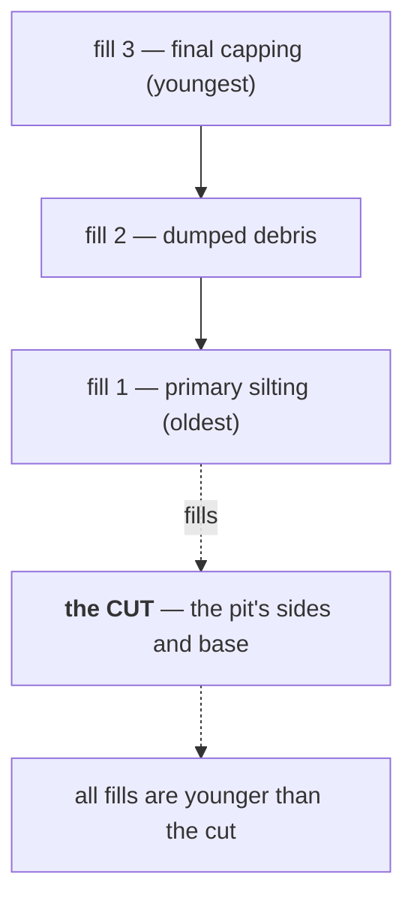

# Fill

The material inside a [cut](cut.md). Recorded separately from the hole it sits
in, because the digging and the filling are different events.

## What it is

Dig a pit, and later something goes into it — deliberately dumped rubbish,
gradual silting, deliberate backfill. That material is the **fill**.

A fill is a deposit like any other: it has a colour, a texture, inclusions, and
finds. What makes it a fill rather than a plain [layer](layer.md) is its
*relationship* — it occupies a cut.

Two consequences:

- **A fill is younger than its cut.** The hole must exist first. Always.
- **A fill may be much younger.** A robbed wall trench can stand open for years
  before silting up. The gap can be archaeologically enormous.

A single cut may hold **several** fills, in sequence — a primary silt at the
base, a dump above it, a final capping. Each is its own unit, and their order is
their chronology.

## The picture



## Why excavation records it

Separating fill from cut separates two moments. If they were recorded as one
unit, the finds in the fill would appear to date the digging — and they date the
filling, which may be much later.

The fill also carries most of the recoverable evidence. Pits are where rubbish
ends up, so a fill is often rich in pottery and bone while the cut itself has
none.

And the **sequence of fills** records a process: a slow silt then a sudden dump
tells a different story from a single homogeneous backfill.

## How this project stores it

A fill is an ordinary **deposit** in the Harris vocabulary — the relationship is
what marks it:

```python
UnitType = Literal[
    "deposit", "cut", "structure", "interface", "natural", "unknown",
]

RelationKind = Literal["above", "cuts", "fills", "precedes", "other"]
```

```json
{
  "id": "rel-3c81aa27de40",
  "younger_id": "unit-9b02f4a17c65",
  "older_id": "unit-4f2a8c1e9b03",
  "kind": "fills",
  "evidence": "silty deposit conforms to the pit's sides and base",
  "source": "manual"
}
```

The unit itself is `unit_type: "deposit"`; `kind: "fills"` on the relation is
what says it is a fill.

That separation matters. A deposit is not intrinsically a fill — it becomes one
by being in a cut, which is a *relationship*, and relationships live on edges
rather than on nodes. See [graphs and terminology](../cs/graphs-and-terminology.md).

On a section drawing a fill is drawn as an ordinary [layer](layer.md), with its
own [Munsell](munsell-colour.md) reading and its own boundaries. Nothing in the
geometry distinguishes it — the distinction is the recorded relationship.

`site_vocab.DRAWN_FEATURE_TYPES` offers `cut` as a drawable unit type but not
`fill`, and that is right: you draw the *edge of the hole*, and the material
inside it is a layer.

## What it is not

| Not a… | Because |
|---|---|
| **[Cut](cut.md)** | The cut is the hole's surface; the fill is what is in it. Two units, two events. |
| **[Layer](layer.md)** | A fill *is* a deposit — but one bounded by a cut rather than spreading across the trench. The difference is relational, not material. |
| **[Natural](natural.md)** | Undisturbed geology beneath everything. A fill is human-associated material in a hole. |
| **Backfill (modern)** | Refilling a trench after excavation is a modern act, not a stratigraphic unit. |
| **[Feature](feature.md)** | A stone *within* a fill is a feature. The fill is a stratigraphic unit. |

## Getting it wrong

**Recording cut and fill as one unit.** The commonest stratigraphic error. It
loses the gap between digging and filling, and makes the fill's finds appear to
date the cut.

**Assuming the fill dates the cut.** It dates the *filling*. A Roman pit filled
in the medieval period has medieval finds and a Roman cut. Only material sealed
*beneath* the cut, or the relationships of what it truncates, dates the digging.

**Merging several fills into one.** A pit filled in three episodes holds three
units. Recording them as one loses the sequence — and the finds from the base and
the top may be very different in date.

**Correlating fills across a trench because they look alike.** Two pits filled
with similar soil are not the same deposit. This is exactly why
[correlation](correlation.md) is always human-confirmed here and never
automatic:

> Correlation — the interpretation that two units are the same deposit — is
> separate and always human-confirmed; equal labels never merge on their own.

## Related pages

- [Cut](cut.md) — the hole a fill occupies.
- [Layer](layer.md) — the general deposit.
- [Stratigraphic relationships](stratigraphic-relationships.md) — `fills` among
  the others.
- [Correlation](correlation.md) — why similar fills are not automatically the
  same.
- [Find](find.md) — what a fill usually contains.
- [Harris Matrix](harris-matrix.md) — where the sequence is drawn.
