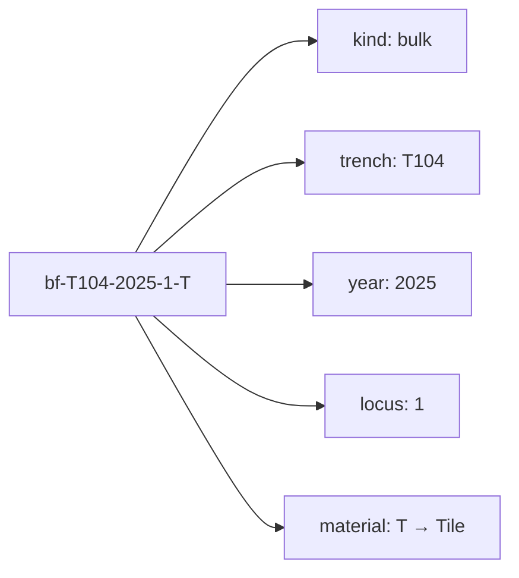

# Find identifiers

The site's own formats for naming recovered material: `bf-`, `sf-`, and
catalogue numbers. Transcribed from Poggio Civitate's recording standards rather
than invented, because an identifier only works if it matches the tag on the bag.

## What it is

Three formats, each for a different kind of [find](find.md):

| Format | Example | Parts |
|---|---|---|
| **Special find** | `sf-T111-2025-1-1` | `sf-` trench · year · locus · number |
| **Bulk find** | `bf-T104-2025-1-T` | `bf-` trench · year · locus · **material letter** |
| **Catalogued** | `pc20240001` | prefix · year · four-digit number |

The bulk-find material letters:

```
T  Tile          P  Plaster       C  Pottery/Ceramic   B  Bone
M  Metal         S  Stone         A  Architectural     O  Other
```

`O` takes a free suffix — `O-Slag`, `O-Iron`, `O-Bronze` — when a trench needs to
separate several kinds of other material.

Catalogue prefixes are `pc` (Poggio Civitate) and `vdm` (Vescovado di Murlo).

An identifier of this shape is **self-describing**: reading
`bf-T104-2025-1-T` tells you it is bulk tile, from Locus 1 of T104, in 2025 —
without consulting anything.

## The picture



## Why excavation records it this way

An identifier's job is to survive leaving the system that made it. It is written
on a bag tag in pencil, typed into a Kobo form on a phone, entered in a
spreadsheet, and published in Open Context. If those do not agree, the record is
broken.

That is stated directly in `poggio_webapp/pipeline/site_vocab.py`:

> Why this exists at all: the application previously carried its own parallel
> vocabularies -- a hand-written feature-type list in the drawing UI, and
> ``uuid4`` find identifiers -- which meant nothing it recorded could be matched
> against the project's own records without a human translating. **Identifiers
> are the part of a record that has to survive leaving the machine that made
> it.**

A UUID is unique and useless on a bag tag.

## How this project stores it

The module transcribes the formats and cites its sources:

```python
"""The site's own controlled vocabularies and identifier formats.

Every list and format here is transcribed from Poggio Civitate's recording
standards, not invented for this application:

  * bulk-find material letters and the ``bf-``/``sf-`` identifier formats --
    *Conservation Kobo Form Instructions*, restated in
    *2025 Poggio Civitate Kobo Deployment Data Entry*
  * catalogued-object numbers (``pc``/``vdm``) -- the same two documents
  * total-station feature codes -- *260715 Murlo Site Total Station Workflow*
"""
```

Citing the source document is what makes it auditable — a reader can check the
list against the standard rather than trusting the code.

### Construction validates as it goes

```python
def special_find_id(trench, year, locus, number) -> str:
    """``sf-T111-2025-1-1`` -- special/supplemental find."""
    trench = _required("trench", trench, canonical_trench)
    locus = _required("locus", locus, canonical_locus)
    number = _required("find number", number, canonical_locus)
    return f"sf-{trench}-{_year(year)}-{locus}-{number}"
```

Every part is canonicalised — see
[regular expressions](../cs/regular-expressions.md) — so a trench typed `T-111`
still produces `sf-T111-…`.

Bad material codes fail with the allowed set in the message:

```python
if material_name(material) is None:
    allowed = ", ".join(sorted(BULK_MATERIALS))
    raise VocabError(
        f"material {material!r} is not a bulk-find code (expected one of "
        f"{allowed}, optionally suffixed like 'O-Slag')")
```

and a bad year says what the format is and why:

```python
raise VocabError(
    f"year must be four digits, got {value!r} -- the identifier "
    "formats use a 4-digit season (e.g. 2025)")
```

### Parsing is permissive, construction is canonical

```python
"""Case: hand-written tags use lowercase (``sf-t108-2024-2-2``) while the Kobo
form examples use the canonical trench spelling (``sf-T111-2025-1-1``). Both
name the same find, so parsing is case-insensitive and construction emits the
canonical form. ``as_tag`` renders the lowercase variant for writing on a tag.
"""
```

Accept what people actually write; emit one canonical form; offer the lowercase
variant back for the tag. That three-way split is the whole design, and it comes
from the identifier existing on paper as well as in a database.

```python
@dataclass(frozen=True)
class FindId:
    """A parsed site identifier.

    ``kind`` is 'special', 'bulk' or 'catalogued'. ``material`` is set only for
    bulk finds, ``number`` only for special and catalogued ones.
    """

    kind: str
    text: str
    trench: str | None = None
    year: str | None = None
    locus: str | None = None
    number: str | None = None
    material: str | None = None

    def as_tag(self) -> str:
        """The lowercase form used on hand-written tags."""
        return self.text.lower()
```

`frozen=True` — a parsed identifier is a value, not something to mutate.

An unrecognised identifier fails with all three formats spelled out:

```python
raise VocabError(
    f"{raw!r} is not a recognised site identifier. Expected "
    "'sf-<trench>-<year>-<locus>-<n>', "
    "'bf-<trench>-<year>-<locus>-<material letter>', "
    "or a catalogue number like 'pc20240001'")
```

## What it is not

| Not a… | Because |
|---|---|
| **A database key** | It is a *human* identifier, written on tags and typed into forms. Its readability is the point. |
| **A [job](../concepts/jobs-sheets-and-trenches.md) or matrix ID** | Those are `uuid4`/`token_hex` — internal, opaque, and correctly so. A find identifier has to leave the machine. |
| **Unique across sites** | Scoped to Poggio Civitate's own numbering. |
| **Proof of context** | The identifier *encodes* trench, year, and locus; it does not verify them. A mislabelled bag has a well-formed identifier. |
| **[Locus](locus.md)** | The locus is one component of it. |

## Getting it wrong

**Inventing an identifier.** A `uuid4` cannot be matched to a bag, a form, or the
published record.

**Spelling the trench inconsistently.** `sf-T-104-…` is not the format.
Construction canonicalises; a hand-written tag that got it wrong is a
transcription problem the software cannot see.

**Using a material letter outside the vocabulary.** `bf-T104-2025-1-X` is
rejected, with the allowed set listed.

**Padding the locus.** `canonical_locus` preserves digits exactly, for the reason
given in `canonical_trench` — collapsing or padding would only ever change a
number nobody meant to write that way.

**Assuming an identifier survives a
[numbering epoch](locus-numbering-epochs.md).** `bf-T104-2019-3-C` and
`bf-T104-2024-3-C` carry the same locus number and may be different deposits. The
year distinguishes them; the locus number alone does not.

## Related pages

- [Find](find.md) — what is being identified.
- [Locus](locus.md) — one component.
- [Trench](trench.md) — another, and its canonical spelling.
- [Locus numbering epochs](locus-numbering-epochs.md) — why the year matters.
- [Survey point codes](survey-point-codes.md) — the other vocabulary in
  `site_vocab`.
- [Regular expressions](../cs/regular-expressions.md) — how the formats are
  parsed.
