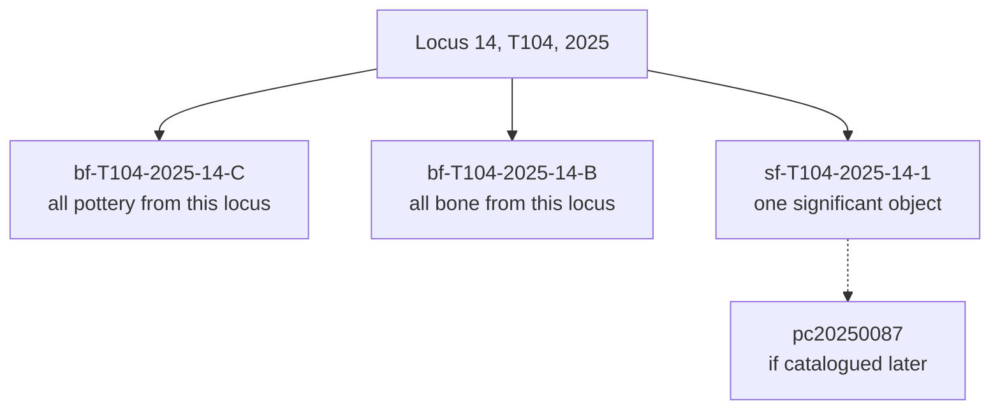

# Find

An object recovered from a deposit and recorded with where it came from. The
association between the object and its [locus](locus.md) is what dates it, and
that association is the record's whole value.

## What it is

A find is anything picked up during excavation and kept: pottery, bone, tile,
metal, plaster, stone.

What makes it archaeologically useful is not the object but its **context**. A
pot with no recorded locus is decoration. The same pot recorded as Locus 14 of
T104 dates that deposit and is dated by it.

Poggio Civitate distinguishes three kinds, each with its own
[identifier format](find-identifiers.md):

| Kind | Recorded as | Meaning |
|---|---|---|
| **Bulk find** | `bf-T104-2025-1-T` | Material collected together by category from one locus |
| **Special find** | `sf-T111-2025-1-1` | An individually significant object, recorded on its own |
| **Catalogued object** | `pc20240001` | An object entered in the site catalogue |

Bulk finds are collected by **material letter**: `T` tile, `P` plaster,
`C` pottery, `B` bone, and so on. Four categories are bulk-collected from the
start of every trench.

## The picture



## Why excavation records it

The object dates the deposit and the deposit dates the object. Neither works
alone, so the association is the record.

Bulk collection makes the volume tractable. A trench produces thousands of tile
fragments; recording each individually would be impossible, and recording them as
"all the tile from Locus 14" preserves the association that matters.

Special finds are the exception, something whose individual position is worth
recording, often with a total-station shot giving its exact coordinates. See
[survey point codes](survey-point-codes.md).

## How this project stores it

Finds are attached to a job and can be logged **independently of any drawing**.
`poggio_webapp/pipeline/editor/finds.py`:

```python
def add_find(job_id: str, find: dict) -> dict:
    """
    Append an artifact find to an existing job and return the stored find.

    A find may be logged independently of any saved or finalized editor state.
    """
```

The required fields, in
`poggio_webapp/pipeline/editor/schema.py`:

```python
REQUIRED_FIND_FIELDS = (
    "face_id",
    "x",
    "y",
    "elevation",
    "locus",
    "description",
)
```

`locus` is required, because a find without a context is not a record. So are
position and elevation.

```json
{
  "find_id": "a4c1e07b9d32",
  "face_id": "southern baulk",
  "x": 1.24,
  "y": 0.63,
  "elevation": 270.81,
  "locus": "14",
  "description": "coarseware rim sherd"
}
```

### Deliberately not idempotent

```python
stored_find = dict(find)
if "find_id" not in stored_find:
    stored_find["find_id"] = uuid.uuid4().hex[:12]
finds.append(stored_find)
```

Two sherds from the same locus are two finds. Deduplicating them would be wrong,
unlike unit import, which *is*
[idempotent](../cs/idempotency.md). The caller may supply its own
`find_id`, which is the escape hatch for a retry that should not duplicate.

### Copied into the finalized output, replacing rather than appending

```python
def sync_finds_to_output(job_id: str) -> None:
    """Copy the current artifact finds into an existing finalized output."""
    output_path = storage.JOBS_DIR / job_id / "extraction_output.json"
    if not output_path.exists():
        return

    output = json.loads(output_path.read_text())
    output["finds"] = get_finds(job_id)
    output_path.write_text(json.dumps(output, indent=2))
```

`output["finds"] = ...` replaces, so running it repeatedly is safe. The early
return means syncing before finalization does nothing.

### The site's own identifier formats

`poggio_webapp/pipeline/site_vocab.py` encodes them, and explains why the
application stopped inventing its own:

> the application previously carried its own parallel vocabularies -- a
> hand-written feature-type list in the drawing UI, and ``uuid4`` find
> identifiers -- which meant nothing it recorded could be matched against the
> project's own records without a human translating. Identifiers are the part of
> a record that has to survive leaving the machine that made it.

That last sentence is the argument. A `uuid4` is unique and meaningless; a
`bf-T104-2025-14-C` matches the tag on the bag.

## What it is not

| Not a… | Because |
|---|---|
| **[Feature](feature.md)** | A feature is a shape *drawn* in section. A find is an object *recovered*. The same stone can be both (drawn on the section and bagged), and the two records serve different purposes. |
| **[Marker](marker.md)** | A marker is a pencil dot at a boundary vertex. |
| **[Locus](locus.md)** | A find comes *from* a locus. `locus` is one of its required fields. |
| **[Interface point](interface-point.md)** | An interface point is boundary geometry feeding the model. A find is an object and never contributes to a surface. |
| **A catalogue entry** | Catalogued objects (`pc`, `vdm`) are a further step, with their own numbering. Not every find is catalogued. |

## Getting it wrong

**Recording a find without a locus.** The schema refuses:

> Missing required find field(s): locus

**Recording a find on the wrong side of a
[numbering epoch](locus-numbering-epochs.md).** "Locus 14" is ambiguous across a
restart, and a find filed under the wrong epoch is attributed to a different
deposit entirely.

**Treating a drawn feature as a find record.** Drawing a stone in section does
not record it as collected material. They are separate records, and
`site_vocab` links them by material letter so the connection can be made
deliberately.

**Using an invented identifier.** A `uuid4` cannot be matched to a bag tag or to
the site database. The formats exist so the record survives leaving this
software.

**Mixing lowercase and canonical spellings and expecting a mismatch.** Both are
in circulation (hand-written tags use lowercase, the Kobo forms use the
canonical trench spelling), so parsing is deliberately case-insensitive.

## Related pages

- [Find identifiers](find-identifiers.md): the three formats in full.
- [Feature](feature.md): the drawn-shape record.
- [Locus](locus.md): the required context.
- [Survey point codes](survey-point-codes.md): how a special find's position is
  shot.
- [Markers, features, and finds](../concepts/markers-features-and-finds.md): the
  three compared.
- [Log a find](../workflows/logging-finds.md): the workflow.
