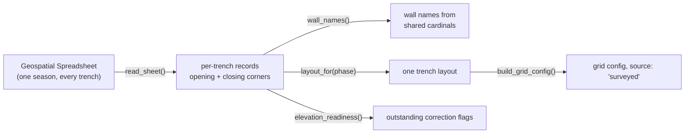

# Geospatial Spreadsheet

The season's master record of where every trench is. One file, one row block
per trench, holding the corner coordinates that would otherwise be typed into
this application one trench at a time.

## What it is

*Excavation and Documentation Procedures* sends every trench's corners to one
place:

> please record your coordinates in the Geospatial Spreadsheet, under the
> "Opening Coordinates" column.

So the numbers this application otherwise asks for (origin, bearing, wall
length) already exist for a whole season, in one file, before anyone opens the
modelling side. `poggio_webapp/pipeline/geospatial_sheet.py` reads a downloaded
copy and hands each trench to [trench layout](trench-layout.md).

Alongside the coordinates it carries the supervisors, the trenchbook title, the
open/closed state, and a set of **Adjusted Elevations** flags.

## The picture



Three things about the sheet's shape drive the parsing.

**A trench spans several rows.** Only the first carries the trench id; the rest
are continuation rows holding the remaining corners and any second supervisor.
A blank id means "still the previous trench", not "no trench".

**Coordinates arrive already signed.** Cells read `NW: 100/-20`, not
`100E/20S`. The cardinal inversion was applied before the number reached the
sheet, so no inversion is applied on read. Doing it here would apply it twice
and mirror the site. This is the same rule [site coordinates](site-coordinates.md)
documents, confirmed for the first time by live records rather than by prose.

**Not every trench is a rectangle.** A trench extended mid-season has eight
corners and unlabelled cells, and its closing outline differs from its opening
one. Both phases are read, and which one a model registers to is the operator's
decision rather than the module's.

## Why excavation records it

A trench is staked before it is dug: a total station puts a nail at each
corner, the coordinates go on surveyor's tape wrapped round the nail, and the
same numbers go into this spreadsheet. Three independent records of one fact,
which is the redundancy pattern the whole recording system runs on.

The spreadsheet is the one of the three that covers the *season* rather than
the trench. That is what makes it useful here: registering twelve trenches from
twelve trenchbooks means opening twelve books, and registering them from this
file means reading one.

## How this project stores it

`read_sheet()` returns a record per trench, keyed by
[canonical label](trench.md):

```json
{
  "trench": "T900",
  "recorded_label": "T900",
  "supervisors": ["Supervisor One", "Supervisor Two"],
  "trenchbook": "ABC/DEF I",
  "state": "Closed",
  "opening": [{"corner": "NW", "gridX": 100.0, "gridY": -20.0}],
  "closing": [{"corner": "NW", "gridX": 100.0, "gridY": -20.0}],
  "adjusted_elevations": {"Adjusted Elevations: Locus Forms?": "FALSE"}
}
```

`wall_names()` names the wall between two consecutive corners from the cardinal
they share: NW to NE is the north wall, NE to SE the east wall. Where a corner
has no label (the extra vertices of an extended trench), the name comes back
empty rather than invented, because "wall 5" would match nothing on any
drawing.

`layout_for()` then produces the layout that [trench layout](trench-layout.md)
turns into a grid config.

## What it is not

**It is not a source of elevations.** The sheet has no Z column at all. A grid
config derived from it has no `surfaceZ` on any face and says so. Elevations
come from the trenchbook's opening-elevation entries, and a face without one
[cannot be registered](../worked-example/registration.md).

**The Adjusted Elevations flags are not elevations.** They record whether
below-datum readings have been corrected to absolute in each *kind* of record:
locus forms, SF forms, daily logs, catalogue forms. `elevation_readiness()`
surfaces the ones still `FALSE`, because a trench whose corrections are
outstanding has no usable elevation anywhere, however many numbers its
trenchbook contains.

**It is not the trenchbook's Trench Layout section.** Both hold the same four
corners, and where they disagree neither is automatically right. The
[worked example](../worked-example/registration.md) has a trench whose two
records agree exactly, which is what makes it worth checking that they do.

## Getting it wrong

| Mistake | What happens |
|---|---|
| Uploading a different spreadsheet | Refused, with the file's own column names listed |
| A stray word in the trench column | Noted and skipped, not read as a trench |
| Expecting the extended trench to register | Returned under `needs_wall_names` until its walls are named |
| Assuming a registered trench can be modelled | It still has no `surfaceZ`; the build refuses until elevations arrive |
| Re-applying the cardinal inversion | The site mirrors. The sheet's values are already signed |

Nothing is written. `/api/trenches/geospatial-sheet` reads the uploaded file
and returns each trench's config for checking; the system of record is
untouched.

## Related pages

- [Trench layout](trench-layout.md): what one trench's corners become
- [Grid registration](grid-registration.md): what a registration is for
- [Site coordinates](site-coordinates.md): the signing rule these cells already carry
- [Datum](datum.md) and [elevation](elevation.md): what this sheet does not hold
- [Kobo locus import](kobo-locus-import.md): the other record-driven import
- [Registering the worked example](../worked-example/registration.md): a corner elevation that was never taken
