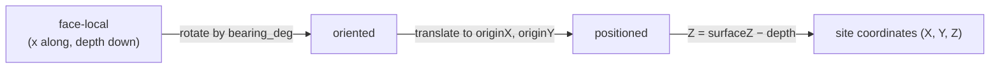

# Grid registration

The four surveyed values that place a [face](face.md) in the site's coordinate
system. The project's own documentation calls registration "the binding
constraint" — everything else can be right and a bad registration still ruins
the model.

## What it is

A traced drawing gives measurements relative to its own edge. Registration says
where that edge is in the world:

| Value | Meaning |
|---|---|
| `originX` | site X (easting) of the face's **x = 0** edge |
| `originY` | site Y (northing) of the same edge |
| `surfaceZ` | ground-surface [elevation](elevation.md) at that edge |
| `bearing_deg` | compass direction the face's local **+x** axis points |

Four numbers per face. Together they define a rigid transform from face-local
metres to [site coordinates](site-coordinates.md).

They come from **survey**, not from the drawing. A total station, a GNSS
receiver, or a tape from established grid pegs — a different act, by a different
person, from different evidence than tracing.

## The picture



## Why excavation records it

Without registration a drawing is a shape with no location. Two walls of one
trench cannot be joined, two trenches cannot be compared, and no find can be
placed.

Separating it from tracing is deliberate. Tracing needs the drawing and one real
measurement; registration needs survey data. Keeping them apart means a face can
be re-registered without re-tracing, and a mistake in one does not contaminate
the other.

## How this project stores it

Keyed by [face](face.md) name:

```json
{
  "faces": {
    "southern baulk": {
      "originX": 512.30,
      "originY": 1043.75,
      "surfaceZ": 271.44,
      "bearing_deg": 92.5
    }
  }
}
```

The generated starter config defines each term in its `_comment`:

```python
"_comment": "Fill in real site values. bearing_deg = compass direction "
            "(clockwise from north) that the face's local +x axis points. "
            "originX/Y = site coords of the face's x=0 edge. surfaceZ = "
            "ground-surface elevation at that edge.",
```

### The transform

```python
X0, Y0 = cfg["originX"], cfg["originY"]
Z0 = cfg["surfaceZ"]
th = math.radians(cfg["bearing_deg"])
sin_t, cos_t = math.sin(th), math.cos(th)

def to_site(x, depth, X0=X0, Y0=Y0, Z0=Z0, sin_t=sin_t, cos_t=cos_t):
    X = X0 + x * sin_t
    Y = Y0 + x * cos_t
    Z = Z0 - depth
    return X, Y, Z
```

`sin` on X and `cos` on Y because `bearing_deg` is a
[compass bearing](bearing-and-azimuth.md), not a mathematical angle.

### Completeness is enforced before finalizing

`poggio_webapp/pipeline/editor/validation.py`:

```python
GRID_REGISTRATION_FIELDS = ("originX", "originY", "surfaceZ", "bearing_deg")
```

```python
missing_fields = [
    field for field in GRID_REGISTRATION_FIELDS
    if not _is_finite_number(registration.get(field))
]
bearing = registration.get("bearing_deg")
if (
    "bearing_deg" not in missing_fields
    and not 0 <= bearing <= 360
):
    missing_fields.append("bearing_deg")

if missing_fields:
    raise IncompleteGridRegistrationError(
        f'Face "{face_name}" grid registration is incomplete: '
        f'{", ".join(missing_fields)}.')
```

An out-of-range bearing is folded into the *same* "incomplete" message, because
to a user a bearing of 400° is as unusable as a missing one — and one message
listing every bad field beats four separate errors.

### The placeholder refusal

The starter config stamps out a pattern:

```python
cfg["faces"][name] = {
    "originX": 0.0 + i * 10.0,
    "originY": 0.0,
    "surfaceZ": 100.0,
    "bearing_deg": 90.0,
}
```

Every face on **bearing 90**, ten metres apart. Left in place, that lays the
walls in a parallel row rather than around a pit — and the model looks entirely
convincing.

`poggio_webapp/pipeline/merge_walls.py` detects it:

```python
# The pattern make_starter_config() stamps out: face i gets originX = i * 10,
# originY 0, surfaceZ 100, bearing 90. Left in a config it silently produces a
# row of parallel walls 10 m apart instead of a pit.
_PLACEHOLDER_ORIGIN_STEP = 10.0
_PLACEHOLDER_ORIGIN_Y = 0.0
_PLACEHOLDER_SURFACE_Z = 100.0
_PLACEHOLDER_BEARING = 90.0
```

and `poggio_webapp/backend/services/trench_builder.py` refuses on it:

```python
raise TrenchBuildError(
    "these faces still carry the starter placeholder registration: "
    + ", ".join(repr(name) for name in sorted(placeholders))
    + ". Fill in real survey values (originX, originY, surfaceZ, "
      "bearing_deg) before building; placeholders would place the "
      "walls in a row instead of around the pit")
```

The service docstring explains why this one is fatal where geometry warnings are
not:

> Merged models amplify mis-registration -- placeholder values put the walls in
> a row 10 m apart instead of around a pit, which produces a confident-looking
> model of nothing.

### Corner adjacency, as a warning

`merge_walls.check_trench_grid_config` also checks that registered walls actually
meet — see [connected components](../cs/connected-components.md):

```python
warnings.append(
    f"face {name!r} is not connected to the rest of the "
    f"trench: neither of its ends lands within "
    f"{tolerance_m} m of another wall's end. Adjacent "
    "walls must share corner coordinates")
```

A warning, because an open end at an unexcavated side is legitimate.

## What it is not

| Not a… | Because |
|---|---|
| **Calibration** | [Calibration](scale-and-dpi.md) converts pixels to face-local metres and needs only the drawing. Registration converts face-local metres to site coordinates and needs survey. |
| **[Site coordinates](site-coordinates.md)** | Registration is the *transform*; site coordinates are the result. |
| **[Datum](datum.md)** | The datum is the vertical reference `surfaceZ` descends from. |
| **A property of the trench** | It is per **face**. Four walls need four registrations. |
| **Derivable from the drawing** | Nothing on a section says where the wall is. |

## Getting it wrong

**Leaving the placeholders.** The project's stated principal limitation: a merged
build refuses, and **a single-sheet build accepts them, with nothing marking the
result as unsurveyed.**

**Registering the wrong edge.** `originX/Y` is the site position of the face's
**x = 0** edge — where you started measuring — which is not necessarily a trench
corner. Register the wrong end and the wall is reflected along its own length.

**Using a mathematical angle.** `bearing_deg` is clockwise from north. Supplying
a counter-clockwise-from-east angle reflects the wall about a diagonal, and the
result looks like a plausible trench in the wrong orientation.

**Mixing datums between faces.** Caught by the
[datum spread](datum.md) warning, above two metres.

**Registering only some faces.** Fatal — a face missing from the config would be
silently dropped from the model.

## Related pages

- [Site coordinates](site-coordinates.md) — the target system.
- [Bearing and azimuth](bearing-and-azimuth.md) — the angle convention.
- [Datum](datum.md) and [elevation](elevation.md) — the vertical.
- [Face](face.md) — what is registered.
- [Similarity transforms](../cs/similarity-transforms.md) — the geometry.
- [Place on site](../workflows/06-place-on-site.md) — the workflow step.
