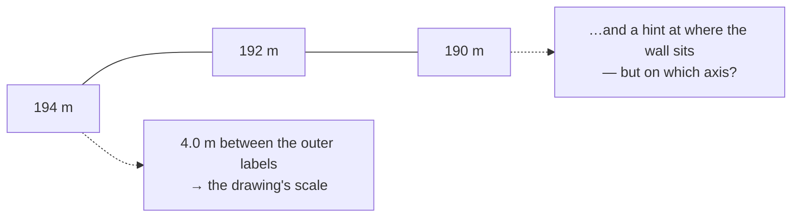

# Grid tie point

A coordinate label written along the edge of a field sheet, tying the drawing to
the site grid. Transcribed exactly as written and deliberately **not
interpreted**, because what the number means is a site-records question.

## What it is

A recorder drawing a wall on graph paper writes reference numbers along the top
edge — `194 m`, `192 m`, `190 m` — marking where the drawing sits relative to the
site grid.

These are **tie points**: they connect the sheet's own coordinate space to the
excavation's.

The difficulty is that the number alone does not say what it measures. `194`
could be a northing, an easting, or an elevation, depending on the trench's
orientation and the site's conventions. Only the excavation's records know.

They serve two purposes:

- **A scale reference.** Two labels a known distance apart give the drawing's
  scale — used directly by
  [marker detection](marker.md), where "194 m … 190 m" means 4.0 m between the
  clicks.
- **A registration hint.** They are the likeliest source of the
  [registration](grid-registration.md) values, if someone can say which axis they
  are on.

## The picture



## Why excavation records it

Without a tie, a section drawing is a shape with a scale and no location. The
labels are the recorder's note to their future self about where on the site this
wall was.

They also make the sheet **self-scaling**. A photograph of the sheet plus two
labelled points is enough to recover metres, with no separate scale bar.

## How this project stores it

Transcribed verbatim:

```json
"gridTiePoints": [
  { "rawText": "194 m", "approxXMeters": 0.0 },
  { "rawText": "192 m", "approxXMeters": 2.0 },
  { "rawText": "190 m", "approxXMeters": 4.0 }
]
```

`rawText` is what is written; `approxXMeters` is where on the drawing it appears.

### Surfaced, never interpreted

`poggio_webapp/pipeline/convert_coords.py`:

```python
if field_wall:
    # The sheet's own tie-in labels are the likeliest source of these
    # numbers, but what they mean (northing / easting / elevation) is a
    # site-records question -- surface them verbatim, don't interpret.
    ties = [t.get("rawText") for t in (data.get("gridTiePoints") or [])
            if t.get("rawText")]
    cfg["_tiePointsFromSheet"] = ties
    cfg["_comment"] += (
        " This is a single-wall field sheet, so there is one face. The "
        "labels transcribed off the drawing are listed in "
        "_tiePointsFromSheet for reference — they are NOT interpreted "
        "here; confirm against site records which are northings, "
        "eastings or elevations before using them."
    )
```

The starter grid config carries the labels **as reference material** with an
explicit warning. The software could guess — the numbers decrease left to right,
so perhaps they are northings — and guessing would produce a plausible
registration that is wrong by a rotation.

This is [fail-closed design](../cs/fail-closed-design.md) applied to
interpretation rather than to computation.

### Used as a scale sanity check

`poggio_webapp/pipeline/validator.py`:

```python
# Tie-point labels: transcribed verbatim on purpose, but if their spacing
# on the sheet disagrees with the drawn wall's own extent, the extraction's
# scale is probably wrong.
ties = [t for t in (data.get("gridTiePoints") or [])
        if isinstance(t.get("approxXMeters"), (int, float))]
numeric = []
for t in ties:
    raw = str(t.get("rawText", "")).strip().rstrip("m").strip()
    try:
        numeric.append((float(raw), t["approxXMeters"]))
    except ValueError:
        continue
if len(numeric) >= 2:
    numeric.sort(key=lambda v: v[1])
    label_span = abs(numeric[-1][0] - numeric[0][0])
    drawn_span = abs(numeric[-1][1] - numeric[0][1])
    if drawn_span > 0 and label_span > 0:
        ratio = label_span / drawn_span
        if ratio > 1.5 or ratio < 0.67:
            report.warn(where,
                        f"tie-point labels span {label_span:g} units but "
                        f"were placed across only {drawn_span:g} m of the "
                        f"drawing ({ratio:.1f}x apart). If those labels are "
                        "metre marks, the extracted scale is wrong.")
```

Clever, and carefully hedged. If labels reading 194 and 190 sit only 1 m apart on
the drawing, either the scale is wrong or the labels are not metres. The warning
says **"if those labels are metre marks"** — it does not assume they are.

Non-numeric labels are skipped rather than failing, and a warning rather than an
error, because the assumption might be wrong.

### As a scale source for marker detection

`poggio_webapp/pipeline/detect_markers.py` uses them directly:

> scale from TWO user clicks (wall's top-left and top-right corners) plus
> the real distance between them read off the sheet's own tie labels
> (e.g. 194 m ... 190 m -> 4.0)

with the alternative recorded as having failed:

> grid-line measurement proved fragile on phone photos (perspective, table
> background, line-edge harmonics)

The labels are more reliable than measuring the printed graph-paper grid.

## What it is not

| Not a… | Because |
|---|---|
| **[Grid registration](grid-registration.md)** | Registration is four surveyed values in a config. Tie points are labels on the sheet that *might* inform them. |
| **[Site coordinates](site-coordinates.md)** | A tie label is a number of unknown axis. Site coordinates are a full XYZ triple. |
| **A scale bar** | A scale bar shows a distance. Tie labels show *positions*, from which a distance can be derived. |
| **[Survey point codes](survey-point-codes.md)** | Those are instrument codes. Tie points are pencil labels on paper. |
| **Interpreted data** | Deliberately. `_tiePointsFromSheet` is reference material with a warning attached. |

## Getting it wrong

**Assuming the labels are northings.** They might be eastings, or elevations. The
config says to confirm against site records, and it means it.

**Using them as registration without checking.** A wrong axis assumption rotates
the wall 90° and produces a model that looks like a plausible trench somewhere
else.

**Assuming they are metres.** The validator's warning is phrased conditionally
for exactly this reason.

**Omitting them.** Legitimate, and it means the sheet has no internal scale
reference and no location hint. The
[calibration](scale-and-dpi.md) then needs a distance from another source.

**Transcribing them "tidily".** `rawText` should be exactly what is written,
including units, spacing, and any ambiguity. Normalising it discards the evidence
of what the recorder actually wrote.

## Related pages

- [Recording sheet](recording-sheet.md) — where the labels are written.
- [Scale and DPI](scale-and-dpi.md) — how a real distance becomes a scale.
- [Grid registration](grid-registration.md) — what they might inform.
- [Marker](marker.md) — the detector that uses them for scale.
- [Fail-closed design](../cs/fail-closed-design.md) — why they are not
  interpreted.
