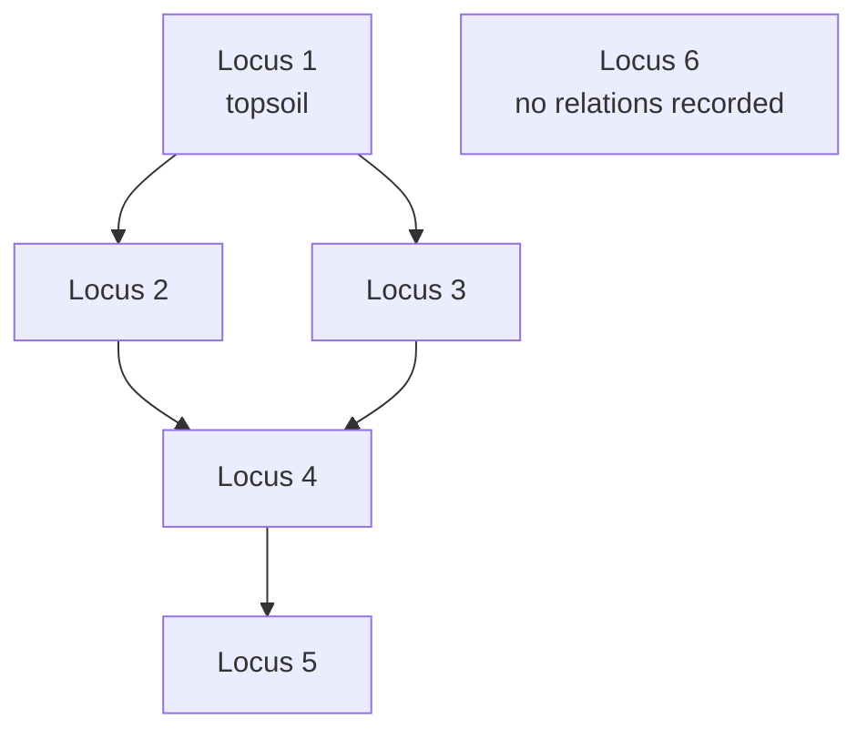

# Harris Matrix

The standard diagram of a site's stratigraphic sequence: boxes for units, lines
for relationships, youngest at the top. A directed acyclic graph, drawn by
archaeologists since 1973.

## What it is

Devised by Edward Harris, the matrix separates the **sequence** from the
**geometry**. A section drawing shows where deposits are; the matrix shows only
what came before what.

The conventions:

- Each **unit** ([layer](layer.md), [cut](cut.md), [fill](fill.md),
  structure) is a box.
- A **line** from a higher box to a lower one means "the upper is younger."
- Vertical position is relative age. Youngest at the top.
- Horizontal position means nothing. Side-by-side boxes are unordered, not
  contemporaneous.
- Only **immediate** relationships are drawn. An implied relationship is
  omitted, so an arrow means direct stratigraphic contact.

That last convention is why [transitive reduction](../cs/transitive-reduction.md)
is a correctness requirement rather than a tidying step.

## The picture



Locus 2 and Locus 3 sit side by side: both younger than 4, both older than 1,
and **unordered relative to each other**. Locus 6 floats because nothing has been
recorded about it yet.

## Why excavation records it

A section drawing shows one plane. A matrix covers the whole site, including
units that never appear in the same section.

It is also where **contradictions become visible**. Three relationships that
cannot all hold are obvious as a loop in a diagram and invisible in a list of
observations.

And it is the working document for interpretation (phasing, correlation,
grouping) done on the matrix rather than on the drawings.

## How this project stores it

A matrix is a workspace of its own, independent of any drawing job, in
`poggio_webapp/matrices/<id>/matrix.json`:

```json
{
  "schema_version": 1,
  "matrix_id": "c891fea0ad60",
  "revision": 7,
  "title": "T104 sequence",
  "site": "Poggio Civitate",
  "trench": "T104",
  "source_job_ids": ["1c786bad7267"],
  "units": [ ... ],
  "relations": [ ... ],
  "correlations": [ ... ],
  "suggestions": [ ... ]
}
```

Four collections, four distinct roles:

| Collection | Holds |
|---|---|
| `units` | the boxes, with labels, types, and source references |
| `relations` | the lines: younger, older, kind, **evidence** |
| `correlations` | judgements that two units are the same deposit |
| `suggestions` | machine proposals, each individually accepted or rejected |

### Units can be imported without changing the source

`poggio_webapp/pipeline/harris_import.py` reads finished jobs and creates one
unit per layer, with a
[content-addressed ID](../cs/content-addressed-identifiers.md) derived from
where it came from:

```python
def _unit_id(job_id, schema_type, face, layer_index) -> str:
    identity = f"{job_id}|{schema_type}|{face}|{layer_index}"
```

so re-importing merges rather than duplicating. See
[idempotency](../cs/idempotency.md). Each unit keeps a `source_refs` list
pointing back at the drawing it came from, and the source job is never modified.

### The graph is validated on every read and write

```python
report = validate_matrix_graph(matrix)
if not report["ok"]:
    error_codes = sorted({issue["code"] for issue in report["errors"]})
    raise InvalidMatrixError(
        "Matrix graph is invalid: " + ", ".join(error_codes) + ".",
        error_codes=error_codes,
    )
```

Errors include `cycle`, `missing-unit`, `self-relation`, `duplicate-relation`,
`overlapping-correlation`, and `relation-within-correlation`. Warnings include
`redundant-relation`, `isolated-unit`, and `generic-label`.

### The diagram is generated deterministically

`poggio_webapp/pipeline/harris_render.py` produces SVG with no layout library:
[longest-path ranking](../cs/layered-graph-drawing.md) so every edge points
downward, and sorted ordering within each rank so the same matrix always renders
identically.

The header states the reading convention on the diagram itself:

```python
_append_text(
    header, "Chronology flows downward: younger units are above older units.", ...
)
```

## What it is not

| Not a… | Because |
|---|---|
| **[Stratigraphy](stratigraphy.md)** | The matrix is a diagram *of* the stratigraphy. The stratigraphy is in the ground. |
| **A section drawing** | The section shows geometry; the matrix shows only sequence. Neither replaces the other. |
| **A timeline** | Vertical position is relative order, not elapsed time. Two adjacent boxes may be a day or a century apart. |
| **Automatic** | Every relationship is asserted by a person, with evidence. Suggestions are proposals requiring individual review. |
| **A phasing diagram** | Grouping units into periods is a further interpretive step this application does not do. |
| **The 3D model** | The model is geometry. The matrix is chronology. They are built from the same jobs and answer different questions. |

## Getting it wrong

**Reading horizontal position as meaning.** Side-by-side boxes are *unordered*,
not contemporaneous. The diagram cannot express contemporaneity.

**Expecting the software to build it for you.** It proposes and refuses to
decide. `harris_suggestions` generates conservative proposals; every one must be
accepted or rejected individually, and accepting one revalidates the whole graph.

**Correlating on label similarity.** Two units labelled "Locus 5" on different
walls may be different deposits. The correlation *suggestion* exists, and it is
a proposal:

> Matching normalized labels appear in different jobs or faces.

**Leaving generic labels.** An imported unit that still reads `Polygon 3` carries
no meaning, and the validator warns:

> Unit unit-4f2a8c1e9b03 still has generic label 'Polygon 3'.

**Treating a redundant relation as an error.** An edge implied by a longer path
is omitted from the *display* and kept in the data, because the archaeologist
observed something, and the software's inference that it is implied could later
be wrong.

## Related pages

- [Stratigraphy](stratigraphy.md): what the matrix diagrams.
- [Stratigraphic relationships](stratigraphic-relationships.md): the edge
  vocabulary.
- [Correlation](correlation.md): the equals judgement.
- [Directed acyclic graphs](../cs/directed-acyclic-graphs.md): the structure.
- [Transitive reduction](../cs/transitive-reduction.md): why implied edges are
  hidden.
- [Layered graph drawing](../cs/layered-graph-drawing.md): how it is drawn.
- [Build and review a Harris Matrix](../workflows/harris-matrix.md): the
  workflow.
