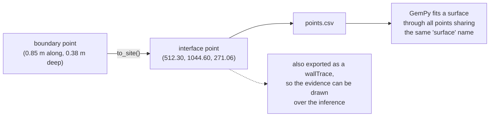

# Interface point

One point on a named stratigraphic surface, in [site coordinates](site-coordinates.md).
The unit the model is built from — and the thing a reader should be able to
distinguish from the interpolated surface passing through it.

## What it is

A [boundary](boundary.md) traced on a wall is a sequence of points in face-local
metres. Converted through the face's [registration](grid-registration.md), each
becomes an **interface point**: a position in the shared site system, tagged with
which stratigraphic surface it lies on.

```
X, Y, Z, surface, face
```

Five fields. The first three are the position; `surface` is what the interpolator
groups by; `face` records which wall it came from.

Interface points are the model's **evidence**. Every surface GemPy produces is
fitted to them, and everywhere else is inference.

## The picture



## Why the model needs it

GemPy interpolates a scalar field whose iso-surfaces are the stratigraphic
interfaces. Interface points are the constraint saying "the field takes this
value here"; [orientation seeds](orientation-seed.md) constrain its gradient.

The name matters as much as the position. **GemPy fuses points into one surface
by exact string match on `surface`** — so a deposit recorded on two walls
contributes to one surface only if both produce the identical string.

## How this project stores it

`poggio_webapp/pipeline/convert_coords.py`:

```python
for layer in face.get("layers") or []:
    surface = layer.get("inferredMaterial") or layer.get("layerName") or "unknown"
    bb = layer.get("bottomBoundary") or []
    pts = [(get_x(p), get_y(p)) for p in bb]
    pts = [
        (x, d)
        for (x, d) in pts
        if isinstance(x, (int, float)) and isinstance(d, (int, float))
    ]
    for x, d in pts:
        X, Y, Z = to_site(x, d)
        rows.append(
            {
                "X": round(X, 4),
                "Y": round(Y, 4),
                "Z": round(Z, 4),
                "surface": surface,
                "face": fname,
            }
        )
```

Written to `points.csv`:

```csv
X,Y,Z,surface,face
512.3000,1043.7500,271.1300,Locus 2,southern baulk
512.3000,1044.6000,271.0600,Locus 2,southern baulk
```

Three details.

**Only points with usable numbers are converted.** A [boundary](boundary.md)
point with a null coordinate — legitimately recorded as unreadable — contributes
nothing rather than a zero.

**Rounded to four decimal places**, which is 0.1 mm and as much as the tracing
supports. See
[grid snapping and quantisation](../cs/grid-snapping-and-quantisation.md).

**`face` travels with every point.** That is what makes
[wall traces](../cs/interpolation-vs-measurement.md) possible, and what lets the
build detect surfaces recorded on only one wall:

```python
coverage = points.groupby("surface")["face"].unique()
single_face = {surf: faces[0] for surf, faces in coverage.items() if len(faces) == 1}
```

### Zero points is a refusal

```python
if conversion["n_points"] == 0:
    raise TrenchBuildError(
        "conversion produced no interface points; check that the walls' "
        "layers have boundary points"
    )
```

and the single-sheet route explains the two possible causes:

```python
return jsonify(
    {
        "error": "conversion produced 0 points. Either no face in the "
        "extraction matched a name in the grid config "
        f"(unmatched: {', '.join(result['missing_faces']) or 'none'}), "
        "or the layers carry no usable boundary coordinates."
    }
), 400
```

### Exported back as evidence

`poggio_webapp/pipeline/build_gempy.py`:

```python
def wall_traces(points):
    """One polyline per (face, surface): the points actually traced on that
    wall, in along-wall order.

    A viewer can draw these over the interpolated surfaces so a reader can
    tell data from interpolation -- everything away from a trace is the
    interpolator's guess.
    """
```

The interface points are shipped **twice**: once to the interpolator as
constraints, once to the viewer as evidence. That duplication is the whole
mechanism for keeping measurement and inference distinguishable.

The ordering detail matters, because in site coordinates a wall is no longer
axis-aligned:

```python
x_span = group["X"].max() - group["X"].min()
y_span = group["Y"].max() - group["Y"].min()
ordered = group.sort_values("X" if x_span > y_span else "Y", kind="stable")
```

## What it is not

| Not a… | Because |
|---|---|
| **[Boundary](boundary.md) point** | A boundary point is in face-local metres; an interface point is in site coordinates. Same measurement, two spaces. |
| **[Marker](marker.md)** | A marker is a pencil dot in pixels. It may become a boundary point, which may become an interface point. |
| **[Find](find.md)** | A find is a recovered object. It has coordinates and never contributes to a surface. |
| **[Orientation seed](orientation-seed.md)** | A seed carries a *direction* as well as a position, and there is one per surface per wall rather than one per traced point. |
| **A model surface** | The surface is interpolated *through* the points and extends far beyond them. |
| **[Survey point](survey-point-codes.md)** | A total-station shot is measured directly into site coordinates. An interface point is reconstructed from a drawing. The same space, two routes. |

## Getting it wrong

**Inconsistent surface names across walls.** GemPy fuses by exact string match,
so anything inside the name is part of the deposit's identity. That is why
`surface_id` is the [locus number alone](munsell-colour.md) — a differing
Munsell reading between two walls used to split one deposit into two surfaces,
and no longer can.

**Expecting points where boundaries were not traced.** Only traced boundaries
produce interface points. A layer with no `bottomBoundary` contributes nothing.

**Reading the interpolated surface as data.** The points are the evidence. The
surface is a hypothesis fitted to them — see
[interpolation versus measurement](../cs/interpolation-vs-measurement.md).

**Expecting a face missing from the grid config to be interpolated anyway.** It
is dropped, and that is fatal rather than silent:

> the grid config has no entry for these faces: 'west wall' -- they would be
> dropped from the model

**Building on a single face and treating the result as three-dimensional.** One
plane of points cannot constrain a volume. The build names the surfaces
affected.

## Related pages

- [Boundary](boundary.md) — where interface points come from.
- [Site coordinates](site-coordinates.md) — the space they live in.
- [Grid registration](grid-registration.md) — the transform.
- [Orientation seed](orientation-seed.md) — the other model input.
- [Spatial interpolation and kriging](../cs/spatial-interpolation-and-kriging.md) —
  what consumes them.
- [Output files](../reference/output-files.md) — `points.csv` in full.
