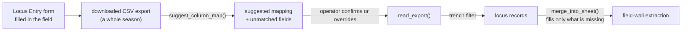

# Kobo locus import

Reading a downloaded **Locus Entry** export into this application's
[locus](locus.md) records, so that Munsell readings, descriptions, and opening
and closing elevations do not have to be retyped from a form that already has
them.

## What it is

The 2025 deployment runs a KoboToolbox **Locus Entry** form, "data entry for
loci described during fieldwork". *Excavation and Documentation Procedures* says
what ends up attached to it: elevations taken at every trench corner, a Munsell
designation, and the top plans drawn at opening and closing.

That is most of what the modelling side otherwise asks an operator to retype
while looking at a [recording sheet](recording-sheet.md). The import reads it
instead.

Two deliberate constraints shape the whole module:

**It reads a file, not the API.** Kobo's own guide recommends periodic XLS/ZIP
downloads, so a downloaded export is the normal artifact, and reading a file
keeps the promise that nothing leaves the machine. An API path would need a
token, and a token belongs in the environment rather than in this repository.

**It never guesses a column name.** A Kobo form's export headers depend on how
the form was built, and this module has never seen the real one.

## The picture



The operator is in the loop at exactly one point, confirming the column map,
and that is the point where a silent mistake would be unrecoverable.

## Why excavation records it

The Locus Entry form exists because a locus record has to be made *in the
field*, by the person who made the interpretation, at the moment they made it.
Everything downstream (the section drawing, the find bags, the publication)
refers back to what that person wrote.

Retyping it into a second system is where records diverge. Two versions of Locus
6's Munsell reading, differing because one was copied by eye, is a
[correlation](correlation.md) problem invented by the software. Importing
removes the retyping and therefore the divergence.

## How this project stores it

Uploaded to `POST /api/trenches/<label>/loci/import`:

```python
result = locus_import.read_export(
    text, column_map or None, vertical=vertical or None, trench=label
)
```

and the route states the constraints again for whoever reads it there:

> A file, not the API: Kobo's own guide treats periodic downloads as the normal
> artifact, and reading a file keeps the promise that nothing leaves the
> machine. Column names are never guessed -- the response says which mapping
> was used, and an unrecognised export is refused with its own headers listed.

### Column mapping is suggested, never assumed

```python
def suggest_column_map(headers):
    """A starting column map, plus the fields nothing plausible matched.

    Matching is on a normalized header (lowercased, punctuation flattened), so
    "Locus Number" and "locus_number" both land. Anything it cannot place is
    returned for the operator to map, not filled in with a nearby column.
    """
```

"Not filled in with a nearby column" is the rule. The failure this avoids is
mapping `closing_elevation` to a column that happens to be adjacent and
producing forty locus records that are internally consistent and wrong.

When a required column cannot be identified the import refuses **and lists the
headers it actually saw**, which is the one thing that makes the mapping easy to
fix. Compare a bare "unrecognised export". See
[error taxonomies](../cs/error-taxonomies.md).

### One bad row is a note, not a failure

```python
"""...
Never raises for a single bad row: a row that cannot be
read becomes a note, because one malformed entry should not cost the
operator the other forty.
"""
```

The severity split runs all the way down. A bad provenance URI in one row is
caught per-row:

```python
try:
    uri = provenance.open_context_uri(cell(row, "open_context_uri"))
except provenance.ProvenanceError as error:
    uri = ""
    notes.append(f"row {index}: {error}")
```

A repeated locus number keeps the first and says which row it came from:

```python
notes.append(
    f"row {index}: locus {number} was already read from row "
    f"{seen[number]}; keeping the first and ignoring this one"
)
```

That is the same first-wins-and-say-so rule the converter applies to duplicate
`loci[]` entries (see [locus](locus.md)).

Row indices start at 2 because row 1 is the header, so a note names the line the
operator will see in a spreadsheet.

### An export covers a season; a model covers a trench

```python
wanted_trench = canonical_trench(trench) if trench else ""
```

Trench labels are compared through `naming.canonical_trench`, so `T104`,
`t104`, and `T-104` filter the same rows. Locus numbers go through
`canonical_locus` for the same reason.

### The import is a second source, not a better one

```python
def merge_into_sheet(...):
    """Fill a field-wall extraction's ``loci`` from imported records.

    Only fills what the sheet is missing unless ``overwrite`` is set. The
    recorder traced the sheet and typed what they saw on it; an import is a
    second source, and quietly preferring it would replace an observation with
    a transcription of a different one.
    """
```

This is the sharpest judgement in the module. The Kobo record and the section
drawing are **two observations of one deposit**, made at different moments,
possibly by different people. Neither is authoritative over the other, so the
import fills gaps and stops. Overwriting is available and has to be asked for.

Imported records are marked as such:

```python
"confidence": "imported-from-locus-record",
```

so a reader can always tell which fields were typed off the drawing and which
arrived from the form.

### Elevations pass through the vertical frame

Opening and closing elevations are read through `_elevation` with the config's
`vertical` block, so a below-datum reading is resolved against the datum nail's
own elevation rather than stored as if it were absolute. See
[elevation](elevation.md) and [datum](datum.md).

## What it is not

| Not a… | Because |
|---|---|
| **A Kobo integration** | Nothing talks to Kobo. A file is downloaded by a person and uploaded here. |
| **A synchronisation** | One direction, once. Nothing is written back, and a later export does not update what was imported. |
| **[Provenance links](provenance-links.md)** | Those are pointers to the record. This reads the record's *contents* as data. Rows carry both. |
| **An [extraction](trench-profile.md)** | An extraction is geometry traced off a drawing. This is the locus register (colour, description, elevations) with no geometry at all. |
| **Authoritative over the sheet** | It fills gaps. The recorder's own entries win unless overwrite is asked for. |

## Getting it wrong

**Confirming a suggested column map without reading it.** The suggestion is a
starting point matched on normalised header text. It can be right about nine
fields and wrong about the tenth, and nothing downstream will notice.

**Importing a season-wide export without a trench filter.** Loci from other
trenches are then read as this one's. The route passes the label; a direct call
to `read_export` without `trench` does not.

**Setting `overwrite` to resolve a disagreement.** A difference between the form
and the sheet is a real fact about the recording, exactly as a
[Munsell](munsell-colour.md) disagreement between two walls is. Overwriting
hides it rather than resolving it.

**Assuming a locus present in the export exists on the drawing.** The import
fills `loci[]`. It creates no geometry, so a locus with no traced boundary still
contributes nothing to the model.

**Exporting as XLS and uploading it.** The route decodes UTF-8 text and refuses
otherwise, naming the fix: export it as CSV.

## Related pages

- [Locus](locus.md): what is being imported.
- [Recording sheet](recording-sheet.md): the paper the form duplicates.
- [Munsell colour](munsell-colour.md): the field most often imported.
- [Elevation](elevation.md) and [Datum](datum.md): how the readings resolve.
- [Provenance links](provenance-links.md): the pointers each row can carry.
- [Error taxonomies](../cs/error-taxonomies.md): why a bad row is a note and a
  bad header is a refusal.
