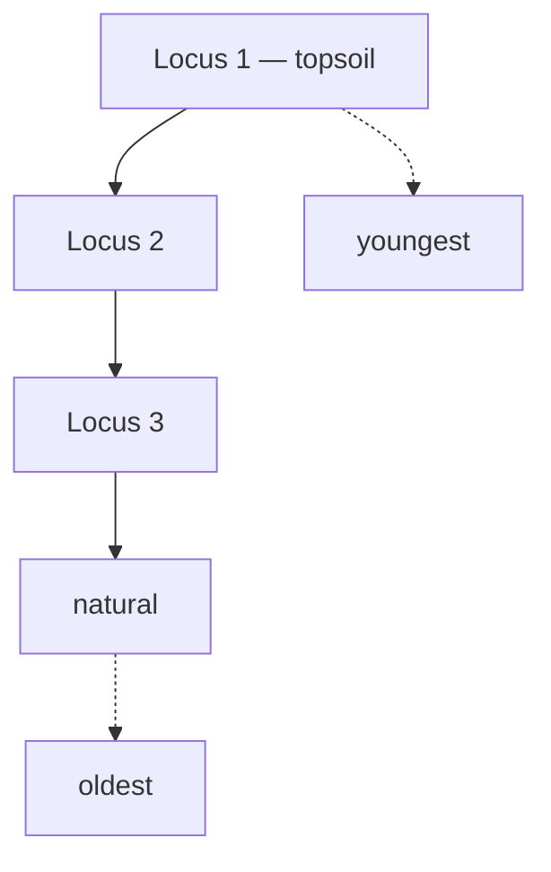

# Law of superposition

In an undisturbed sequence, what lies above was deposited later. The founding
principle of stratigraphy — and, in this software, an invariant enforced by
construction rather than checked afterwards.

## What it is

Stated by Nicolas Steno in 1669 for geological strata and carried into
archaeology: **in an undisturbed sequence, a deposit is younger than the deposit
beneath it.**

Simple, and it does an enormous amount of work. It is what turns a vertical
arrangement of soil into a chronology.

The qualifier matters. *Undisturbed* excludes:

- **[Cuts](cut.md)** — a pit dug from above puts younger material *below* older
  deposits.
- **Inversion** — upcast from a ditch can lay older material on top of younger.
- **Structures** — a wall foundation may be built into a trench cut through
  existing deposits.

So superposition is the default reading, and the exceptions are exactly what
excavators are trained to spot. Those exceptions are why the relationship
vocabulary has [`cuts` and `fills`](stratigraphic-relationships.md) alongside
`above`.

## The picture



Two units cannot swap:

```
Locus 2 is above Locus 3   →   Locus 2 is younger
Locus 3 is above Locus 2   →   contradiction — both cannot hold
```

## Why it is the foundation

Every relative date in archaeology descends from it. A find is dated by its
deposit; the deposit by its position; the position by superposition.

It is also the only dating method that needs **no external evidence**. No
typology, no radiocarbon, no historical reference — just the arrangement of the
soil, observed and recorded.

And it is what makes a contradiction meaningful. If the record says A is above B
*and* B is above A, one observation is wrong. That is a detectable, reportable
error rather than a matter of taste.

## How this project enforces it

Three layers of enforcement, from geometry up to graph structure.

### As a geometric error

`poggio_webapp/pipeline/validator.py` checks that boundaries do not cross:

```python
if prev_bottom and bottom:
    for x, y in bottom:
        above = depth_at_x(prev_bottom, x)
        if above is not None and y < above - monotonic_tolerance_m:
            report.err(
                where,
                f"bottom at x={x} (depth {y:.2f}) is ABOVE "
                f"{prev_name}'s bottom (depth {above:.2f}) — layers cross",
            )
```

An **error**, not a warning. Layers crossing is not unusual — it is impossible,
so it is a recording mistake by definition.

The comparison uses
[piecewise-linear interpolation](../cs/piecewise-linear-functions.md) because the
two boundaries rarely share x stations, and a
[tolerance](../cs/epsilon-comparison.md) because hand-traced lines do not agree
to the millimetre:

```python
DEFAULT_MONOTONIC_TOLERANCE_M = 0.02
```

### As an acyclicity requirement

`poggio_webapp/pipeline/harris_matrix.py` treats a
[cycle](../cs/cycle-detection.md) as the signature of a superposition
contradiction:

```python
cycle = _find_cycle(nodes, edges)
if cycle is not None:
    errors.append(
        _issue(
            "cycle",
            f"Chronological cycle detected: {' -> '.join(cycle)}.",
            cycle,
            _cycle_relation_ids(cycle, relation_ids_by_edge),
        )
    )
    order = []
    display_edges = []
```

No order and no diagram are produced for a cyclic graph, because neither exists.
See [directed acyclic graphs](../cs/directed-acyclic-graphs.md).

The check runs on every load, every save, and every accepted suggestion — the
last applied to a **copy** first, so a suggestion that would create a
contradiction is rejected wholesale:

```python
report = validate_matrix_graph(reviewed)
if not report["ok"]:
    raise _acceptance_error(suggestion, report)
```

### As ordering constraints across walls

`poggio_webapp/pipeline/merge_walls.py` turns each face's layer order into edges
and [topologically sorts](../cs/topological-sorting.md) the union. Contradictory
walls produce a cycle, and it refuses:

```python
return (
    "the walls contradict each other: these surfaces form a "
    "stratigraphic cycle and cannot be ordered young to old -- "
    + listed
    + ". Check the layer order on those walls, or correlate the loci "
    "explicitly; no order is guessed."
)
```

The message names the surfaces **and which wall each is on**, because resolving
it means going back to those drawings.

## What it is not

| Not a… | Because |
|---|---|
| **Absolute dating** | It gives order, never years. |
| **A law without exceptions** | Cuts, inversion, and structures all violate the naive reading. The vocabulary exists to record them. |
| **[Stratigraphy](stratigraphy.md)** | Superposition is one principle; stratigraphy is the whole discipline. |
| **True of all deposits everywhere** | It applies within a *sequence*. Two deposits on opposite sides of a trench with no physical relationship have no superposition relationship at all. |

## Getting it wrong

**Applying it across unrelated deposits.** Two units at the same elevation in
different parts of a trench are not contemporaneous, and the deeper of two
unrelated deposits is not necessarily older. Superposition holds only where units
are physically in contact.

**Missing a [cut](cut.md).** The most consequential error. A pit dug from an
upper level puts younger fill deep in the sequence; miss the cut, and
superposition reads it as early. Nothing in this software can detect it — only
the excavator can.

**Reading the model as evidence of order.** The 3D model interpolates. It renders
a surface everywhere, including where nothing was recorded, and the interpolated
part is not an observation.

**Assuming deeper means older across numbering epochs.** A trench reopened after
a gap may restart its locus numbering, so Locus 3 from one epoch and Locus 3 from
another are different deposits — see
[locus numbering epochs](locus-numbering-epochs.md).

## Related pages

- [Stratigraphy](stratigraphy.md) — the discipline built on it.
- [Cut](cut.md) — the most important exception.
- [Stratigraphic relationships](stratigraphic-relationships.md) — the vocabulary
  for the exceptions.
- [Harris Matrix](harris-matrix.md) — the diagram it produces.
- [Cycle detection](../cs/cycle-detection.md) — how a contradiction is found.
- [Validation rules](../reference/validation-rules.md) — the geometric check.
