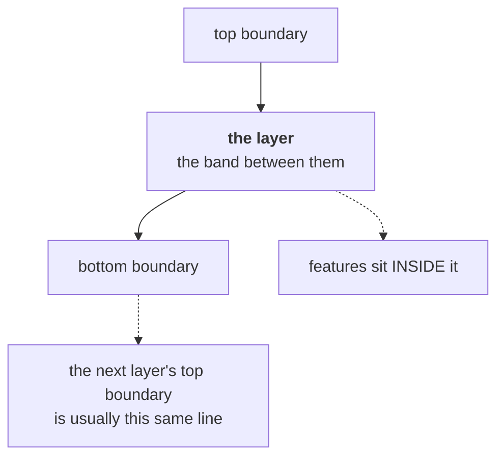

# Layer

A band of material visible in a section, between one boundary and the next. The
thing you actually see when you look at a trench wall.

## What it is

Looking at a trench wall you see stripes: a dark band at the top, a lighter one
below, a stony one below that. Each band is a **layer**: a body of material
distinguishable from what is above and below it.

A layer is defined by its **edges**. In this project's data model a layer is
exactly the region between a top boundary and a bottom boundary.

The relationship to [locus](locus.md) depends on the recording tradition:

- On a **field sheet**, layer and locus coincide: the band *is* the locus, and
  `layers[]` is keyed by `locusNumber`.
- On an **illustrator sheet**, layers have names and hatch patterns and **no
  locus numbers at all**; they are described, not numbered.

So *layer* is what you see, and *locus* is an excavation's numbered decision
about it.

## The picture



## Why excavation records it

Layers are the **units of the sequence**. Each was deposited at a moment, one
after another, and their order in the section is their order in time. Recording
the bands is recording the chronology.

They are also where finds come from. An object's layer is what dates it, the
central inferential move in stratigraphic archaeology.

## How this project stores it

Illustrator shape:

```json
{
  "layerName": "burnt destruction deposit",
  "inferredMaterial": "charcoal-rich silt",
  "description": "dense charcoal, fired daub fragments",
  "visualPattern": "dense stipple with cross-hatch",
  "topBoundary":    [ ... ],
  "bottomBoundary": [ ... ],
  "featuresInLayer": [ ... ]
}
```

Field-wall shape:

```json
{
  "locusNumber": "3",
  "topBoundary":    [ ... ],
  "bottomBoundary": [ ... ],
  "featuresInLayer": null
}
```

### Order is meaning

`layers[]` is **ordered top to bottom**, which is young to old. That ordering is
data, not presentation. `merge_walls` reads it as stratigraphic constraints:

```python
for earlier, later in zip(sequence, sequence[1:]):
    ...
    successors[earlier].add(later)
    indegree[later] += 1
```

Every adjacent pair within a face becomes an edge in a
[directed acyclic graph](../cs/directed-acyclic-graphs.md), and the constraints
from all walls are [topologically sorted](../cs/topological-sorting.md) into one
trench-wide order.

The manual tracer enforces the ordering rather than trusting it:

```python
original_order = [b["name"] for b in bottoms]
bottoms.sort(key=lambda b: _average_depth(b["points"]))
if [b["name"] for b in bottoms] != original_order:
    warnings.append(
        "Bottom boundaries were reordered from shallowest to "
        "deepest before building layers."
    )
```

Reorders, and **says so**.

### Layers share their boundaries

One traced line usually serves twice, as one layer's bottom and the next's top.
`manual_extraction.build_illustrator`:

```python
bands = []
top = surface
for bottom in bottoms:
    bands.append((top, bottom["points"]))
    top = bottom["points"]
```

Each layer's top is the previous layer's bottom. That is not an optimisation; it
is a statement that there is no gap between them.

### The layer name becomes the model surface

```python
surface = layer.get("inferredMaterial") or layer.get("layerName") or "unknown"
```

GemPy fuses interface points by **exact string match** on this name, so the same
deposit on two walls must produce the identical string. For a field sheet that
name is `convert_coords.surface_id(locusNumber)` (`Locus 6`, the locus number
alone), so two walls fuse on the number and a differing
[Munsell reading](munsell-colour.md) cannot split them.

## What it is not

| Not a… | Because |
|---|---|
| **[Locus](locus.md)** | On a field sheet they coincide; conceptually a layer is what you see and a locus is a numbered decision. Illustrator sheets have layers and no loci. |
| **[Boundary](boundary.md)** | The boundary is the *line*; the layer is the band between two of them. |
| **[Feature](feature.md)** | A feature sits *inside* a layer: a stone, a lens, a void. It never defines the layer's edge. |
| **[Cut](cut.md)** | A cut is the *absence* of material, a hole dug through layers. A layer is material present. |
| **Surface (model)** | The GemPy surface is derived from the layer's boundary. Renaming it in the CSV does not rename the layer. |
| **Context / stratigraphic unit** | A broader term covering layers, cuts, and structures. A layer is one kind. |

## Getting it wrong

**Recording layers out of order.** The order encodes the chronology. The tracer
reorders and warns; an extraction that lists them out of order produces a
[cycle](../cs/cycle-detection.md) when merged, and the build refuses.

**Crossing layers.** Physically impossible, so the validator makes it an
**error**:

> bottom at x=1.2 (depth 0.55) is ABOVE Locus 2's bottom (depth 0.48): layers
> cross

**A gap between layers**, by contrast, is only a **warning**, because a void can be
real:

> top at x=0.8 (depth 0.42) is far from Locus 1 bottom (depth 0.31): possible
> void/overlap

That severity split is [the archaeology speaking through the code](../cs/error-taxonomies.md).

**Naming the same deposit differently on two walls.** GemPy would model it as two
surfaces. Since identity is the locus number alone, the number is the thing
that must be right; a differing colour is reported and harmless.

**Confusing a layer with a feature.** A lens of charcoal a few centimetres across
is a feature within a layer; a charcoal-rich band running the wall's width is a
layer. The distinction is whether it defines an edge.

## Related pages

- [Locus](locus.md): the numbered decision.
- [Boundary](boundary.md): the lines that define it.
- [Feature](feature.md): what sits inside it.
- [Stratigraphy](stratigraphy.md): why order is meaning.
- [Layers and boundaries](../concepts/layers-and-boundaries.md): the concept
  page.
- [Trace the layers](../workflows/03-trace-layers.md): the workflow.
