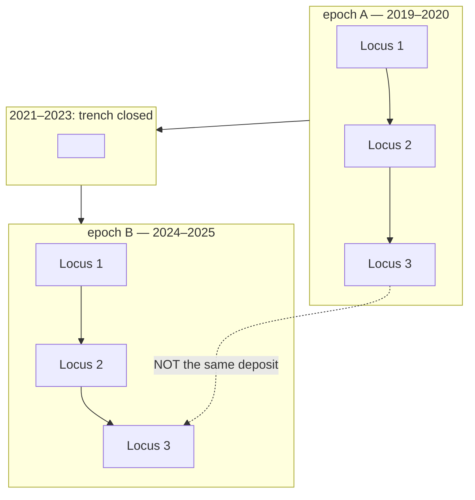

# Locus numbering epochs

A trench reopened after a gap may start its [locus](locus.md) numbers again at
1. So "Locus 3" is not a stable identifier over time, and merging sheets from
either side of a restart fuses two different deposits.

## What it is

Locus numbers are unique **within a trench** — but a trench is excavated over
several seasons, and what happens to the numbering when it reopens depends on
how it reopened.

Poggio Civitate's *Excavation and Documentation Procedures* makes it
conditional:

- **Reopened in consecutive years** — numbering **continues**. "If the last
  locus excavated … in prior year was Locus 10, you will begin excavating in
  Locus 11."
- **Reopened after a gap** — "you may treat this as a new trench opening — you
  do not need to continue with any locus sequences."
- **An administratively new trench over older ones** — restarts at Locus 1.

An **epoch** is one continuous numbering sequence. Within an epoch a locus
number identifies one deposit; across epochs the same number means nothing in
common.

## The picture



## Why excavation records it

A trench is a long-lived administrative unit and a locus sequence is not. Tying
them together permanently would mean an excavator returning after five years had
to find the old records before they could number anything.

The restart is a practical accommodation. The cost is that the *combination* of
trench and locus number is no longer a stable key, and only the excavation's own
records know where the boundaries fall.

## How this project stores it

Two optional metadata fields on a job —
`poggio_webapp/backend/routes/scans.py`:

```python
season = clean_label(request.form.get("season"))
locus_epoch = clean_label(request.form.get("locus_epoch"))
```

```json
{
  "trench_label": "T104",
  "wall_label": "southern baulk",
  "season": "2025",
  "locus_epoch": "2024-2025"
}
```

`season` is when the sheet was recorded; `locus_epoch` names which numbering
sequence it belongs to.

### The refusal

`poggio_webapp/backend/services/trench_builder.py` states the whole problem in
its docstring:

```python
def check_locus_epochs(members, notes):
    """Refuse to merge sheets whose locus numbers may not mean the same thing.
    ...
    So neither (trench, locus) nor (trench, season, locus) is a safe fixed key.
    The first fuses two deposits when numbering restarted; the second splits
    one deposit that ran across two consecutive seasons, which is ordinary.

    What the application cannot do is work out which case applies, so the
    numbering epoch is declared rather than inferred. Consecutive seasons pass
    without one, because that is the case where numbering demonstrably
    continues. A gap does not: guessing there would either fuse two deposits
    into one model surface or split one into two, and both look plausible in
    the output.
    """
```

Neither obvious key works. That is the crux, and it is why the epoch has to be
**declared** rather than derived.

Three outcomes:

**Different declared epochs → refuse.**

```python
raise TrenchBuildError(
    "these sheets declare different locus numbering epochs ("
    + ", ".join(repr(e) for e in epochs)
    + "). Locus numbers restart at each epoch, so the same number "
    "means different deposits on either side of one. Build each epoch "
    "as its own trench")
```

**Consecutive seasons, no epoch declared → allow, with a note.**

```python
if years == list(range(years[0], years[-1] + 1)):
    notes.append(
        f"sheets span consecutive seasons {years[0]}-{years[-1]}; locus "
        "numbering continues across those, so their locus numbers are "
        "being read as one sequence")
    return
```

The one case the procedures say is safe, allowed automatically — and the
assumption is stated rather than left implicit.

**Non-consecutive seasons, no epoch declared → refuse.**

```python
raise TrenchBuildError(
    "these sheets span non-consecutive seasons ("
    + ", ".join(str(y) for y in years)
    + f"; nothing from {', '.join(str(y) for y in missing)}). A trench "
    "reopened after a gap may restart its locus numbering, so the same "
    "locus number need not mean the same deposit. Set a locus_epoch on "
    "each job to say which numbering sequence it belongs to")
```

The message names the **missing years**, so an operator can see exactly which gap
triggered it.

An unparseable season is also a refusal, because the consecutiveness test cannot
run:

```python
raise TrenchBuildError(
    "these sheets span more than one season and at least one season is "
    "not a 4-digit year (...), so whether their locus numbering continues "
    "cannot be determined. Set a locus_epoch on each job")
```

And a partially-declared set is allowed with a note rather than refused:

```python
notes.append(
    f"jobs {', '.join(undeclared)} declare no locus epoch; taking "
    f"them as part of {epochs[0]!r}, the only one declared")
```

## What it is not

| Not a… | Because |
|---|---|
| **Season** | A season is when a sheet was recorded. An epoch is which numbering sequence it belongs to. Several seasons can share one epoch. |
| **Phase** | Phasing groups deposits by *archaeological period*. An epoch is a bookkeeping boundary in the numbering, with no chronological meaning. |
| **[Trench](trench.md)** | One trench can hold several epochs over its life. |
| **[Correlation](correlation.md)** | Correlation says two units are the same deposit. An epoch says two numbers cannot be compared at all. |

## Getting it wrong

**Merging across a restart.** Locus 3 from 2019 and Locus 3 from 2024 become one
model surface. The model builds, looks plausible, and fuses two unrelated
deposits. This is the failure the check exists to prevent.

**Splitting across consecutive seasons.** The opposite error — treating each
season as its own epoch when numbering demonstrably continued — divides one
deposit into two surfaces. Equally plausible-looking, equally wrong.

**Leaving `locus_epoch` blank on a gapped trench.** The build refuses, correctly.
The fix is to declare which sequence each sheet belongs to, from the excavation
records — which is the only place that information exists.

**Assuming the application can infer it.** It cannot, and the docstring says so:
"What the application cannot do is work out which case applies."

## Related pages

- [Locus](locus.md) — the number in question.
- [Trench](trench.md) — the scope numbers are unique within.
- [Correlation](correlation.md) — the other cross-record judgement.
- [Fail-closed design](../cs/fail-closed-design.md) — why it refuses rather than
  guesses.
- [Combine walls into one trench](../workflows/09-multi-wall-trench.md) — where
  the check runs.
