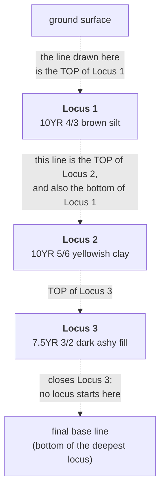

# Locus

The excavation's own identifier for one recorded thing — a deposit, a cut, a
surface. It is the number an excavator writes on the sheet, and everything
downstream hangs off it.

## What it is

A locus (plural *loci*) is a numbered unit of excavation. When an excavator
recognises that the soil has changed — a different colour, a different texture,
a different inclusion — they declare a new locus, give it the next number, and
record it: its Munsell colour, its description, what was found in it, and where
its edges are.

Elsewhere in archaeology the same idea is called a **context**. The British
single-context recording tradition says "context"; much North American and
Mediterranean practice, including Poggio Civitate, says "locus". They are the
same concept with different paperwork.

The critical point is that a locus is **an interpretation, made in the field, by
a person**. It is not something the soil announces. Two excavators can look at
the same section and draw the boundary in slightly different places, or disagree
about whether a change is worth a new number at all. Everything this application
does downstream inherits that judgement.

## The picture

A field sheet records loci top to bottom. What is drawn is the **line** that
starts each locus.



One line does two jobs. The line naming Locus 2 is simultaneously the top of
Locus 2 and the bottom of Locus 1. Only the last line is different: it closes
the deepest locus and names nothing.

That is the single most important sentence on this page, and getting it
backwards shifts every locus in the model down by one.

## Why excavation records it

Stratigraphy is about **sequence**, and sequence needs units to sequence. A
locus is the atom. Without numbered units you cannot say "this is later than
that," you cannot tie a find to a moment, and you cannot build a
[Harris Matrix](index.md).

Numbering also makes the record auditable. A find bag says "Locus 14"; the
locus sheet says what Locus 14 was and where; the section drawing says where its
edges ran. Three independent records that have to agree. A locus number is the
key that joins them.

## How this project stores it

A locus appears in two places in a `FieldWallProfile` document, and they are
joined by the number.

**`loci[]`** — what the locus *is*:

```json
{
  "locusNumber": "2",
  "munsell": { "raw": "10YR 5/6", "colorName": "yellowish brown" },
  "description": "compact clay with small inclusions",
  "confidence": "human-entered"
}
```

**`layers[]`** — where the locus *runs*:

```json
{
  "locusNumber": "2",
  "topBoundary":    [ { "xMeters": 0.00, "depthMeters": 0.31, "confidence": "human-traced" },
                      { "xMeters": 0.85, "depthMeters": 0.38, "confidence": "human-traced" } ],
  "bottomBoundary": [ { "xMeters": 0.00, "depthMeters": 0.62, "confidence": "human-traced" },
                      { "xMeters": 0.85, "depthMeters": 0.66, "confidence": "human-traced" } ],
  "featuresInLayer": null
}
```

The split is deliberate. A locus's **identity** is recorded once; its
**geometry** is recorded per drawing, because the same locus can appear on more
than one wall of the same trench.

### The name that reaches the model

`convert_coords.surface_id()` builds the model surface name from the locus
number **alone**:

```python
def surface_id(locus_number):
    """The stable identity of a locus's model surface: ``Locus 6``.

    A deposit is identified at this site by its trench and locus number. A
    model is built from one trench, so the locus number alone is unique within
    it, and the prefix would add nothing.

    What this deliberately does NOT contain is the Munsell reading. GemPy fuses
    interface points into a surface by exact string match on this value, so
    anything inside it is part of the deposit's identity. A soil colour is an
    observation about a deposit, not a name for one: readings of the same
    deposit differ legitimately between recorders, between walls, and between
    wet and dry soil. ...
    """
    return f"Locus {locus_number}"
```

That last paragraph is the whole argument, and it is worth stating plainly:
**the locus number is the identity; the colour is an observation about it.**

Earlier the surface name was `Locus 2 (10YR 5/6 yellowish brown)`, and because
GemPy fuses by exact string match, two walls reading one deposit's colour
slightly differently produced *two model surfaces*. A whole canonicalisation
layer existed in `merge_walls` to force the readings to agree so the identities
would. Taking the colour out of the identity removed the failure and about
sixty lines with it.

The colour survives as a **display label**, carried separately —
`convert_coords.surface_labels()` returns `{surface_id: display label}` for
anything user-facing, and only where the two differ.

### Where the "named line is the top" rule is enforced

In the manual tracer, `poggio_webapp/pipeline/manual_extraction.py`:

```python
"""Read field-wall lines using the recording sheet's locus convention.

Each named line is the *top* of that locus.  The next locus top is also
the current locus's bottom, while one separately traced base line closes
the deepest locus.
"""
```

And in the marker-classification prompt, `poggio_webapp/pipeline/assign_markers.py`, where it has to be spelled out to a language model:

> A locus is named by its top line: the top of the next deeper locus is also
> the bottom of the locus above it. … The shallowest named line is the top of
> the first locus. Do not shift the locus numbers down by treating that line as
> an unlabelled surface.

## What it is not

| Not a… | Because |
|---|---|
| **[Layer](index.md)** | On a field sheet they coincide, and this project's `layers[]` array is keyed by `locusNumber`. But *layer* is a description of what you see — a band in the section — while *locus* is an excavation's numbered decision about it. An illustrator sheet has layers with names and hatch patterns and **no locus numbers at all**. |
| **[Feature](index.md)** | A stone, a lens, a void drawn *inside* a locus. It belongs to a locus; it does not define one. Features live in `featuresInLayer` and never contribute a boundary. |
| **[Find](index.md)** | An object recovered *from* a locus. A find records `locus` as one of its fields — that is the relationship. A find is a point, not a unit. |
| **[Marker](index.md)** | A pencil dot on the sheet marking one measured vertex of a locus boundary. Many markers describe one locus's edge. |
| **Phase or period** | A locus is a single recorded unit. Grouping loci into phases is a later interpretive step this application does not do. |
| **Surface name in the model** | The model surface `Locus 2` is *derived* from the locus number by `convert_coords.surface_id()`. Renaming it in the CSV does not rename the locus. |

## Getting it wrong

**Shifting the loci down by one.** The classic error: treating a named line as
the *bottom* of its locus instead of the top. Every locus then occupies the band
belonging to the one above it. The model looks entirely plausible and is
uniformly wrong by one unit.

The repository carries explicit machinery for this. `assign_markers._assemble()`
still accepts the old `"bottom"` and `"surface"` classifications so saved work is
not lost, and says so:

> `finalized a classification made with the old bottom-of-locus convention;`
> `re-run marker assignment to use named locus tops`

And `convert_coords.fieldwall_to_profiles()` warns when it has to fall back:

> `locus 2 has no topBoundary — using its bottomBoundary as a legacy fallback;`
> `re-extract to avoid a one-line locus shift`

**Forgetting the final base line.** If nothing closes the deepest locus, it has
no bottom boundary. The manual tracer refuses outright:

> `draw the final bottom line below the deepest locus`

and marker assembly warns:

> `no markers classified as the final bottom line — the deepest locus has no`
> `bottom boundary`

**A locus in `layers[]` with no entry in `loci[]`.** The geometry exists but the
Munsell does not, so the locus has no colour recorded. Since
[surface identity is the locus number alone](#the-name-that-reaches-the-model),
this no longer splits a deposit into two model surfaces — it is now a
completeness problem rather than a modelling one. The validator still warns:

> `layer references locus 2, which has no entry in loci[] (no Munsell reading)`

**The same locus number listed twice with different Munsell readings.** Real
sheets do this; T104 has two entries numbered 5. The project takes the first and
says so rather than merging them:

> `locus 5 appears 2 times in loci[] with different Munsell readings — the`
> `converter will use the first`

**Reusing a locus number on a different wall for a different deposit.** Nothing
can detect this, and it is the one failure mode with no safety net: the two
deposits will be fused into a single model surface because their names match.
Locus numbers must be unique across the trench, not per wall.

## Related pages

- [Glossary](../start-here/glossary.md) — the short definition.
- [Layers and boundaries](../concepts/layers-and-boundaries.md) — how a locus's
  edges become geometry.
- [Markers, features, and finds](../concepts/markers-features-and-finds.md) —
  the three records a locus is confused with.
- [Trace the layers](../workflows/03-trace-layers.md) — the workflow that
  records locus tops.
- [Combine walls into one trench](../workflows/09-multi-wall-trench.md) — where
  locus numbering across walls starts to matter.
- [Validation rules](../reference/validation-rules.md) — every message quoted
  above, in full.
- [Data schemas](../reference/data-schemas.md) — the complete
  `FieldWallProfile` shape.
