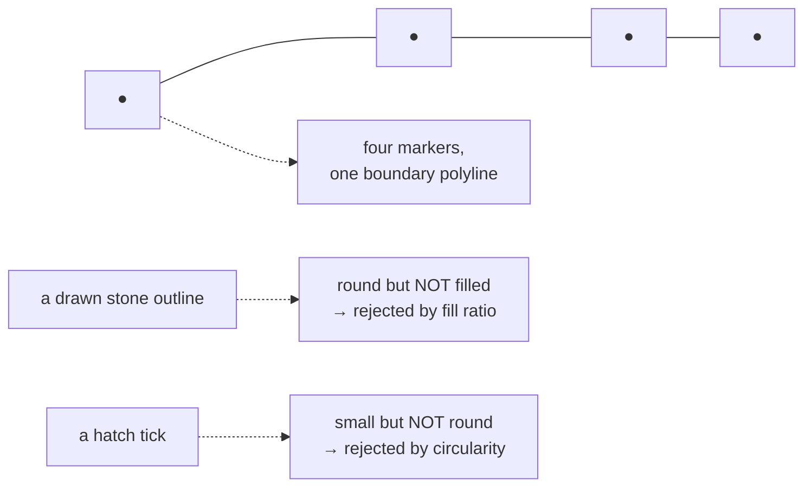

# Marker

A small deliberate dot the recorder puts on a field sheet at a measured boundary
vertex. Not a stone, not a find — a *measurement mark*, and the only thing on the
sheet that computer vision here is allowed to locate.

## What it is

Drawing a boundary on graph paper, a recorder measures a series of points along
it and marks each with a small filled circle, then connects them. Those circles
are **markers**.

Each marker is one measured vertex. Together they define the
[boundary](boundary.md)'s geometry.

They are physically distinctive, and that is what makes them findable:

- **small** — around 0.5 to 2.5 mm on the paper
- **round**
- **filled** — a solid disk, not an outline
- **on a boundary line**, often touching it

Every one of those properties becomes a filter in the detector.

## The picture



## Why excavation records it

A drawn line is an interpretation of a continuous edge. The markers are the
points where the recorder **actually measured** — the evidence beneath the line.

That distinction is what makes them worth detecting. A boundary traced by eye is
one person's rendering; a boundary read off its markers is the recorded
measurements.

It is also why the CV path exists at all. From
`poggio_webapp/pipeline/detect_markers.py`:

> Finds the recorder's circle-marked vertex points on a field-wall photo with
> computer vision instead of asking an LLM to trace boundaries — **CV cannot
> fabricate a marker that isn't on the paper**, which is exactly the failure
> mode Gemini tracing runs on T104-style sheets kept exhibiting.

## How this project stores it

A detected marker, before it is assigned to anything:

```json
{
  "id": 7,
  "pixel_x": 1109.4,
  "pixel_y": 901.2,
  "x_m": 0.847,
  "depth_m": 0.382,
  "diam_px": 11.3,
  "circularity": 0.912
}
```

Pixel position, converted position, and the two measurements that got it
accepted.

### Found by shape, in units of paper

Four predicates, all in **paper millimetres** converted through the calibration:

```python
if (
    min_d <= diameter <= max_d
    and circularity >= min_circularity
    and solidity >= min_solidity
    and fill >= 0.5
):
    cand.append(entry)
else:
    rejected.append(entry)
```

with defaults `min_marker_paper_mm=0.5`, `max_marker_paper_mm=2.5`,
`min_circularity=0.65`, `min_solidity=0.9`. Each rejects a different impostor —
see [circularity](../cs/circularity.md), [solidity](../cs/solidity.md), and
[fill ratio](../cs/extent-and-fill-ratio.md).

The docstring names the target precisely:

> dots are small **FILLED** disks; stone outlines and nested contour duplicates
> are not

[Morphological opening](../cs/morphological-opening.md) runs first so a dot
touching its boundary line survives as its own blob rather than merging into one
long non-circular contour.

### The photograph must be good enough

```python
if mm_px < 2:
    raise RuntimeError(
        "photo resolution too low for marker detection "
        f"({mm_px:.1f} px per paper mm) — retake closer or "
        "at higher resolution"
    )
```

An honest refusal rather than unreliable output.

### Rejected candidates come back for review

```python
# The route and review UI consume the rejected candidates too (red,
# toggleable dots), so a person can rescue a real vertex the filters
# wrongly dropped.
```

A missed marker is lost evidence; an extra one is one click. The near misses are
ranked by circularity and capped at 300.

### Coordinates are immutable downstream

`poggio_webapp/pipeline/assign_markers.py` classifies each marker — top of locus
N, final base, or noise — and assembles the extraction with the coordinates
untouched:

```python
def pt(m):
    return {"xMeters": m["x_m"], "depthMeters": m["depth_m"], "confidence": None}
```

reading only from `m`, a detected marker. The model's response schema has no
coordinate field, so there is no path by which it can move one. See
[human-in-the-loop review](../cs/human-in-the-loop-review.md).

The provenance is written into the document:

```python
marginalia.append(
    f"[provenance] boundary coordinates from CV marker detection "
    f"({len(markers)} candidates: {n_boundary} boundary + "
    f"{n_noise + len(missing)} noise); "
    f"Gemini assigned loci/labels only and generated no geometry"
)
```

## What it is not

| Not a… | Because |
|---|---|
| **[Feature](feature.md)** | A feature is a thing in the deposit — a stone, a lens. A marker is a measurement mark on paper. A drawn stone's *outline* is round and is rejected because it is not filled. |
| **[Find](find.md)** | A find is a recovered object with an identifier. |
| **[Boundary](boundary.md)** | Many markers describe one boundary. The marker is one vertex. |
| **[Interface point](interface-point.md)** | An interface point is a boundary point in *site* coordinates. A marker is in pixels and face-local metres. |
| **Grid intersection** | Graph-paper rulings are printed. A marker is drawn by the recorder. |

## Getting it wrong

**Drawing markers too small or too faint.** Below 0.5 mm they fall outside the
size band; too faint and thresholding misses them. See the
[drawing guidelines](../reference/drawing-guidelines.md).

**Drawing hollow circles.** The fill test rejects an outline, on purpose —
because a drawn stone is a round outline and must not be admitted.

**Photographing at too low a resolution.** Refused outright below 2 px per paper
millimetre.

**Marking in red pen.** The ink mask excludes red, because recorders annotate in
red and those marks are not vertices. See
[colour-channel arithmetic](../cs/colour-channel-arithmetic.md).

**Assuming detection is complete.** It has false negatives, which is exactly why
rejected candidates are returned for review. Skipping the review means trusting
a filter with no second opinion.

## Related pages

- [Boundary](boundary.md) — what markers collectively define.
- [Feature](feature.md) and [find](find.md) — the two records confused with it.
- [Morphological opening](../cs/morphological-opening.md) — how a dot on a line
  is separated.
- [Circularity](../cs/circularity.md), [solidity](../cs/solidity.md) — the shape
  filters.
- [Human-in-the-loop review](../cs/human-in-the-loop-review.md) — the division of
  labour.
- [Markers and features](../workflows/03-markers-and-features.md) — the workflow.
