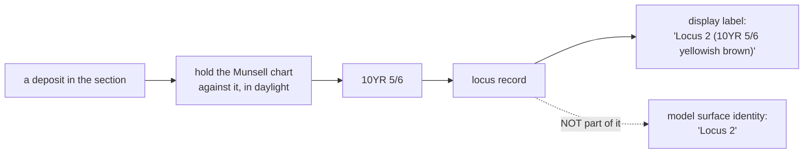

# Munsell colour

A standard notation for soil colour, read by holding a physical chart against
the deposit. `10YR 5/6` is a measurement, not a description — and in this
project it is deliberately a **label** on a deposit rather than part of its
identity.

## What it is

The Munsell system describes a colour by three values:

```
10YR 5/6
│    │ └── chroma: how strong, 0 (grey) upward
│    └──── value:  how light, 0 (black) to 10 (white)
└───────── hue:    the colour family, 0–10 within YR, Y, R, …
```

Hue families run `R`, `YR`, `Y`, `GY`, `G`, `BG`, `B`, `PB`, `P`, `RP`. Soils use
the red-to-yellow end almost exclusively, so `YR` dominates.

`N 5/` is **neutral** — grey, no chroma.

The critical property: the notation refers to a **physical chip**. A recorder
holds a Munsell soil chart against the deposit, in daylight, and finds the
closest match. It is a comparison against a standard, not a subjective
impression — which is what makes it repeatable between excavators.

## The picture



## Why excavation records it

Soil colour is one of the main criteria for distinguishing one deposit from the
next. "Where the brown silt ends and the yellow clay begins" is a boundary, and
colour is how it was recognised.

The notation makes that **communicable and repeatable**. "Brown" means different
things to different people; `10YR 5/6` means one chip. Two excavators reading the
same deposit should reach the same notation, which is the point.

It also travels. A published record giving Munsell readings can be compared
against another site's; "mid-brown" cannot.

## How this project stores it

On the locus, not on the layer:

```json
{
  "locusNumber": "2",
  "munsell": { "raw": "10YR 5/6", "colorName": "yellowish brown" },
  "description": "compact clay with small inclusions",
  "confidence": "human-entered"
}
```

`raw` is the notation; `colorName` is the chart's own name for that chip. Both
are kept, and reading tolerates either form —
`poggio_webapp/pipeline/convert_coords.py`:

```python
def _munsell_label(entry):
    """'10YR 5/3 brown' from a locus entry, however munsell got serialized."""
    m = entry.get("munsell")
    if isinstance(m, str):
        return m.strip() or None
    if isinstance(m, dict):
        parts = [m.get("raw"), m.get("colorName")]
        parts = [
            str(p).strip() for p in parts if p and str(p).strip().lower() != "none"
        ]
        return " ".join(parts) or None
    return None
```

### It is a label, deliberately not an identity

`convert_coords.surface_id()` names a model surface from the locus number
alone, and the docstring says exactly why the colour is excluded:

> A soil colour is an observation about a deposit, not a name for one: readings
> of the same deposit differ legitimately between recorders, between walls, and
> between wet and dry soil. When the reading was part of the name, two walls
> describing one deposit slightly differently produced two model surfaces, and
> an entire canonicalization layer existed in merge_walls to stop that
> happening. **Identity here, colour in the display label.**

That last sentence is the design in four words. The colour is carried
separately, by `convert_coords.surface_labels()`:

```python
def surface_labels(data):
    """{surface_id: display label} for a document, for anything user-facing.

    Only surfaces whose label differs from their id appear, so a document with
    no Munsell readings produces an empty map rather than a table of
    identities. The first label seen for an id wins; a later disagreement is
    the merge layer's to report, not this function's to resolve.
    """
```

### Disagreements are reported, not resolved

Because the colour is no longer part of the identity, two walls reading one
deposit differently **already fuse**. There is nothing to canonicalise, and
`merge_walls` says so in the function that used to do it:

```python
def _report_munsell_disagreements(field_sheets, notes):
    """Note where two walls read one locus's colour differently.

    This used to do more. When the Munsell reading was part of the GemPy
    surface name, two walls describing one deposit slightly differently
    produced two model surfaces, so this function computed a trench-wide
    canonical reading and a companion rewrote every sheet to use it -- forcing
    a field observation to agree so that an identity would.

    Surfaces are now identified by locus number alone
    (``convert_coords.surface_id``), so the walls fuse whatever their colours
    say and there is nothing left to canonicalize. The disagreement is still
    worth surfacing: it is a real fact about the recording, and a supervisor
    may want to reconcile it. It is reported and nothing is rewritten.
    """
```

**"Forcing a field observation to agree so that an identity would"** is the
diagnosis of what was wrong. The disagreement is real data about the recording;
overwriting it to satisfy a string-matching rule was the software's problem
leaking into the archaeology.

The note now reports without rewriting:

```python
notes.append(
    f"locus {num}: Munsell disagrees between wall "
    f"{first_wall!r} ({first_reading!r}) and wall "
    f"{wall_label!r} ({reading!r}). Both walls still model one "
    f"surface; {first_reading!r} is used as its label"
)
```

The module docstring records the size of the removal: taking the colour out of
the identity "removed the failure, and with it the ~60 lines that worked around
it."

### Displayed as an approximate colour

`poggio_webapp/static/shared/munsell-color.js` maps the notation to a screen
colour via HSL, and is explicit about what that is worth:

```javascript
/**
 * Approximate a physical Munsell chip as an sRGB display color.
 *
 * This intentionally returns a fallback for unparseable text. Displays,
 * lighting, and the physical Munsell system differ, so the result is a useful
 * visual correspondence rather than a colorimetric replacement for a chip.
 */
```

"A useful visual correspondence rather than a colorimetric replacement" is the
honest framing — the swatch helps a reader tell two layers apart in a legend, and
is not a colour measurement.

The parser handles notation embedded in a longer label, which is how it reads
`Locus 2 (10YR 5/6 yellowish brown)` — see
[regular expressions](../cs/regular-expressions.md).

## What it is not

| Not a… | Because |
|---|---|
| **A description** | "Brown" is a description. `10YR 5/6` is a match against a physical standard. |
| **A digital colour** | It refers to a chip under daylight. The screen swatch is an approximation and says so. |
| **[Locus](locus.md) identity** | A locus is identified by its number, and so is its model surface. The Munsell reading *describes* the deposit; it does not name it. Two loci can share a reading. |
| **A material identification** | Colour is one criterion. Texture, inclusions, and compaction matter too, which is why `description` exists alongside. |
| **Stable across walls** | The same deposit routinely reads slightly differently on two walls. That is expected, is reported, and no longer affects the model — the walls fuse on locus number regardless. |

## Getting it wrong

**Reading in the wrong light.** Munsell assumes daylight. A reading taken in
shade or under an artificial lamp is not comparable.

**Reading wet versus dry.** Soil darkens substantially when wet. The convention
matters and should be recorded consistently.

**Omitting the reading.** The deposit then has no recorded colour. Since the
surface identity is the locus number alone this no longer splits it into two
model surfaces — it is a completeness problem rather than a modelling one, and
the validator still warns.

**Expecting the screen swatch to match the chip.** It is a visual aid.

**Treating a disagreement between walls as an error.** It is normal. Merging
reports it and rewrites nothing; the reading it names is the *display label*,
not a resolution of the disagreement.

## Related pages

- [Locus](locus.md) — what carries the reading.
- [Layer](layer.md) — the band it describes.
- [Correlation](correlation.md) — why similar colours do not prove sameness.
- [Combine walls into one trench](../workflows/09-multi-wall-trench.md) — where
  readings between walls are reported.
- [Regular expressions](../cs/regular-expressions.md) — how the notation is
  parsed.
