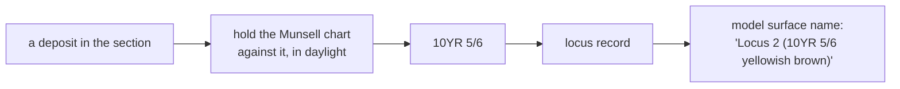

# Munsell colour

A standard notation for soil colour, read by holding a physical chart against
the deposit. `10YR 5/6` is a measurement, not a description — and in this
project it becomes part of a model surface's name.

## What it is

The Munsell system describes a colour by three values:

```
10YR 5/6
│    │ └── chroma: how strong, 0 (grey) upward
│    └──── value:  how light, 0 (black) to 10 (white)
└───────── hue:    the colour family, 0–10 within YR, Y, R, …
```

Hue families run `R`, `YR`, `Y`, `GY`, `G`, `BG`, `B`, `PB`, `P`, `RP`. Soils use
the red-to-yellow end almost exclusively, so `YR` dominates.

`N 5/` is **neutral** — grey, no chroma.

The critical property: the notation refers to a **physical chip**. A recorder
holds a Munsell soil chart against the deposit, in daylight, and finds the
closest match. It is a comparison against a standard, not a subjective
impression — which is what makes it repeatable between excavators.

## The picture



## Why excavation records it

Soil colour is one of the main criteria for distinguishing one deposit from the
next. "Where the brown silt ends and the yellow clay begins" is a boundary, and
colour is how it was recognised.

The notation makes that **communicable and repeatable**. "Brown" means different
things to different people; `10YR 5/6` means one chip. Two excavators reading the
same deposit should reach the same notation, which is the point.

It also travels. A published record giving Munsell readings can be compared
against another site's; "mid-brown" cannot.

## How this project stores it

On the locus, not on the layer:

```json
{
  "locusNumber": "2",
  "munsell": { "raw": "10YR 5/6", "colorName": "yellowish brown" },
  "description": "compact clay with small inclusions",
  "confidence": "human-entered"
}
```

`raw` is the notation; `colorName` is the chart's own name for that chip. Both
are kept, and reading tolerates either form —
`poggio_webapp/pipeline/convert_coords.py`:

```python
def _munsell_label(entry):
    """'10YR 5/3 brown' from a locus entry, however munsell got serialized."""
    m = entry.get("munsell")
    if isinstance(m, str):
        return m.strip() or None
    if isinstance(m, dict):
        parts = [m.get("raw"), m.get("colorName")]
        parts = [str(p).strip() for p in parts if p and str(p).strip().lower() != "none"]
        return " ".join(parts) or None
    return None
```

### It becomes part of the model surface name

```python
if num and munsell:
    surface = f"Locus {num} ({munsell})"     # "Locus 2 (10YR 5/6 yellowish brown)"
elif num:
    surface = f"Locus {num}"
    notes.append(f"locus {num} has no Munsell entry in loci[] — "
                 f"surface named without a color")
```

That has a consequence nobody would guess: **GemPy fuses interface points into
one surface by exact string match on this name.** So a Munsell reading that
differs slightly between two walls produces two surfaces for one deposit.

`poggio_webapp/pipeline/merge_walls.py` exists partly to fix that:

```python
def _canonical_munsell(field_sheets, notes):
    """One trench-wide locusNumber -> Munsell label map. First usable reading
    (in sheet order, then loci[] order) wins; disagreements become notes."""
```

```python
notes.append(
    f"locus {num}: Munsell disagrees between wall "
    f"{first_wall!r} ({first_reading!r}) and wall "
    f"{wall_label!r} ({reading!r}); using {first_reading!r} "
    "trench-wide so both walls map to one model surface")
```

It picks one and **says so**, rather than merging silently or refusing. A
disagreement is normal — the same deposit genuinely looks slightly different on
two walls, in different light, read by different people — and it is not an error.

A locus used in `layers[]` but absent from `loci[]` gets the trench-wide reading
added, so its surface name matches the other walls:

```python
notes.append(
    f"wall {label!r}: locus {num} appears in layers[] but not "
    f"loci[]; using the trench-wide Munsell reading "
    f"{canon[num]!r} so its surface name matches the other walls")
```

### Displayed as an approximate colour

`poggio_webapp/static/shared/munsell-color.js` maps the notation to a screen
colour via HSL, and is explicit about what that is worth:

```javascript
/**
 * Approximate a physical Munsell chip as an sRGB display color.
 *
 * This intentionally returns a fallback for unparseable text. Displays,
 * lighting, and the physical Munsell system differ, so the result is a useful
 * visual correspondence rather than a colorimetric replacement for a chip.
 */
```

"A useful visual correspondence rather than a colorimetric replacement" is the
honest framing — the swatch helps a reader tell two layers apart in a legend, and
is not a colour measurement.

The parser handles notation embedded in a longer label, which is how it reads
`Locus 2 (10YR 5/6 yellowish brown)` — see
[regular expressions](../cs/regular-expressions.md).

## What it is not

| Not a… | Because |
|---|---|
| **A description** | "Brown" is a description. `10YR 5/6` is a match against a physical standard. |
| **A digital colour** | It refers to a chip under daylight. The screen swatch is an approximation and says so. |
| **[Locus](locus.md) identity** | A locus is identified by its number. The Munsell reading describes it. Two loci can share a reading. |
| **A material identification** | Colour is one criterion. Texture, inclusions, and compaction matter too, which is why `description` exists alongside. |
| **Stable across walls** | The same deposit routinely reads slightly differently on two walls. Merging canonicalises rather than treating it as an error. |

## Getting it wrong

**Reading in the wrong light.** Munsell assumes daylight. A reading taken in
shade or under an artificial lamp is not comparable.

**Reading wet versus dry.** Soil darkens substantially when wet. The convention
matters and should be recorded consistently.

**Omitting the reading.** The surface is then named `Locus 2` with no colour,
which on a multi-wall trench means **two surfaces for one deposit** unless
merging supplies the canonical value. The warning exists for exactly this.

**Expecting the screen swatch to match the chip.** It is a visual aid.

**Treating a disagreement between walls as an error.** It is normal, and merging
reports which reading it used.

## Related pages

- [Locus](locus.md) — what carries the reading.
- [Layer](layer.md) — the band it describes.
- [Correlation](correlation.md) — why similar colours do not prove sameness.
- [Combine walls into one trench](../workflows/09-multi-wall-trench.md) — where
  readings are canonicalised.
- [Regular expressions](../cs/regular-expressions.md) — how the notation is
  parsed.
