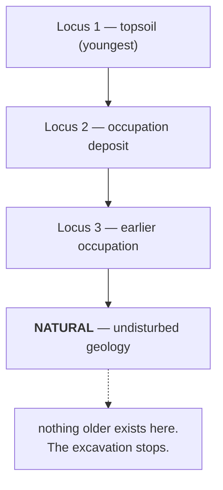

# Natural

The undisturbed geological deposit beneath everything human. Reaching it means
the sequence is complete — there is nothing older to find.

## What it is

**Natural** (also *the natural*, or *natural subsoil*) is material laid down by
geological processes rather than by people: bedrock, glacial till, weathered
subsoil, river gravels.

It matters for one reason: it is the **bottom of the archaeology**. Every human
deposit lies above it, and nothing beneath it is archaeological.

Identifying it is a judgement, and not always an easy one. Deeply weathered
natural can resemble an old buried soil; a homogeneous dump can resemble
undisturbed subsoil. Recording it is a claim: *we believe we have reached the
base of the sequence here*.

## The picture



## Why excavation records it

**It closes the sequence.** Without it, an excavator cannot say whether the
deepest deposit recorded is genuinely the earliest or simply the deepest they
dug. Reaching natural turns "we found nothing earlier" into "there was nothing
earlier."

**It bounds the [cuts](cut.md).** A pit cut into natural is dated relative to
geology rather than to another deposit — which anchors it firmly.

**It is a stopping rule.** Excavation is destructive and expensive; natural is
where it stops.

## How this project stores it

`natural` is one of the six unit types in the Harris vocabulary —
`poggio_webapp/pipeline/harris_matrix.py`:

```python
UnitType = Literal[
    "deposit",
    "cut",
    "structure",
    "interface",
    "natural",
    "unknown",
]
```

and one of the drawable unit types —
`poggio_webapp/pipeline/site_vocab.py`:

```python
{"key": "natural", "label": "Natural", "kind": "unit",
 "unitType": "natural", "surveyCode": None},
```

`"kind": "unit"` rather than `"material"`, because natural is a stratigraphic
context, not something bagged as a find. The comment above the list draws that
line:

> `unit` entries are stratigraphic and carry a Harris unit type instead — they
> are contexts, not finds.

Note `"surveyCode": None`. `site_vocab.SURVEY_POINT_CODES` has `TOPO` for ground
surface and codes for walls, stones, and features — but nothing for natural,
because it is a *region* recognised in section rather than a point shot with a
total station.

### In the model

Natural is a [layer](layer.md) like any other and becomes a model surface by the
usual route. Being the deepest, it defines the model's lower extent:

```python
zmin, zmax = points["Z"].min(), points["Z"].max()
```

It is also the layer whose *bottom* is often absent — a section drawn down to
natural typically records natural's top and nothing below it. That is correct:
the bottom of natural was never observed.

`normalizer.dedupe_floor` handles a related recording habit — a "floor" drawn as
both a feature and the deepest layer's bottom:

```python
def dedupe_floor(face, log):
    ...
    if "floor" in name and points_key(f.get("shapePoints")) == bkey and bkey:
        log.append(f'{face.get("face")}: dropped trench-floor feature '
                   f'(duplicates ... bottom)')
```

The trench floor and the base of the deepest deposit are the same line drawn
twice. One is kept, and the removal is logged.

## What it is not

| Not a… | Because |
|---|---|
| **[Layer](layer.md)** | Structurally identical in the data — natural is a deposit with a boundary. Conceptually it is the one deposit nobody made. |
| **Bedrock** | Bedrock is one kind of natural. Till, subsoil, and river gravels are others. |
| **[Fill](fill.md)** | A fill is human-associated material in a [cut](cut.md). Natural predates all of it. |
| **Trench floor** | The floor is where digging stopped, which may or may not be natural. Recording the floor is not the same as recording that natural was reached. |
| **Sterile deposit** | A deposit with no finds may still be human-made — a clean dumped clay, say. Sterile is about content; natural is about origin. |

## Getting it wrong

**Calling a deep deposit natural because it is deep and clean.** A homogeneous
dumped clay can look exactly like weathered subsoil in section. Mistaking one for
the other truncates the sequence and discards the units beneath.

**Assuming natural is flat.** It is a weathered geological surface and can
undulate substantially. A model treating it as horizontal misrepresents the
depth of everything above it — which is why its boundary is
[traced like any other](boundary.md) rather than assumed.

**Recording it without a bottom, and expecting a closed model.** Correct
practice, and it means the model's lowest surface has data on one side only.
Where it is recorded on a single wall, the build says so:

> These surfaces have points from only ONE face and will still be interpolated
> across the whole model extent

**Assuming it means the site is finished.** Natural at one point in a trench does
not mean natural everywhere. A [cut](cut.md) may descend far below the general
natural surface elsewhere in the same trench.

## Related pages

- [Layer](layer.md) — natural's data representation.
- [Cut](cut.md) — what may descend into it.
- [Stratigraphy](stratigraphy.md) — the sequence it terminates.
- [Law of superposition](law-of-superposition.md) — why deepest means earliest.
- [Harris Matrix](harris-matrix.md) — where it sits at the bottom.
