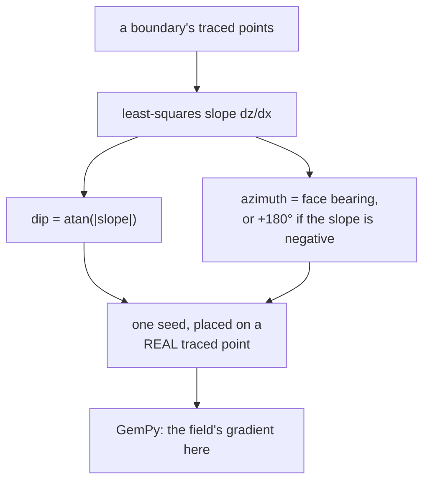

# Orientation seed

A point paired with a direction, telling the interpolator which way a surface
tilts. Without seeds the model knows where a surface *is* and nothing about how
it leaves the wall.

## What it is

[Interface points](interface-point.md) say where a surface passes. A seed adds
its **gradient**:

```
X, Y, Z, surface, face, dip, azimuth, polarity
```

- **dip** — how steeply the surface tilts, in degrees.
- **azimuth** — the compass [bearing](bearing-and-azimuth.md) it descends toward.
- **polarity** — which side of the surface is "up"; `1` throughout here.

One seed per surface per wall, rather than one per traced point. It is a summary
of the whole trace, not a per-vertex property.

The derivation on a single wall is
[least squares](../cs/ordinary-least-squares.md) over the boundary's points, and
the resulting dip is an [apparent](apparent-and-true-dip.md) one — always
shallower than the truth.

## The picture



## Why the model needs it

GemPy fits a scalar field whose iso-surfaces are the interfaces. Interface points
constrain the field's *value*; seeds constrain its *gradient*.

Without a gradient constraint, a surface recorded on one wall has no information
about which way it goes as it leaves that wall — so the interpolator's only
option is something flat or arbitrary. The seed is what makes a single wall's
trace say anything about the volume around it.

## How this project stores it

### One seed per boundary, on a real point

`poggio_webapp/pipeline/convert_coords.py`:

```python
if len(pts) >= 2:
    xs = [p[0] for p in pts]
    ds = [p[1] for p in pts]

    dz_dx = least_squares_slope(xs, ds)

    dip, azimuth = slope_to_orientation(
        slope=dz_dx,
        face_bearing=cfg["bearing_deg"],
    )

    midx = xs[len(xs) // 2]
    midd = ds[len(ds) // 2]

    X, Y, Z = to_site(midx, midd)

    orient.append({
        "X": round(X, 4), "Y": round(Y, 4), "Z": round(Z, 4),
        "surface": surface, "face": fname,
        "dip": round(dip, 2), "azimuth": round(azimuth, 2),
        "polarity": 1,
    })
```

Four decisions.

**At least two points.** One point has no slope.

**The slope is fitted over every point**, not from the endpoints — and the
docstring records that this was once lost:

```python
"""Best-fit slope (dz/dx) of depth vs. x over ALL points, not just the
endpoints. Falls back to 0.0 if x has no spread (can't determine a slope).

Restored from commit b01638d — this was dropped when the files were
reorganized into numbered folders (c7ec511), silently reverting the
orientation seeds to an endpoint-only slope."""
```

A silent regression that produced plausible numbers, recorded where it prevents
recurrence.

**The seed sits on a real traced point** — `xs[len(xs) // 2]`, the middle
recorded vertex — not at the fitted line's centroid. The position is measured;
only the orientation is fitted.

**Angles are rounded to two decimal places** where positions get four. An
orientation fitted over a handful of traced points does not justify more
precision — see
[grid snapping and quantisation](../cs/grid-snapping-and-quantisation.md).

### The sign carries the direction

```python
dip = math.degrees(math.atan(abs(slope)))

if slope >= 0:
    azimuth = face_bearing % 360.0
else:
    azimuth = (face_bearing + 180.0) % 360.0
```

Depth increases downward, so a positive depth-slope means the surface descends
along +x — dipping *toward* the face bearing. Negative flips it 180°.

### Corrected on a merged trench

`poggio_webapp/pipeline/true_dip.py` replaces per-wall apparent dips with one
solved [true dip](apparent-and-true-dip.md), keeping each seed's own position:

```python
"""Give every seed of a solved surface that surface's true orientation.

Rewrites `orientations_csv` in place: each seed keeps its own position on
its own wall -- `convert()` already placed those on real traced points -- and
only its dip and azimuth change, to the one plane solved from two walls.
Surfaces that could not be solved are left exactly as they were, still
carrying the apparent dip of the wall they were measured on, which is the
best available answer for them.
"""
```

Only the two derived numbers change; the measured positions stay. And every
change is reported:

```python
notes.append(
    f"surface {surface!r}: replaced the per-wall apparent dips "
    f"({'; '.join(before)}) with one true dip of "
    f"{round(solved['dip'], 2)} toward {round(solved['azimuth'], 2)}, "
    f"solved from {' and '.join(solved['faces'])}")
```

> so a reader can see the change rather than discovering the numbers moved.

### It refuses rather than inventing

```python
Where a solve is not available -- a surface drawn on one wall, or two walls too
nearly parallel to condition it -- nothing is emitted and a note says so. A
plausible-looking invented orientation would be worse than the apparent dips
already in the CSV, because it would look like an improvement.
```

## What it is not

| Not a… | Because |
|---|---|
| **[Interface point](interface-point.md)** | An interface point is a position. A seed is a position *plus a direction*, and there is one per surface per wall rather than one per traced vertex. |
| **A measurement** | It is fitted from traced points. On one wall it is an [apparent dip](apparent-and-true-dip.md), systematically too shallow. |
| **A surveyed orientation** | Nobody measured it in the field with a clinometer. |
| **Constant across a surface** | A real boundary is curved; the seed is the best single-plane summary of one wall's trace. |
| **[Strike](bearing-and-azimuth.md)** | Strike is 90° from the dip azimuth. GemPy wants dip azimuth. |

## Getting it wrong

**Trusting a single-wall dip as real.** It is apparent, always shallower. The
notes say so:

> its dip stays the apparent dip measured on that one wall, which is always
> shallower than the true dip

**Building a merged model without the true-dip pass.** Two seeds per surface,
disagreeing, both too shallow, and GemPy fits a compromise plane matching
neither.

**Expecting a seed from a one-point boundary.** Needs at least two.

**Reading the seed's position as significant.** It is the middle traced vertex,
chosen so the position is a real measurement. The *orientation* is the payload.

**Editing dip in the CSV and expecting the position to follow.** They are
independent. `apply_true_dip` deliberately changes only the two angles.

## Related pages

- [Interface point](interface-point.md) — the other model input.
- [Apparent and true dip](apparent-and-true-dip.md) — what the numbers mean.
- [Bearing and azimuth](bearing-and-azimuth.md) — the azimuth convention.
- [Ordinary least squares](../cs/ordinary-least-squares.md) — how the slope is
  fitted.
- [Spatial interpolation and kriging](../cs/spatial-interpolation-and-kriging.md) —
  what consumes it.
- [Output files](../reference/output-files.md) — the orientations CSV.
