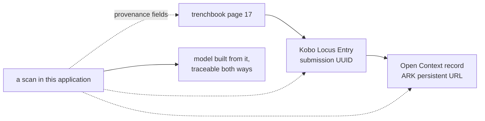

# Provenance links

The pointers from something in this application back to the published record it
came from: an Open Context or ARK persistent URL, a Kobo submission id, and a
trenchbook page. Three strings, and they are what make a model traceable to
evidence.

## What it is

Poggio Civitate's system of record is **KoboToolbox** for field data entry,
feeding **Open Context** for publication, with **ARK**-backed persistent URLs so
that a citation still resolves years later.

This application is a modelling tool that sits beside that system. It reads
drawings and produces surfaces; it is not where the locus record lives. Without
provenance links, a job here could not say which locus record it was built from,
and a model that left the machine carried no route back to the published
evidence.

`poggio_webapp/pipeline/provenance.py` records three fields:

| Field | Example | What it points at |
|---|---|---|
| Open Context / ARK URI | `https://n2t.net/ark:/28722/r2p24/<id>` | the published record |
| Kobo record id | a submission UUID | the field-entry form response |
| Trenchbook page | `17`, or `17-19` | the handwritten source |

## The picture



The solid arrows are the site's own publication chain. The dotted ones are all
this module adds, and they cost a string each.

## Why excavation records it

An archaeological claim is only as good as the record behind it. A published
sequence that cannot be traced to the trenchbook page, the locus sheet, and the
find bag is an assertion; one that can is evidence.

Persistent identifiers exist because ordinary URLs rot. An **ARK** is resolved
through a naming authority rather than a web server, so the link survives the
site reorganising its own pages. Citing the ARK rather than the current page is
the whole point of having one.

Trenchbook pages matter for a reason peculiar to how trenchbooks are written:

> Trenchbooks are written on odd-numbered right-hand pages only, so an even
> page is worth questioning rather than storing -- but it is a note, not a
> refusal: a supplemental find is written on the facing left-hand page, and
> that reference is real.

An even page number is *usually* a transcription slip and *sometimes* a
supplemental find on the facing page. That is precisely the shape of thing that
should be a note and never a rejection.

## How this project stores it

Read off a request body or form at upload time, in
`poggio_webapp/backend/routes/scans.py`:

```python
provenance_fields, provenance_notes = p_provenance.read(request.form)
```

and merged into the scan's metadata:

```python
meta.update(provenance_fields)
```

`read` returns only the fields actually supplied:

```python
def read(payload):
    """Pull the provenance fields out of a request body or form.

    Returns ``(record, notes)`` where record holds only the fields that were
    actually supplied, so it can be merged into metadata without writing empty
    keys over something already stored.
    """
```

That sentence is the whole reason the function returns a sparse record rather
than a fixed shape: an update that mentions the trenchbook page should not blank
the ARK.

### Only the project's own hosts

```python
raise ProvenanceError(
    f"{text!r} is not a Poggio Civitate record link. Expected an Open "
    f"Context URL like https://{OPEN_CONTEXT_HOST}/subjects/<id> or a "
    f"persistent https://{ARK_HOST}/ark:/28722/r2p24/<id>"
)
```

The module docstring says why an allowlist and not general URL validation:

> An arbitrary URL stored as provenance would be a link the operator did not
> vouch for, presented in the interface as though they had.

A provenance field is displayed as authoritative. Accepting any well-formed URL
would turn it into an unvetted outbound link wearing the interface's own
credibility. It is the same closed-list reasoning as
[same-origin URL validation](../cs/same-origin-url-validation.md), applied to
stored data rather than to a fetch.

### Normalised, so one reference has one spelling

```python
def open_context_uri(value):
    """A canonical Open Context or ARK URI, or '' when absent.

    Upgraded to https: these are public read-only records and the project's own
    links are https, so storing a plain-http variant only creates two spellings
    of one reference.
    """
```

The same reasoning applies to the Kobo id, which arrives with or without its
`uuid:` prefix, and to page ranges, normalised to `17` or `17-19` from `p. 17`,
`pp. 17–19`, and the rest: one reference, one spelling. See
[input sanitisation](../cs/input-sanitisation.md).

### Read-only, and never fetched

> **Read-only by design.** This module records where something came from. It
> never writes to Kobo or Open Context, and nothing here performs a network
> request -- a URI is validated by its shape, not by fetching it. The
> application's promise is that data stays on the machine, and resolving a link
> to check it would quietly break that.

Validating by shape is weaker than resolving. A syntactically perfect ARK for a
record that does not exist passes. That is accepted deliberately, because the
alternative silently turns a local tool into one that talks to the network.

## What it is not

| Not a… | Because |
|---|---|
| **Archaeological provenance** | In excavation, *provenance* (or provenience) is where an object was found. These are links to records. The overlap in the word is unfortunate and worth being alert to. |
| **[Find identifier](find-identifiers.md)** | A find id names the object. These name the *record* of it. |
| **A live lookup** | Nothing is fetched. A valid-looking link to a record that does not exist is stored happily. |
| **A synchronisation** | Nothing is written back to Kobo or Open Context. The relationship is one-directional. |
| **[Content-addressed identifier](../cs/content-addressed-identifiers.md)** | Those are derived from content, inside this application. These point outside it. |

## Getting it wrong

**Storing a page-1 reference for a whole trenchbook.** The page number is meant
to locate the specific entry. A blanket reference is worse than none, because it
looks specific.

**Pasting a search-results URL.** Refused, because it is not a record link. The
allowlist is doing exactly its job here.

**Assuming an even page number is an error.** It is a note. Supplemental finds
are written on the facing left-hand page.

**Expecting the link to be checked.** Validation is structural. A typo inside a
well-formed identifier passes.

**Treating provenance as optional because the model builds without it.** It
does build. It is then a model whose evidence cannot be located, which is the
condition this module exists to end.

## Related pages

- [Find identifiers](find-identifiers.md): identifiers for the objects
  themselves.
- [Recording sheet](recording-sheet.md): the paper these links point at.
- [Kobo locus import](kobo-locus-import.md): reading the Kobo side as data
  rather than as a link.
- [Same-origin URL validation](../cs/same-origin-url-validation.md): why the
  host list is closed.
- [Input sanitisation](../cs/input-sanitisation.md): one reference, one
  spelling.
- [Validation at trust boundaries](../cs/validation-at-trust-boundaries.md):
  where these are checked.
- [Regular expressions](../cs/regular-expressions.md): how each form is
  recognised.
