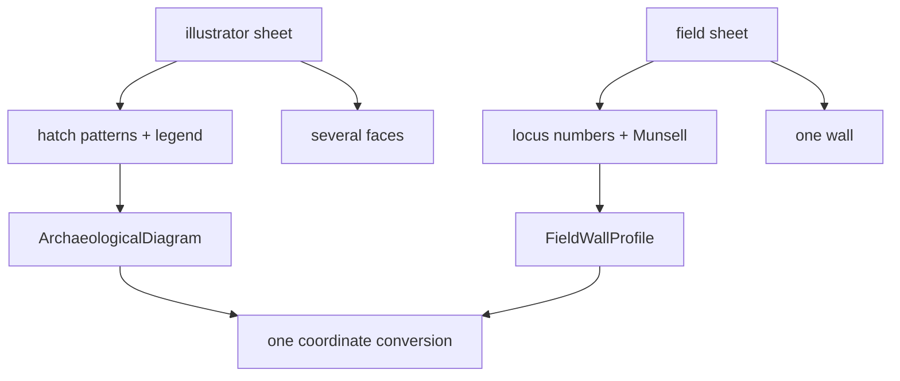

# Recording sheet

The physical document a section is drawn on. This project handles two
traditions, and the difference between them shapes the whole data model.

## What it is

A recording sheet is where the [trench profile](trench-profile.md) lives — the
paper, its layout, its conventions, and the text around the drawing.

Two traditions are in scope here:

**The illustrator sheet.** A polished, measured drawing, often produced after the
fact from field notes. Layers are distinguished by **hatch patterns** keyed to a
legend. Several faces can appear on one sheet. Trench 23's 1980 sheets are of
this kind.

**The field sheet.** Drawn in the trench, on graph paper, while the wall is open.
Layers are identified by **[locus](locus.md) number** and
**[Munsell](munsell-colour.md) reading** rather than by pattern. One wall per
sheet. T104's 2025 sheets are of this kind.

The distinction is not stylistic. They record **material identity** by different
mechanisms, which is why they need different schemas.

## The picture



## Why the difference matters

A hatch pattern says "this material" by reference to a legend on the same sheet.
A locus number says "this recorded unit" by reference to the excavation's own
records. The first is self-contained; the second points outward.

That has a practical consequence. An illustrator sheet can be read without any
other document. A field sheet cannot — the locus numbers mean nothing without the
locus records, which is why the Munsell reading travels with them.

The sheet also carries **text** around the drawing: trench and face labels,
illustrators' names, a date, grid tie labels, marginalia. That text is part of
the record.

## How this project stores it

Two schemas — see [trench profile](trench-profile.md) for their shapes — adapted
to one path by `convert_coords.fieldwall_to_profiles()`.

### The sheet's text is transcribed, not interpreted

`poggio_webapp/pipeline/assign_markers.py`'s prompt:

> PART 1 — transcribe the sheet's text, verbatim:
> - trenchLabel, faceLabel, illustrators, date, northArrowPresent
> - gridTiePoints: the coordinate labels along the top edge, rawText exactly
>   as written
> - loci[]: every locus entry with its Munsell color exactly as written,
>   including duplicates if a locus number appears twice
> - marginalia: any other writing on the sheet

"Including duplicates if a locus number appears twice" is the instructive
instruction. Real sheets contain contradictions — T104 has two entries numbered
5 — and the transcription's job is to record what is there, not to tidy it.
Resolving it happens later, visibly:

```python
notes.append(
    f"locus {num} is listed more than once in loci[] — "
    f"using the first Munsell reading ({munsell_by_locus[num]}) "
    f"and ignoring {label!r}"
)
```

Grid tie labels are transcribed, parsed where they can be, and explicitly
**not applied**:

```python
# The sheet's own tie-in labels are the likeliest source of these
# numbers. Grid labels like "190E/53S" now have a defined reading --
# site_grid.label_to_grid applies the site's sign rule -- so any that
# parse are offered alongside the raw text. They are still offered,
# not applied: which end of a face a label marks is a site-records
# question this module cannot answer.
```

The raw text is kept beside the parse, so the sheet's own wording survives even
when the label is read successfully.

### Text has its own review contract

`poggio_webapp/pipeline/extract_text.py` defines a review vocabulary for
transcribed text:

```python
class ConfidenceLevel(str, Enum):
    HIGH = "high"
    MEDIUM = "medium"
    LOW = "low"


class ReviewStatus(str, Enum):
    ACCEPTED = "accepted"
    CORRECTED = "corrected"
    UNREADABLE = "unreadable"
```

`UNREADABLE` is the important one. A word nobody can make out is a **recorded
outcome**, not a blank — the same principle as a
null [boundary](boundary.md) coordinate with a stated reason.

Verified text raises a point's confidence:

```python
"confidence": (
    "human-verified" if verified_info else "human-entered"
),
```

Typed and confirmed are different claims.

### Sheet metadata reaches the extraction

```python
marginalia = [
    "Boundary and feature geometry was manually traced by a user.",
    "Named field-wall lines are locus tops; each next locus top closes "
    "the locus above, and the separate final line closes the deepest locus.",
    f"Source image: {source_path}" if source_path else "Source image unavailable.",
]
```

The extraction records **how it was made** and **which convention was used** —
see [provenance and data lineage](../cs/provenance-and-data-lineage.md).

## What it is not

| Not a… | Because |
|---|---|
| **[Trench profile](trench-profile.md)** | The profile is the drawing; the sheet is the document carrying it, plus its text and conventions. |
| **A form** | Kobo forms capture structured data. A recording sheet is a drawing with annotation. |
| **A photograph of the wall** | A photograph records appearance; a sheet records an interpretation. |
| **A locus sheet** | The locus record is a separate document describing the unit. A section sheet may reference locus numbers without containing their descriptions — which is why `loci[]` may be incomplete. |
| **Standardised across traditions** | The two kinds differ enough to need different schemas. |

## Getting it wrong

**Assuming a legend exists.** Field sheets have no hatch legend. A tool expecting
one on a T104 sheet finds nothing.

**Assuming locus numbers exist.** Illustrator sheets have layer names and hatch
patterns and no locus numbers. Both directions of this assumption are wrong.

**Tidying transcription.** Duplicates, contradictions, and unreadable words are
part of the record. Transcribe them; resolve them later, visibly, with a note.

**Interpreting tie labels.** A number written along the top edge might be a
northing, an easting, or an elevation. The sheet does not say, and neither should
the extraction.

**Photographing at an angle or too low a resolution.** The
[calibration](scale-and-dpi.md) corrects rotation and scale, not perspective.
See the [drawing guidelines](../reference/drawing-guidelines.md).

## Related pages

- [Trench profile](trench-profile.md) — the drawing on the sheet.
- [Scale and DPI](scale-and-dpi.md) — how the sheet's scale is recovered.
- [Locus](locus.md) and [Munsell colour](munsell-colour.md) — the field sheet's
  identity mechanism.
- [Grid tie point](grid-tie-point.md) — the labels along the top edge.
- [Source drawing types](../concepts/source-drawing-types.md) — the two compared.
- [Drawing guidelines](../reference/drawing-guidelines.md) — how to draw an
  extractable sheet.
