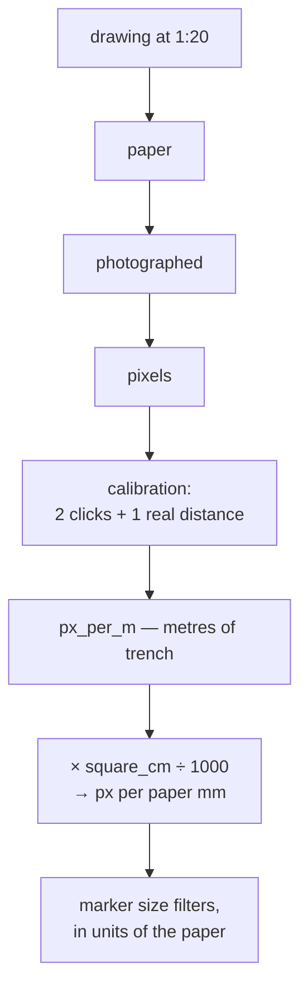

# Scale and DPI

Two different things people call "resolution". **Scale** is how many metres of
trench a centimetre of paper represents; **DPI** is how many pixels a centimetre
of paper became when scanned. Both matter, for different reasons.

## What it is

**Drawing scale** is a property of the *drawing*: 1:20 means one centimetre of
paper is twenty centimetres of trench. Chosen by the recorder and fixed when the
drawing was made.

**Scan resolution (DPI)** is a property of the *photograph*: how finely the paper
was sampled. Chosen when the sheet was digitised, and independent of the drawing
scale.

A third quantity connects them and is what the software actually uses:

**Pixels per metre** — how many pixels correspond to one metre of *trench*. It
comes from [calibration](../cs/similarity-transforms.md): two clicks a known real
distance apart.

A fourth appears in the marker detector:

**Pixels per paper millimetre** — how finely the *paper* is sampled, derived from
pixels-per-metre and the grid square size. Marker sizes are physical properties
of pencil dots, so they are expressed in paper millimetres.

## The picture



## Why it matters

**Scale** is what makes the drawing a measurement. Without it, a traced boundary
is a shape.

**DPI** decides whether the drawing survives digitisation. A boundary line drawn
at 0.3 mm wide is roughly 3.5 pixels at 300 DPI and one pixel at 90 DPI — and one
pixel is what disappears under any resampling.

The project's own driving case: Trench 23 was "scanned well below the 300 DPI the
drawing guidelines recommend," which is why
[upscaling](../cs/lanczos-resampling.md) exists at all.

## How this project stores it

### Calibration, from clicks and one real distance

`poggio_webapp/pipeline/manual_extraction.py`:

```python
dx, dy = rx - ox, ry - oy
pixel_span = math.hypot(dx, dy)
if pixel_span < 2:
    raise ValueError("the two top calibration points are too close together")
...
px_per_m=pixel_span / ref_meters,
```

One division. The `ref_meters` comes from the user — read off a
[tie point](grid-tie-point.md), a scale bar, or the graph-paper grid.

Stored so the browser can reproduce it:

```python
meta["manual_calibration"] = {
    "kind": "manual",
    "origin_px": payload["calibration"]["origin_px"],
    "ref_px": payload["calibration"]["ref_px"],
    "lowest_px": payload["calibration"]["lowest_px"],
    "ref_meters": payload["calibration"]["ref_meters"],
    "px_per_m": round(calib.px_per_m, 6),
}
```

The inputs *and* the derived value, so the calibration can be checked rather than
trusted.

### Paper millimetres, for physical thresholds

`poggio_webapp/pipeline/detect_markers.py`:

```python
# Pixels per paper millimeter.
mm_px = px_per_m * float(square_cm) / 1000.0

if mm_px < 2:
    raise RuntimeError(
        "photo resolution too low for marker detection "
        f"({mm_px:.1f} px per paper mm) — retake closer or "
        "at higher resolution")
```

and the module explains the units choice:

> Marker size limits are given in PAPER millimeters (how big the pencil dot
> is on the sheet) and converted through square_cm, assuming one bold grid
> square is 1 cm of paper -- standard for mm graph paper.

So `min_marker_paper_mm=0.5` and `line_kill_paper_mm=0.35` are numbers a person
holding the drawing can check with a ruler — resolution-independent by
construction. See
[structuring elements](../cs/structuring-elements.md).

The `mm_px < 2` refusal is honest: below that, a 0.35 mm kernel rounds to the
floor and stops meaning anything.

### Upscaling, tuned against the next stage

`poggio_webapp/pipeline/preprocess.py`:

```python
def recommend_upscale(width, height, target_dim=3000):
    """Suggest an upscale factor that lands the image's longest side near
    `target_dim` pixels.

    Rationale: preprocessing's upscale exists to keep thin boundary lines
    from vanishing on LOW-DPI scans -- it has no benefit on an
    already-high-res photo, and extraction caps the longest side to
    MAX_SEND_DIMENSION ... before sending to Gemini regardless. Landing near
    that same target means preprocessing's upscale doesn't do work that
    just gets undone again a step later, while a genuinely low-res scan
    still gets real help.
    """
```

and the recommendation says which case you are in:

```python
if max_dim < 1500:
    reason = ("low-resolution scan -- a higher upscale helps keep thin "
               "boundary lines from vanishing before extraction.")
elif max_dim < target_dim:
    reason = "moderate resolution -- a modest upscale can help a bit."
else:
    reason = ("already high-resolution -- little upscale needed; ...")
```

Upscaling **cannot add detail that was not captured**. It redistributes what is
there so thin lines survive later processing — see
[Lanczos resampling](../cs/lanczos-resampling.md). A drawing scanned too coarsely
is not recoverable.

## What it is not

| Not a… | Because |
|---|---|
| **[Grid registration](grid-registration.md)** | Scale converts pixels to face-local metres. Registration converts those to site coordinates. Two steps, two kinds of evidence. |
| **Drawing scale alone** | The software never uses `1:20` directly. It uses pixels per metre, derived from a real measured distance. |
| **DPI alone** | DPI relates pixels to *paper*. Pixels per metre relates pixels to *trench*. The grid square connects them. |
| **Recoverable by upscaling** | Upscaling redistributes; it does not add information. |
| **A [tie point](grid-tie-point.md)** | Tie points may supply the real distance. The calibration is what uses it. |

## Getting it wrong

**Scanning below 300 DPI.** The recommendation in the
[drawing guidelines](../reference/drawing-guidelines.md), and Trench 23 is the
counter-example the upscale exists for.

**Calibrating on too short a distance.** Two clicks close together make every
derived metre sensitive to a pixel of click error. Refused below 2 px, and below
20 px in the CV path — but "not refused" is not the same as "accurate."

**Assuming a bold grid square is 1 cm.** Standard for mm graph paper and stated
as an assumption. A sheet with a different ruling gives wrong paper-millimetre
thresholds.

**Photographing at an angle.** The calibration corrects rotation and uniform
scale, not perspective. Scale then varies across the sheet and the error grows
with distance from the calibration points.

**Expecting upscaling to rescue a poor scan.** It helps thin lines survive
processing. It cannot recover a line that fell below one pixel.

## Related pages

- [Recording sheet](recording-sheet.md) — what is being scanned.
- [Grid tie point](grid-tie-point.md) — a source of the real distance.
- [Grid registration](grid-registration.md) — the next conversion.
- [Similarity transforms](../cs/similarity-transforms.md) — the calibration
  geometry.
- [Lanczos resampling](../cs/lanczos-resampling.md) — the upscale.
- [Drawing guidelines](../reference/drawing-guidelines.md) — the DPI
  recommendation.
- [Prepare the image](../workflows/02-prepare-image.md) — the workflow step.
