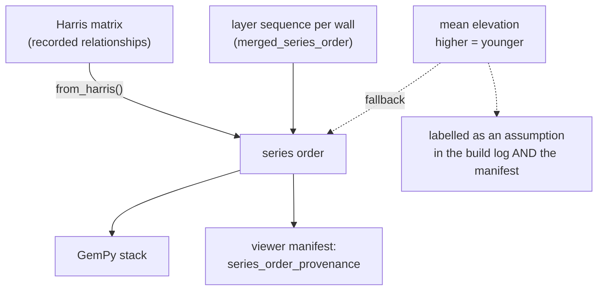

# Series order

The single young-to-old ordering of surfaces that the model is built from —
and, just as importantly, the record of **which evidence supplied it**. Three
sources are available, they are not equally trustworthy, and one of them is
wrong at this site in a way the others are not.

## What it is

GemPy needs a *series*: one total order of stratigraphic surfaces, youngest
first. That is a modelling requirement, not an archaeological fact, and
something has to produce it.

`poggio_webapp/pipeline/series_order.py` names the four possible sources and
ranks them:

| Constant | Source | What it is worth |
|---|---|---|
| `SUPPLIED` | an order sent with the build request | whatever the operator knows |
| `HARRIS` | the trench's [Harris Matrix](harris-matrix.md) | the excavation's own record of relationships |
| `RECORDED` | each wall's layer sequence, top to bottom | real evidence, about what one wall saw |
| `ELEVATION` | mean elevation of each surface's points | **not evidence** — an assumption |

The module's whole purpose is that the fourth is still available and is never
allowed to pass for the first three.

## The picture



The dotted path is the important one. Elevation ordering is not removed — a
model with no other information still has to be buildable — but it never
arrives unlabelled.

## Why excavation records it

Stratigraphy *is* order. The [law of superposition](law-of-superposition.md)
gives you a local rule and the Harris Matrix gives you a whole trench's worth of
relationships, built by the people who dug it. That record already exists in
every trenchbook, which is why it outranks anything the software can infer from
geometry.

The site's own procedures rule the elevation assumption out as a general rule,
in as many words:

> we excavate in reverse chronological order of deposition (from most recent to
> oldest) … sometimes, however, stratigraphically newer deposits may exist at
> lower elevations than stratigraphically older deposits

T104 is exactly that case: the 2025 report describes the Intermediate Phase
surface diving over 2 m below the contemporary floor of OC2/Workshop. Sort those
by elevation and the model confidently inverts them — and looks entirely
plausible doing it.

## How this project stores it

The descriptions the build log and the manifest carry:

```python
SOURCE_DESCRIPTIONS = {
    HARRIS: "the trench's Harris matrix",
    RECORDED: "the layer sequence recorded on each wall",
    ELEVATION: (
        "mean elevation, an assumption that higher means younger. This site's "
        "procedures record cases where it does not: stratigraphically newer "
        "deposits can sit at lower elevations than older ones. Supply a Harris "
        "matrix or a series order to replace this"
    ),
    SUPPLIED: "an order supplied with the build request",
}
```

The elevation entry is four times the length of the others, and that asymmetry
is the design: the weakest source has to explain itself hardest, and the text
ends with the remedy.

`build_gempy.run_build` resolves and records both:

```python
"series_order": surf_order,
"series_order_source": resolved_source,
"series_order_note": order_note,
```

and the viewer manifest carries the provenance alongside the order itself, so a
reader looking at a rendered model can see what its sequence rests on:

```python
"series_order": [str(name) for name in series_order],
"series_order_provenance": {
```

### Names have to match as strings

```python
def _unit_surface(unit):
    """The model surface a Harris unit refers to, or None.

    A field-sheet unit is labelled with the bare locus number, so it becomes
    ``Locus 6`` through the same function the converter uses -- the names have
    to match as strings for GemPy to fuse anything. An illustrator unit's label
    is already the layer name the converter emits.
    """
```

The Harris matrix and the points CSV are built by different code paths from
different documents. They meet only through `convert_coords.surface_id()`, and
using the same function on both sides is what makes the join work. See
[locus](locus.md) for why that identity is the locus number alone.

### An order may not name a surface the model lacks

```python
def from_harris(...):
    """A young-to-old surface order from a Harris matrix.

    ``available_surfaces``, when given, is the set of surface names the model
    actually has points for. Anything else is dropped: ``run_build`` refuses a
    series order naming a surface absent from the points CSV, and a matrix
    legitimately holds units this model does not cover.
    """
```

A trench's matrix covers the whole excavation; a model covers whichever walls
were traced. The mismatch is normal, so it is filtered rather than treated as an
error — but only in this direction. The opposite case, an order missing a
surface the points contain, is still a refusal.

Reachability is computed before the drop, so an ordering implied through a chain
of relations survives even when the intermediate unit is not modelled:

```python
def _reachable(...):
    """Transitive closure, so an ordering implied through a chain counts."""
```

### Contemporaneity is recorded, not invented away

The module docstring states the mismatch plainly:

> A Harris matrix represents that faithfully by having no edge between them.
> GemPy cannot: its stack is a total order. So the order this module returns
> will separate them anyway, and it records which adjacent pairs were placed
> arbitrarily so the model does not present an invented sequence as a recorded
> one.

`from_harris` returns `(order, arbitrary_pairs, notes)`. The second element is
the list of adjacent pairs the matrix does not order — deposits the excavation
recorded as simultaneous, which the stack forced into a sequence.

This is the same honesty move as [wall traces](interface-point.md): the model
has to commit to something, so the commitment is shipped next to a record of
where it was arbitrary. See
[interpolation versus measurement](../cs/interpolation-vs-measurement.md).

## What it is not

| Not a… | Because |
|---|---|
| **[Harris Matrix](harris-matrix.md)** | The matrix is a partial order — a graph with genuinely unordered pairs. A series order is a total order flattened out of it. |
| **[Stratigraphy](stratigraphy.md)** | Stratigraphy is the sequence as excavated. A series order is one linearisation of it that a particular modelling library needs. |
| **A phasing** | Phases group units into periods of activity. This is an ordering of individual surfaces and does no grouping. |
| **[Topological sort](../cs/topological-sorting.md) output alone** | The sort produces *an* order; this module decides which evidence is sorted and labels the result. |
| **A statement about elevation** | When the source is `ELEVATION` it *is* an elevation statement, and says so. When it is `HARRIS` the elevations are irrelevant. |

## Getting it wrong

**Reading an elevation-sourced order as a result.** It is an assumption, and the
site has documented counterexamples. The build log and the manifest both name
the source; anything reporting the order without the provenance has dropped the
part that matters.

**Assuming an order means the deposits are sequential.** Adjacent pairs in
`arbitrary_pairs` were unordered in the matrix. They appear in some sequence
because the stack requires one.

**Supplying an order with a surface the points do not contain.** Refused. The
model would carry a stack entry with nothing to fit.

**Expecting a Harris matrix to cover every modelled surface.** It usually
covers more, not less. Units outside the model are dropped; the implied
orderings through them are preserved by the transitive closure.

**Correlating loci after the order is derived.** Correlation collapses units,
so an order built before it can contradict one built after. `_component_surfaces`
works from correlation representatives for exactly this reason.

## Related pages

- [Harris Matrix](harris-matrix.md) — the authoritative source.
- [Stratigraphy](stratigraphy.md) and
  [Law of superposition](law-of-superposition.md) — why order is meaning.
- [Correlation](correlation.md) — what collapses units before ordering.
- [Topological sorting](../cs/topological-sorting.md) — the algorithm.
- [Directed acyclic graphs](../cs/directed-acyclic-graphs.md) — the structure.
- [Interpolation versus measurement](../cs/interpolation-vs-measurement.md) —
  the same honesty principle applied to geometry.
