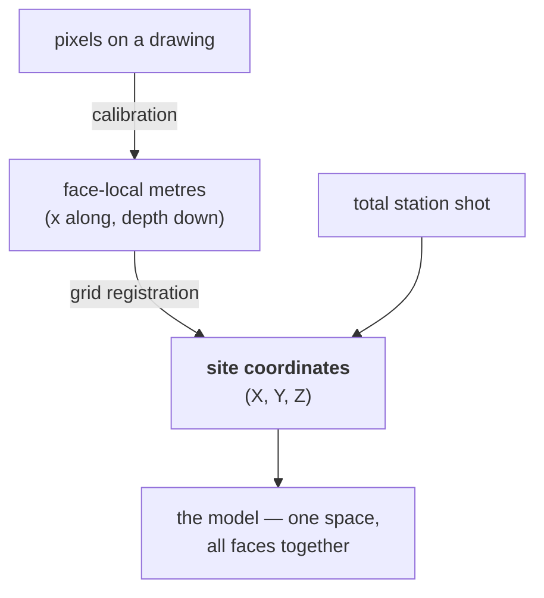

# Site coordinates

The shared three-dimensional system every recorded position on the site converts
into. The only space in which measurements from different walls, trenches, and
seasons can be compared.

## What it is

A site coordinate is a triple:

```
X — easting     metres east on the site grid
Y — northing    metres north on the site grid
Z — elevation   metres above the datum
```

The grid is usually local and arbitrary — origin at a convenient point, axes
aligned to something useful — rather than a national projection. What matters is
that it is **shared**: every measurement on the site descends from the same
origin and the same [datum](datum.md).

At Poggio Civitate the rules are concrete, and
`poggio_webapp/pipeline/site_grid.py` is the one place that holds them. There
are **two** local grids — the hill of Poggio Civitate and Vescovado di Murlo —
so a bare pair of numbers is not a location until the grid is named. Grid X is
the E/W value and is recorded first, Grid Y the N/S value; and **South and West
are negative**, so a label of `190E/53S` reads as `(190, -53)`. Model
coordinates *are* grid coordinates: `site_grid.grid_to_site` is the identity
function, and exists so that assumption is written down once.

Poggio Civitate's total station workflow records exactly these three, which is
why `site_vocab` notes that a survey shot is directly comparable to what this
application reconstructs from drawings:

```python
# Total-station point codes. Relevant here because a shot carries Northing,
# Easting and Elevation on the local grid -- i.e. exactly the interface points
# this application otherwise reconstructs from drawings.
```

## The picture



Two independent routes into the same space. That is the point of having one.

## Why excavation records it

Depth is measured from each wall's own top edge, and those edges are at different
heights. Face-local x is measured from each wall's own starting point. Neither is
comparable across walls.

Site coordinates are the space where they become comparable — where the four
walls of a trench form a pit, where a [find](find.md) can be placed relative to a
boundary, and where a model can be built.

They also outlive the excavation. A trench backfilled twenty years ago can be
relocated from its coordinates.

## How this project stores it

### The conversion, in one function

`poggio_webapp/pipeline/convert_coords.py`:

```python
def to_site(x, depth, X0=X0, Y0=Y0, Z0=Z0, sin_t=sin_t, cos_t=cos_t):
    X = X0 + x * sin_t
    Y = Y0 + x * cos_t
    Z = Z0 - depth
    return X, Y, Z
```

`sin` on X and `cos` on Y because the bearing is a
[compass angle](bearing-and-azimuth.md); `Z = Z0 − depth` because depth runs
down.

### The output

```python
rows.append({"X": round(X, 4), "Y": round(Y, 4), "Z": round(Z, 4),
             "surface": surface, "face": fname})
```

Written to `points.csv`, four decimal places — 0.1 mm, which is as much as the
tracing supports. See
[grid snapping and quantisation](../cs/grid-snapping-and-quantisation.md).

`face` travels alongside so a reader can tell which wall each point came from —
which is what lets `wall_traces` draw the recorded evidence over the interpolated
model.

### The units are declared, not assumed

`poggio_webapp/pipeline/build_gempy.py`:

```python
"coordinate_system": {
    "units": "m",
    "up_axis": "Z",
},
```

and both the server and the browser check it:

```python
and coordinate_system.get("units") == "m"
and coordinate_system.get("up_axis") == "Z"
```

Stating which axis is up rather than assuming it — see
[schema versioning](../cs/schema-versioning.md).

### The model extent is bounded by the data

```python
def infer_extent(points, pad_xy, pad_z):
    xmin, xmax = points["X"].min(), points["X"].max()
    ymin, ymax = points["Y"].min(), points["Y"].max()
    zmin, zmax = points["Z"].min(), points["Z"].max()

    def pad(lo, hi, minimum):
        span = hi - lo
        p = max(span * 0.1, minimum)
        return lo - p, hi + p
```

The model does not extend arbitrarily beyond where anything was recorded — see
[interpolation versus measurement](../cs/interpolation-vs-measurement.md).

### One reason a wall may be sorted along Y rather than X

```python
x_span = group["X"].max() - group["X"].min()
y_span = group["Y"].max() - group["Y"].min()
ordered = group.sort_values("X" if x_span > y_span else "Y", kind="stable")
```

A wall running north–south has effectively one X for every point. Sorting by X
first would leave the trace in arbitrary order — a small consequence of the fact
that in site coordinates, a wall is no longer axis-aligned.

## What it is not

| Not a… | Because |
|---|---|
| **Face-local coordinates** | Local coordinates are per face: x along, depth down. Site coordinates are shared. |
| **Pixel coordinates** | Pixels are a property of the photograph. |
| **Latitude and longitude** | A local grid, usually arbitrary. Relating it to a global system needs a separate survey tie. |
| **[Grid registration](grid-registration.md)** | Registration is the *transform*; site coordinates are the result. |
| **A national projection** | Unless deliberately tied to one, which is a separate act. |

## Getting it wrong

**Comparing depths instead of elevations.** Depth is per face; only Z is shared.

**Assuming X is east.** It is here, and on a local grid the axis meanings are a
site convention that has to be checked, not assumed.

**Confusing northing/easting order.** Survey data is often quoted
northing-first, and this project stores X (easting) first. Transposing them
reflects the whole model about a diagonal — and the result looks like a plausible
trench in the wrong place.

**Publishing real coordinates carelessly.** The documentation's own visual
manifest lists "no real survey coordinates" among its publication-safety rules,
because precise coordinates of an unpublished site are sensitive.

**Reading equal Z as contemporaneity.** Two deposits at the same elevation in
different places are not related. Elevation is geometry; sequence is
[stratigraphy](stratigraphy.md).

## Related pages

- [Grid registration](grid-registration.md) — the transform into this space.
- [Datum](datum.md) and [elevation](elevation.md) — the vertical axis.
- [Bearing and azimuth](bearing-and-azimuth.md) — the angle convention.
- [Interface point](interface-point.md) — a boundary point in this space.
- [Survey point codes](survey-point-codes.md) — how the site measures directly
  into it.
- [Coordinate spaces](../concepts/coordinate-spaces.md) — the three spaces
  compared.
