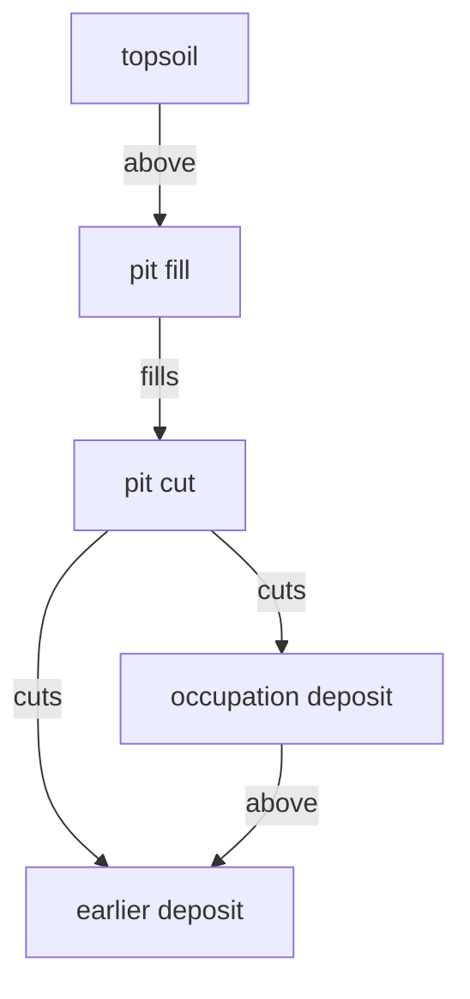

# Stratigraphic relationships

The recorded statements about which unit came before which. Each is an
observation, each carries a reason, and together they are the site's chronology.

## What it is

A relationship connects two stratigraphic units and asserts their order. This
project's vocabulary:

| Kind | Means |
|---|---|
| `above` | the younger lies over the older — plain [superposition](law-of-superposition.md) |
| `cuts` | the younger truncated the older — a [cut](cut.md) through it |
| `fills` | the younger is the [fill](fill.md) of the older cut |
| `precedes` | the younger is later, by a relationship not of the other kinds |
| `other` | a relationship the recorder describes in the evidence text |

`cuts` and `fills` are separate from `above` because they say more. `above` says
one unit lies over another. `cuts` says the younger **removed part of** the
older, which is a much stronger observation and usually a much sharper date.

Every relationship is **directed** — younger to older — and **transitive**: if A
is above B and B above C, then A is above C, whether or not anyone recorded it.

## The picture



One pit produces four separate recorded relationships, and each is a distinct
observation an excavator could make or miss.

## Why excavation records it

The relationships **are** the chronology. Units alone are a list; the
relationships turn them into a sequence.

They are also the *evidence*. A relationship is something someone saw in the
ground and can no longer be checked, because the excavation removed it. That is
why the schema demands a reason.

And they are what makes contradiction detectable. Three relationships that cannot
all hold form a [cycle](../cs/cycle-detection.md), and a cycle is a reportable
error rather than an aesthetic judgement.

## How this project stores it

`poggio_webapp/pipeline/harris_matrix.py`:

```python
RelationKind = Literal["above", "cuts", "fills", "precedes", "other"]
RelationSource = Literal["manual", "suggestion"]


class HarrisRelation(_HarrisModel):
    id: RelationId
    younger_id: UnitId
    older_id: UnitId
    kind: RelationKind
    evidence: HumanText
    source: RelationSource
    notes: HumanText | None
```

Three fields worth dwelling on.

**`evidence` is required.** Not optional, unlike `notes`. A chronological
assertion without a stated reason cannot be stored. That is a schema encoding an
epistemic standard — see
[JSON schema design](../cs/json-schema-design.md).

**`source` records who asserted it** — `"manual"` for a person,
`"suggestion"` for an accepted machine proposal. Provenance travels with the
claim.

**`kind` is a closed vocabulary.** A `Literal` type, so an unrecognised kind is a
validation error at the boundary rather than a surprise later.

### The invariants checked

`validate_matrix_graph` reports several error classes, each a specific
impossibility:

```python
if relation.younger_id == relation.older_id:
    errors.append(
        _issue(
            "self-relation",
            f"Relation {relation.id} connects unit {relation.younger_id} to itself.",
            ...,
        )
    )
```

```python
for (younger, older), relation_ids in sorted(relations_by_pair.items()):
    if len(relation_ids) > 1:
        errors.append(
            _issue(
                "duplicate-relation",
                f"Multiple relations assert {younger} -> {older}.",
                ...,
            )
        )
```

```python
and components[relation.younger_id] == components[relation.older_id]
...
errors.append(_issue(
    "relation-within-correlation",
    f"Relation {relation.id} connects units in the same "
    "correlation component.", ...))
```

That last one is subtle and important. If two units are
[correlated](correlation.md) — asserted to be the *same* deposit — then a
relationship between them says a deposit is younger than itself. The check
catches a contradiction that only arises from the *combination* of two
individually reasonable assertions.

### Implied relationships are hidden, not deleted

```python
for edge in sorted(edges - reduced_edges):
    warnings.append(
        _issue(
            "redundant-relation",
            f"Saved relation {edge[0]} -> {edge[1]} is implied by "
            "a longer path and is omitted from display edges.",
            list(edge),
            relation_ids_by_edge[edge],
        )
    )
```

A **warning**, and the relation stays in the data. The archaeologist observed
something; the software's inference that it is implied rests on the *other*
relationships, any of which might later be corrected. See
[transitive reduction](../cs/transitive-reduction.md).

### Suggested relationships are conservative

`poggio_webapp/pipeline/harris_suggestions.py` proposes only where two
consecutive layers in one source share a recorded boundary within tolerance:

```python
_ORDERING_REASON = "Consecutive source layers share a recorded boundary."
```

and always as `kind="above"` — never `cuts` or `fills`, which require judgement
the geometry cannot supply.

## What it is not

| Not a… | Because |
|---|---|
| **[Correlation](correlation.md)** | A relationship says one unit is *younger*. A correlation says two units are *the same*. Asserting both between the same pair is an error. |
| **A date** | It gives relative order only. |
| **Contemporaneity** | The vocabulary has no way to say "these are the same age." Two unrelated units are simply unordered. |
| **Automatic** | Suggestions are proposals; every one is accepted or rejected individually. |
| **Reversible by editing** | The direction is the claim. Swapping `younger_id` and `older_id` asserts the opposite. |

## Getting it wrong

**Using `above` where `cuts` belongs.** Both are valid, and `cuts` records that
the younger unit truncated the older — a stronger and more useful statement.

**Recording a relationship between correlated units.** Individually reasonable,
jointly contradictory. Caught as `relation-within-correlation`.

**Recording implied relationships and expecting them drawn.** A matrix shows
*immediate* relationships; an implied one is omitted from the diagram, with a
warning.

**Leaving `evidence` thin.** The schema requires a string; it cannot require a
*good* one. "Observed in section" is less useful in ten years than "pit sides
truncate the occupation deposit at 0.4 m".

**Creating a cycle.** Three relationships that cannot all hold. The matrix
refuses to save, naming the units and the specific relation IDs on the loop.

## Related pages

- [Harris Matrix](harris-matrix.md) — where relationships are drawn.
- [Law of superposition](law-of-superposition.md) — what `above` encodes.
- [Cut](cut.md) and [fill](fill.md) — what `cuts` and `fills` encode.
- [Correlation](correlation.md) — the other kind of assertion.
- [Cycle detection](../cs/cycle-detection.md) — how contradictions are found.
- [Directed acyclic graphs](../cs/directed-acyclic-graphs.md) — the structure.
