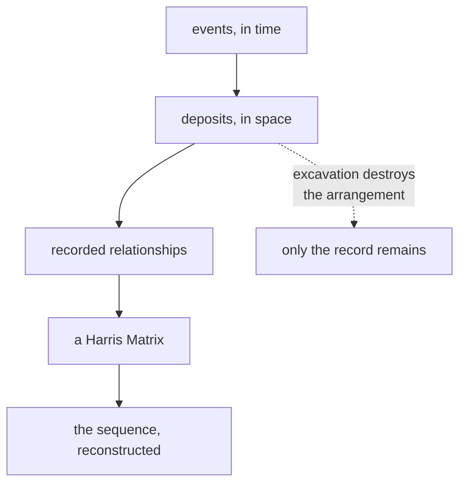

# Stratigraphy

The study of layers and their order. The discipline this entire application
exists to serve, and the reason a wrong answer here matters more than a slow one.

## What it is

Stratigraphy is the analysis of how deposits accumulate and what their
arrangement says about the order of events.

Its core claim is simple: **the arrangement of deposits records the sequence of
the events that produced them.** A layer of destruction debris over a floor means
the building burned after the floor was laid. That inference — from spatial
arrangement to temporal order — is the whole method.

Three things follow, and each shapes this software:

**The order is partial, not total.** Two deposits on opposite sides of a trench
with no physical relationship have no known order. Any system forcing a total
order would invent chronology. This is why the data model is a
[graph](../cs/graphs-and-terminology.md) rather than a list.

**Relationships are observed, not derived.** That A lies above B is something an
excavator saw. It is evidence, and it is recorded with a reason.

**It is destroyed by the act of reading it.** Excavating a deposit to reach the
one below removes the relationship permanently. The record is all that survives.

## The picture



## Why it is the point

Archaeology dates things by association. An object's date comes from the deposit
it was found in; the deposit's date comes from its position in the sequence. Break
the stratigraphy and the dating goes with it.

The sequence is also the *history* — not merely a filing system for finds. That a
floor was laid, used, burned, robbed, and buried is the site's story, and it is
read off the layers.

## How this project stores it

Stratigraphy appears in two places, and both refuse rather than guess.

### As layer order within a face

`layers[]` is ordered top to bottom, which is young to old, and
`poggio_webapp/pipeline/merge_walls.py` reads that as constraints:

```python
"""One trench-wide young-to-old surface order for a merged document.
...
Each face's layers[] is already top-to-bottom, i.e. young to old, so every
adjacent pair within a face is an ordering constraint. The constraints from
all faces are merged and topologically sorted (Kahn's algorithm). ...

Raises ValueError if the walls contradict each other (a cycle). Guessing an
order there would invent stratigraphy, so it refuses.
"""
```

"Guessing an order there would invent stratigraphy" is the sentence that governs
the design.

### As an explicit relationship graph

`poggio_webapp/pipeline/harris_matrix.py` models the chronology directly:

```python
class HarrisRelation(_HarrisModel):
    id: RelationId
    younger_id: UnitId
    older_id: UnitId
    kind: RelationKind
    evidence: HumanText
    source: RelationSource
    notes: HumanText | None
```

`evidence` is **required**. A relation without a stated reason is not storable —
see [JSON schema design](../cs/json-schema-design.md).

A contradiction is an error, and the message names the units on the
[cycle](../cs/cycle-detection.md):

```python
errors.append(_issue(
    "cycle",
    f"Chronological cycle detected: {' -> '.join(cycle)}.",
    cycle,
    _cycle_relation_ids(cycle, relation_ids_by_edge),
))
```

### As geometry the validator checks

Crossing layers are physically impossible, so
`poggio_webapp/pipeline/validator.py` makes it an **error**:

```python
report.err(
    where,
    f"bottom at x={x} (depth {y:.2f}) is ABOVE "
    f"{prev_name}'s bottom (depth {above:.2f}) — layers cross")
```

while a gap is only a **warning**, because a void can be real. That severity
split *is* the stratigraphy, encoded — see
[error taxonomies](../cs/error-taxonomies.md).

## What it is not

| Not a… | Because |
|---|---|
| **Chronology in years** | Stratigraphy gives *relative* order. Absolute dates come from finds, radiocarbon, or historical association. |
| **[Harris Matrix](harris-matrix.md)** | The matrix is a *diagram* of the stratigraphy. The stratigraphy is the thing in the ground. |
| **Geology** | The same principles, applied to human deposits accumulating over decades rather than sediments over millennia. Overlapping vocabulary, very different timescales. |
| **The 3D model** | The model interpolates between recorded surfaces. The stratigraphy is what was observed. |
| **Phasing** | Phasing groups units into periods of activity. It is a later interpretive step this application does not perform. |

## Getting it wrong

**Forcing a total order.** Two unrelated deposits have no relationship, and any
data structure requiring one manufactures a claim.

**Correlating on appearance.** Two similar-looking deposits in different parts of
a trench are not necessarily the same. This is why
[correlation](correlation.md) is always human-confirmed here:

> Correlation — the interpretation that two units are the same deposit — is
> separate and always human-confirmed; equal labels never merge on their own.

**Trusting the model over the record.** The 3D model is interpolated. It renders
exactly as confidently as a measurement, which is why `wall_traces` draws the
actual recorded points over it:

> A viewer can draw these over the interpolated surfaces so a reader can tell
> data from interpolation -- everything away from a trace is the interpolator's
> guess.

**Assuming locus numbers are comparable across time.** A trench reopened after a
gap may restart numbering — see
[locus numbering epochs](locus-numbering-epochs.md).

## Related pages

- [Law of superposition](law-of-superposition.md) — the founding principle.
- [Harris Matrix](harris-matrix.md) — how the sequence is drawn.
- [Stratigraphic relationships](stratigraphic-relationships.md) — the
  vocabulary.
- [Layer](layer.md), [cut](cut.md), [fill](fill.md) — the units.
- [Directed acyclic graphs](../cs/directed-acyclic-graphs.md) — the data
  structure.
- [From archaeology to 3D](../concepts/archaeology-to-3d.md) — the pipeline.
