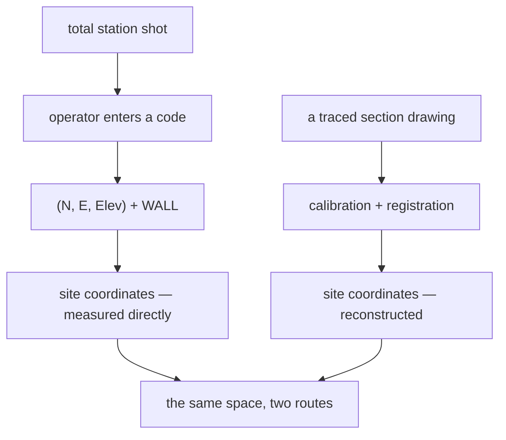

# Survey point codes

The short labels a total station records against each shot, saying what was
measured. A controlled vocabulary transcribed from the site's own workflow — and
the point at which surveyed positions and drawing-derived ones become
comparable.

## What it is

A total station measures a point and records its position. It does not know what
the point *is*, so the operator enters a code:

| Code | Means |
|---|---|
| `CTRL` | Control point |
| `UNIT` | Unit corner |
| `WALL` | Wall |
| `STONE` | Isolated stone |
| `ART` | Artifact |
| `FEAT` | Feature |
| `TEST` | Test pit |
| `TOPO` | Ground surface |

A shot carries **northing, easting, and elevation** on the site's local grid —
which is exactly [site coordinates](site-coordinates.md).

The vocabulary is closed on purpose. A free-text field would produce `wall`,
`Wall`, `wall?`, and `w` across one season, and nothing could be filtered
reliably afterwards.

## The picture



## Why it matters here

`poggio_webapp/pipeline/site_vocab.py` records exactly why this vocabulary
appears in a drawing-processing application at all:

```python
# Total-station point codes. Relevant here because a shot carries Northing,
# Easting and Elevation on the local grid -- i.e. exactly the interface points
# this application otherwise reconstructs from drawings.
SURVEY_POINT_CODES = {
    "CTRL": "Control point",
    "UNIT": "Unit corner",
    "WALL": "Wall",
    "STONE": "Isolated stone",
    "ART": "Artifact",
    "FEAT": "Feature",
    "TEST": "Test pit",
    "TOPO": "Ground surface",
}
```

A surveyed point and a drawing-derived
[interface point](interface-point.md) are the same kind of thing in the same
space. One is **measured directly**; the other is **reconstructed** through
[calibration](scale-and-dpi.md) and [registration](grid-registration.md).

That makes surveyed points a potential **check** on the reconstruction. If a
`WALL` shot and a traced wall disagree by half a metre, the registration is
wrong.

Some codes are also the *source* of registration values. A `UNIT` shot at a
trench corner is where `originX` and `originY` come from; a `TOPO` shot gives
`surfaceZ`.

## How this project stores it

The vocabulary is currently a **reference**, and the drawable feature types are
tagged with the survey code they would correspond to:

```python
DRAWN_FEATURE_TYPES = (
    {"key": "stone", "label": "Stone", "kind": "material",
     "material": "S", "surveyCode": "STONE"},
    ...
    {"key": "wall", "label": "Wall", "kind": "unit",
     "unitType": "structure", "surveyCode": "WALL"},
    ...
)
```

Only two entries carry a `surveyCode`, and the rest are `None` — which is honest.
A tile fragment drawn in section is not something anyone shoots with a total
station; a stone or a wall is.

That tag is what would let a drawn stone be matched against its survey shot.
Three vocabularies cross-referenced on one record: a
[bulk-find material letter](find-identifiers.md), a
[Harris unit type](harris-matrix.md), and a survey code — each pointing at a
different system the site already runs.

The module states the general principle:

> Identifiers are the part of a record that has to survive leaving the machine
> that made it.

The same applies to codes. `STONE` means something to the site's survey data;
`stone` typed freely into this application would not.

Note the vocabulary is transcribed with its source cited:

> total-station feature codes -- *260715 Murlo Site Total Station Workflow*

so a reader can check the list against the standard rather than trusting the
code.

## What it is not

| Not a… | Because |
|---|---|
| **[Find identifiers](find-identifiers.md)** | A find identifier names a *bag of material*. A survey code names *what kind of point* was shot. Both live in `site_vocab`, and they answer different questions. |
| **[Feature](feature.md) types** | The drawable vocabulary is longer and includes things nobody surveys. `surveyCode` is the mapping between them where one exists. |
| **[Interface points](interface-point.md)** | Interface points are reconstructed from drawings. Survey points are measured. The same space, different provenance. |
| **A Harris unit type** | `WALL` says a wall was shot; `unitType: "structure"` says a wall is a structural stratigraphic unit. Different systems, related meanings. |
| **Implemented** | The vocabulary is present as reference. Nothing in this application currently ingests total-station data. |

## Getting it wrong

**Using free text instead of a code.** The whole point of a closed vocabulary is
that it can be filtered. `wall`, `Wall`, and `w` cannot be.

**Confusing `ART` with a [find](find.md) record.** `ART` marks a shot at an
artifact's position. The find record — with its
[identifier](find-identifiers.md), material, and description — is separate. The
shot gives coordinates; the find record gives everything else.

**Assuming surveyed and traced positions must agree exactly.** They will not.
Tracing accumulates calibration error, drawing error, and registration error. A
disagreement of centimetres is normal; a disagreement of half a metre indicates a
registration problem.

**Treating `CTRL` as ordinary data.** Control points define the grid itself.
Losing or moving one invalidates everything measured from it.

## Related pages

- [Site coordinates](site-coordinates.md) — the space a shot records into.
- [Interface point](interface-point.md) — the reconstructed counterpart.
- [Grid registration](grid-registration.md) — where `UNIT` and `TOPO` shots feed
  in.
- [Find identifiers](find-identifiers.md) — the other vocabulary in
  `site_vocab`.
- [Datum](datum.md) — what elevations descend from.
- [Feature](feature.md) — the drawable types carrying `surveyCode`.
