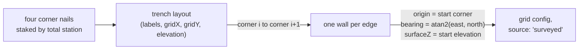

# Trench layout

The surveyed shape and position of a trench: four corner nails with grid
coordinates and opening elevations, and the walls between them. It is the first
section of every trenchbook, and it is enough to derive a whole
[grid registration](grid-registration.md) without anyone typing a bearing.

## What it is

Before anything is dug, the trench is **staked**. A total station puts a nail at
each corner, its grid coordinates are written on surveyor's tape wrapped round
the nail, and the numbers go into the master Geospatial Spreadsheet under the
season's opening-coordinates column. An opening elevation is shot at each corner
too.

*Excavation and Documentation Procedures* names the section and its contents:

> Opening trench dimensions, in meters. Opening coordinates of the four corners
> of your trench. How your trench was sited on the master grid … The location
> and elevation of your datum nail.

A layout is therefore: **corners in order around the pit**, each with a grid
label like `190E/53S` (or numeric `gridX`/`gridY`) and an elevation; plus
**wall names**, one per edge. The last wall closes back to the first corner. A
corner's `label` is its *grid* label, parsed by `site_grid.label_to_grid`,
never a corner name like `NW`, which is a different thing the
[Geospatial Spreadsheet](geospatial-spreadsheet.md) keeps under `corner`.

## The picture



Note the direction of travel. Everywhere else in this application, registration
is something an operator supplies. Here it is **derived**, because the survey already
knows where the walls are.

## Why excavation records it

A trench with no recorded position is a hole. The layout is what ties the
excavation to the site: it says which square metres were opened, so that a
find's [locus](locus.md) can be a place and not just a number, and so that next
season's trench can be sited against this one.

It is also the excavation's own audit trail for the grid. Corner coordinates
staked by instrument, written on the nail, and logged in a spreadsheet are three
independent records of one fact, which is the same redundancy pattern as
[locus numbers](locus.md) joining a find bag, a locus sheet, and a section
drawing.

## How this project stores it

A layout posted to `POST /api/trenches/<label>/layout`:

```json
{
  "site_grid": "poggio-civitate",
  "corners": [
    { "label": "190E/53S", "elevation": 24.31 },
    { "label": "194E/53S", "elevation": 24.28 },
    { "label": "194E/57S", "elevation": 24.19 },
    { "label": "190E/57S", "elevation": 24.22 }
  ],
  "walls": ["north wall", "east wall", "south wall", "west wall"]
}
```

Each corner carries either a grid label, read through the site's own sign rule
(`190E/53S` is `gridX 190, gridY -53`), or explicit numeric `gridX` and
`gridY`.

`poggio_webapp/pipeline/trench_layout.py` turns each edge into a face:

```python
for index, name in enumerate(walls):
    start = corners[index]
    end = corners[(index + 1) % len(corners)]
    start_point = (start["gridX"], start["gridY"])
    end_point = (end["gridX"], end["gridY"])
    faces[name] = {
        "originX": round(start["gridX"], 4),
        "originY": round(start["gridY"], 4),
        "surfaceZ": start["elevation"],
        "bearing_deg": round(bearing_degrees(start_point, end_point), 4),
    }
```

The `% len(corners)` is the closure: the last wall's end corner is the first
one.

### The bearing has to match the converter exactly

```python
def bearing_degrees(start, end):
    """Grid bearing of start -> end, in degrees clockwise from Grid North.

    Matches ``convert_coords.convert`` exactly, which computes
    ``X = X0 + x*sin(bearing)``, ``Y = Y0 + x*cos(bearing)``: a direction is
    ``(sin, cos)`` of the bearing, so the bearing is ``atan2(east, north)``.
    That is also the total station's convention -- HA 0 Grid North, 90 East.
    """
```

`atan2(east, north)` and not `atan2(north, east)`. That argument order is the
whole difference between a [compass bearing and a mathematical
angle](bearing-and-azimuth.md), and it is stated here as an *obligation to
match another module* rather than as a preference. See
[compass bearings versus mathematical angles](../cs/compass-bearings-vs-mathematical-angles.md).

### It refuses a shape that is not a trench

```python
def _self_intersects(points):
    """True when the closed ring through these corners crosses itself.

    This is the check that catches the realistic mistake. Two corner labels
    transposed produce a bow-tie, which is geometrically a perfectly good
    polygon but not a trench, and the derived bearings would send two walls
    diagonally across the pit.
    """
```

Transposing the two southern corners in the list above still gives four
distinct points and four edges. Nothing about the numbers is wrong. The result
is a bow-tie, and two
of the derived walls would run diagonally across the trench, producing a model
that builds cleanly and places half the evidence in the wrong place. See
[line segment intersection](../cs/line-segment-intersection.md).

Shared endpoints are excluded deliberately, because consecutive walls are
*supposed* to touch:

```python
def _segments_cross(a, b, c, d):
    """True when segment a-b properly crosses segment c-d.

    Shared endpoints do not count: consecutive walls of a trench meet at a
    corner by design.
    """
```

### It will not invent an elevation

Opening elevations are taken at every corner, so a corner without one is an
**incomplete record**, not a default waiting to be filled. A layout missing them
produces `surfaceZ: null`, and the build refuses rather than guessing. This is
the same [fail-closed](../cs/fail-closed-design.md) posture as the placeholder
check.

### The derived config declares itself surveyed

```python
config = {
    "_comment": (...),
    "site_grid": grid_name or None,
    "source": "surveyed",
    ...
}
```

`source: "surveyed"` is the point of the whole module. A hand-typed config
starts at `"placeholder"` and a build refuses it; a derived one carries real
coordinates and says so, so the refusal lets it through. The declaration is
stored rather than inferred precisely so nothing has to recognise the starter's
number pattern (see [grid registration](grid-registration.md)).

Nothing is written to disk. The route returns the config for the operator to
check:

> Nothing is written: the config comes back for the operator to check against
> the drawings and pass to the build.

which is why every wall gets a note giving its length and bearing: a wall that
comes back as 12 m when the trench is 4 m across is a transposition the operator
will catch by reading.

## What it is not

| Not a… | Because |
|---|---|
| **[Grid registration](grid-registration.md)** | The registration is the four values per face. The layout is the survey evidence they are derived *from*. |
| **[Trench](trench.md)** | The trench is the excavated unit and everything recorded in it. The layout is one section of its trenchbook. |
| **[Grid tie point](grid-tie-point.md)** | A tie point is a label transcribed off a *drawing*, offered and never applied. A layout is instrument survey, and is applied. |
| **[Datum](datum.md)** | The datum nail is one fixed reference for elevations. Corner elevations are shot readings, and the layout records both. |
| **[Site coordinates](site-coordinates.md)** | Site coordinates are the space. The layout is four positions in it. |
| **A plan drawing** | Top plans are drawn at opening and closing and record what was *in* the trench. The layout records where the trench is. |

## Getting it wrong

**Transposing two corner labels.** The realistic mistake, and the one the
self-intersection check exists for. It is refused rather than registered.

**Listing corners in the wrong rotational direction.** Every bearing is then
180° out and each wall's origin is at its far end. Nothing detects this (the
shape is still a valid trench), so the per-wall notes are what an operator has
to read.

**Naming fewer walls than corners.** Each edge needs a name, because the name is
what the [face](face.md) in the extraction is matched against. A face with no
config entry is fatal at build time.

**Assuming the derived `surfaceZ` describes the whole wall.** It is the opening
elevation at the wall's **start corner**. A sloping ground surface is not
modelled; depth runs straight down from that single value.

**Treating `source: "surveyed"` as a guarantee of correctness.** It is a
declaration of origin, not a check. Coordinates typed wrongly into the layout
are surveyed-looking and wrong.

## Related pages

- [Grid registration](grid-registration.md): what this derives.
- [Site coordinates](site-coordinates.md): the space the corners live in.
- [Bearing and azimuth](bearing-and-azimuth.md): the convention the walls use.
- [Datum](datum.md) and [Elevation](elevation.md): where `surfaceZ` comes from.
- [Line segment intersection](../cs/line-segment-intersection.md): the bow-tie
  check.
- [Place on site](../workflows/06-place-on-site.md): the workflow step this
  replaces.
