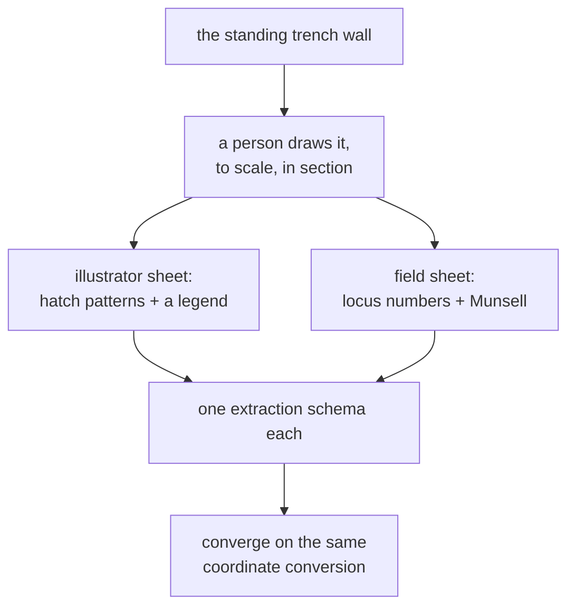

# Trench profile

The drawing of a vertical trench wall, showing the sequence of deposits in
section. It is the primary evidence this whole application processes — and, for
an excavated trench, often the only evidence left.

## What it is

A trench profile — also called a **section drawing** — records one vertical face
of a trench: the layers visible in it, where their boundaries run, what is
embedded in them, and how deep each sits.

It is drawn to scale, on graph paper or as a measured illustration, while the
trench is open. Once the trench is backfilled the wall is gone. The drawing is
what remains.

Two things follow from that:

**A profile is evidence, not illustration.** Its measurements are the record.

**A profile is an interpretation.** Where one deposit ends and the next begins is
a judgement made by a person looking at soil. Two excavators can draw the same
wall slightly differently, and neither is wrong.

## The picture



## Why excavation records it

Excavation is destruction. Digging through a deposit to reach the one below
removes the relationship between them permanently. The section drawing is how
that relationship survives.

It also does something a photograph cannot: it **records an interpretation**. A
photograph of a trench wall shows a continuous surface of soil. The drawing says
where the excavator judged one deposit to end and another to begin — which is
the archaeological content.

## How this project stores it

Two schemas, matching the two drawing traditions.

**`ArchaeologicalDiagram`** — an illustrated sheet, possibly several faces:

```json
{
  "metadata": { "trenchLabel": "Trench 23", "scale": { "unit": "m" } },
  "trenchProfiles": [
    {
      "face": "north",
      "layers": [
        {
          "layerName": "topsoil",
          "inferredMaterial": "dark brown silt",
          "visualPattern": "fine stipple",
          "topBoundary": [ ... ],
          "bottomBoundary": [ ... ],
          "featuresInLayer": [ ... ]
        }
      ]
    }
  ]
}
```

**`FieldWallProfile`** — a modern field sheet, exactly one wall:

```json
{
  "trenchLabel": "T104",
  "faceLabel": "southern baulk",
  "gridSquareCm": 10,
  "loci": [ { "locusNumber": "2", "munsell": { "raw": "10YR 5/6" } } ],
  "layers": [ { "locusNumber": "2", "topBoundary": [ ... ] } ]
}
```

The difference is not arbitrary. The two traditions record **material identity**
differently: an illustrator sheet uses hatch patterns keyed to a legend, a field
sheet uses locus numbers keyed to Munsell readings.

`convert_coords.fieldwall_to_profiles()` adapts the second into the first's
shape so everything downstream is one code path:

```python
def fieldwall_to_profiles(data, face_name=None):
    """Adapt a FieldWallProfile dict into the single-face trenchProfiles shape
    that convert() reads. Returns (adapted_data, notes).

    A field sheet records ONE wall, so this produces exactly one face.
    """
```

## What it is not

| Not a… | Because |
|---|---|
| **Plan drawing** | A plan is the view *down* onto a surface. A profile is the view *at* a vertical face. Different geometry, different information. |
| **Photograph** | A photograph records appearance. A profile records an interpretation of where units begin and end. |
| **[Face](face.md)** | The face is the modelled representation derived from the profile. The profile is the paper document. |
| **The wall itself** | The [wall](wall-and-baulk.md) is soil. The profile is the drawing of it, and after backfilling it is all that remains. |
| **A model** | The 3D model interpolates between profiles. The profile is measured; the model is inferred. |

## Getting it wrong

**Treating the drawing as complete.** A profile shows one plane. What happens a
metre behind it is unknown, which is why a single-face model is flagged:

> These surfaces have points from only ONE face and will still be interpolated
> across the whole model extent

**Scanning below the recommended resolution.** Trench 23 was "scanned well below
the 300 DPI the drawing guidelines recommend," which is why
[upscaling](../cs/lanczos-resampling.md) exists at all. Thin boundary lines
disappear at low DPI, and no processing recovers what was not captured.

**Photographing at an angle.** The
[calibration](../cs/similarity-transforms.md) corrects rotation and scale, not
perspective. A sheet photographed obliquely is keystoned, and the error grows
with distance from the calibration points. Photograph square-on.

**Assuming boundaries are objective.** They are the recorder's judgement. The
project keeps `confidence` on every point for this reason — `"human-traced"`,
`"human-verified"` — so a later reader knows what kind of claim each is.

## Related pages

- [Trench](trench.md) — what is being sectioned.
- [Wall and baulk](wall-and-baulk.md) — the physical face drawn.
- [Face](face.md) — the modelled representation.
- [Recording sheet](recording-sheet.md) — the two sheet traditions.
- [Boundary](boundary.md) — the lines a profile records.
- [Source drawing types](../concepts/source-drawing-types.md) — the two formats
  compared.
- [Drawing guidelines](../reference/drawing-guidelines.md) — how to draw an
  extractable sheet.
