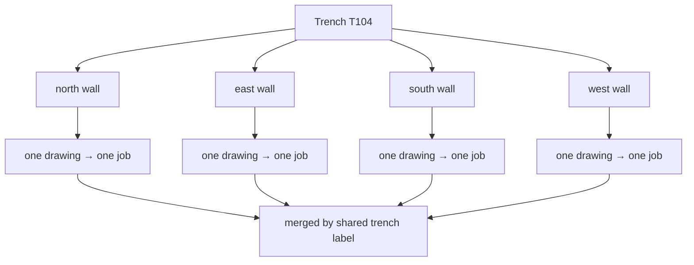

# Trench

The excavated hole. Everything this application models is one trench's walls,
and the trench label is the string that decides which walls belong together.

## What it is

A trench is a defined area opened for excavation — a rectangle or square marked
out on the ground, dug down in controlled stages, its four vertical sides left
standing so the layers can be seen and drawn.

It is an **administrative** unit as much as a physical one. The trench is what a
supervisor is responsible for, what a season's records are filed under, and what
a locus number is unique within. Two trenches ten metres apart have entirely
independent locus sequences.

At Poggio Civitate a trench is named by a property-designation abbreviation and
a number — `T104`, `CA100`. The abbreviation says which part of the site; the
number identifies the trench within it.

## The picture



A trench is excavated as one thing and **recorded as four drawings**. Rejoining
them is what the multi-wall build does.

## Why excavation records it

Excavation destroys what it examines. A trench is the unit of that destruction:
a bounded, documented area whose removal is recorded well enough that the
sequence can be reconstructed afterwards.

Bounding it also makes the work tractable. A trench is small enough for one
team, and its standing sides — the [baulks](wall-and-baulk.md) — preserve a
readable vertical section for as long as the trench is open.

And it is the scope within which identifiers are unique. A [locus](locus.md)
number means something only relative to its trench.

## How this project stores it

The trench label is metadata on a job, not a document of its own:

```json
{
  "job_id": "1c786bad7267",
  "sheet_type": "fieldwall",
  "trench_label": "T104",
  "wall_label": "southern baulk",
  "season": "2025"
}
```

Jobs are grouped by that string —
`poggio_webapp/backend/services/trench_builder.py`:

```python
label = canonical_trench(meta.get("trench_label"))
if not label:
    continue
...
grouped.setdefault(label, []).append({...})
```

### The label is canonicalised, and why that matters

`poggio_webapp/naming.py`:

```python
def canonical_trench(value) -> str:
    """A trench label in the site's required form: ``T104``, never ``T-104``.

    *Conservation Kobo Form Instructions* requires the property designation
    abbreviation followed by the number "without spacing", and names ``T-62``
    and ``T 62`` as incorrect. That rule is not cosmetic here:
    ``trench_builder.grouped_members`` groups jobs by this exact string, so two
    spellings build two trenches, each holding a subset of the walls, each
    producing a confident model of half a pit. Both spellings are already in
    circulation on the same material -- the T104 field drawings are titled
    "T-104" while the Open Context records read "T104".
    """
```

This is the clearest example in the project of a **recording standard being a
correctness requirement**. `T-104` and `T104` are the same trench to a person and
two different trenches to a dictionary key. The consequence is not a cosmetic
inconsistency — it is two builds, each with two of the four walls, each looking
plausible.

Canonicalisation happens **on read as well as on write**:

```python
# Canonicalized on read, not just on write: jobs created before the
# rule existed still carry whatever the operator typed, and grouping
# them by the raw string is exactly the split this closes.
```

Existing jobs are not migrated; they are normalised as they are grouped.

### The label becomes a directory name

`poggio_webapp/backend/services/trench_builder.py`:

```python
def safe_label(label):
    """A filesystem-safe directory name for a trench label."""
    return safe_filename(label, "trench")
```

`safe_filename` is where a trench labelled `".."` was once a
[path traversal](../cs/path-traversal-and-containment.md). Two functions, two
jobs: `canonical_trench` for identity, `safe_filename` for the filesystem. They
are not interchangeable.

## What it is not

| Not a… | Because |
|---|---|
| **[Wall](wall-and-baulk.md)** | A trench has four; a wall is one side of it. One drawing records one wall. |
| **[Face](face.md)** | A face is the modelled representation of a wall. A trench holds several faces in one merged document. |
| **Job** | A job is one *drawing* being processed. A trench spans several jobs joined by the label. |
| **Site** | Poggio Civitate is the site; T104 is one trench in it. |
| **Excavation unit** | Sometimes synonymous, sometimes a subdivision, depending on the recording tradition. This project uses "trench" throughout. |
| **[Locus](locus.md)** | A locus is a deposit *within* a trench. |

## Getting it wrong

**Spelling the label two ways.** `T-104` on one job and `T104` on another builds
two trenches. Canonicalisation now closes it, and the failure is worth knowing
because it was live in the source material — the field drawings say `T-104` and
the published records say `T104`.

**Reusing a locus number across numbering epochs.** A trench reopened after a
gap may restart at Locus 1, so the same number means different deposits either
side of the gap. See [locus numbering epochs](locus-numbering-epochs.md).

**Assuming four walls.** A trench may be recorded with fewer, and a wall of an
unexcavated side is normal. The corner-adjacency check warns about a wall that
joins *nothing*, not about an open end:

> face 'west' is not connected to the rest of the trench: neither of its ends
> lands within 0.05 m of another wall's end. Adjacent walls must share corner
> coordinates

**Building on placeholder registration.** Every wall registered with the starter
values lies along the same bearing, producing a row of parallel walls rather
than a pit. The merged build refuses outright.

## Related pages

- [Wall and baulk](wall-and-baulk.md) — the sides of a trench.
- [Face](face.md) — how a wall is represented in the model.
- [Locus numbering epochs](locus-numbering-epochs.md) — when locus numbers
  restart.
- [Grid registration](grid-registration.md) — placing a trench on the site.
- [Combine walls into one trench](../workflows/09-multi-wall-trench.md) — the
  workflow.
- [Jobs, sheets, and trenches](../concepts/jobs-sheets-and-trenches.md) — the
  data model.
