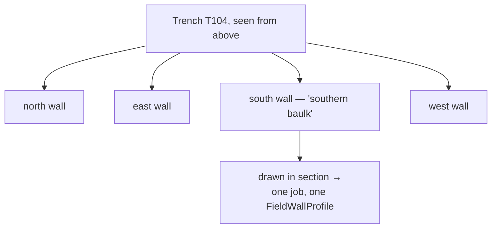

# Wall and baulk

One vertical side of a trench. "Wall" is the general term; "baulk" is the
standing strip of earth deliberately left between or around excavated areas so a
section stays readable.

## What it is

When a trench is dug, its sides are kept vertical. Each of those sides is a
**wall**, and each shows the deposits in section — the stack of layers, in
order, exposed for drawing.

A **baulk** is a wall that was left standing *on purpose*. Where two areas are
excavated side by side, a strip of unexcavated earth between them keeps a
continuous section visible across both. It is removed at the end, once recorded.

The distinction is one of intent rather than of geometry. Both are vertical
faces; a baulk is one that exists so the section can be read.

Two terminological hazards, both live in this project's own material:

- **Wall (side of a trench)** versus **wall (a built structure)** — masonry,
  which is a [feature](feature.md) or a stratigraphic unit, not a side of the
  hole. `site_vocab.DRAWN_FEATURE_TYPES` includes a `wall` entry typed
  `"unitType": "structure"`, meaning the masonry sense.
- **Baulk** is also spelled *balk*.

## The picture



Four walls, four drawings, four jobs — rejoined by the shared
[trench label](trench.md).

## Why excavation records it

A wall is where stratigraphy becomes **visible**. Looking down into a trench
shows one surface; looking at its side shows the whole sequence at once, in
order.

A baulk exists so that visibility survives the excavation. Digging an area
completely removes every section through it; leaving a strip standing preserves
one, to be drawn and only then removed.

Each wall is also a **separate observation of the same stratigraphy**. The same
deposit crossing two walls is recorded twice, from two directions. That
redundancy is what makes a [true dip](apparent-and-true-dip.md) solvable at all.

## How this project stores it

The wall label is job metadata, alongside the trench label:

```json
{
  "trench_label": "T104",
  "wall_label": "southern baulk",
  "sheet_type": "fieldwall"
}
```

Unlike the trench label, it is **free text**, only tidied —
`poggio_webapp/backend/routes/scans.py`:

```python
# The trench label is an identifier and is canonicalized; the wall label is
# free text ("north wall") and is only tidied.
trench_label = canonical_trench(request.form.get("trench_label"))
wall_label = clean_label(request.form.get("wall_label"))
```

A trench label is an identifier that must match across records. A wall label is
a description — "southern baulk", "north wall", "east section" — and
canonicalising it would mangle legitimate phrasing.

### Wall labels become face names, so they must be unique

`poggio_webapp/backend/services/trench_builder.py`:

```python
def resolve_wall_labels(members, notes):
    """Give every member a wall label, deriving one where the operator left it
    blank. Duplicates are fatal: two faces with one name would collide in the
    merged document, and GemPy fuses faces by exact name."""
    for member in members:
        if not member["wall_label"]:
            derived = f"{member['sheet_type'] or 'wall'} {member['job_id']}"
            member["wall_label"] = derived
            notes.append(
                f"job {member['job_id']} has no wall_label; using {derived!r} "
                "as its face name. Set a wall label so the face names match "
                "your survey and the grid config"
            )
```

A missing label is **derived and reported**; a duplicate is **fatal**:

```python
raise TrenchBuildError(
    "two or more sheets claim the same wall of this trench "
    f"({described}). Each job must describe a different wall"
)
```

Two drawings of the same wall is either a mistake or a decision the operator must
make explicitly. Merging them silently would fuse two independent records.

### Walls must meet at corners

`poggio_webapp/pipeline/merge_walls.py` checks that the registered walls
actually enclose something — see
[connected components](../cs/connected-components.md):

```python
warnings.append(
    f"face {name!r} is not connected to the rest of the "
    f"trench: neither of its ends lands within "
    f"{tolerance_m} m of another wall's end. Adjacent "
    "walls must share corner coordinates"
)
```

An open end is fine — an unexcavated side is normal. A wall joining *nothing* is
almost always a mis-typed survey coordinate.

## What it is not

| Not a… | Because |
|---|---|
| **[Trench](trench.md)** | A trench has four walls. The wall is one side. |
| **[Face](face.md)** | The face is the modelled representation of the wall; the wall is soil. In practice the wall label *becomes* the face name. |
| **[Trench profile](trench-profile.md)** | The profile is the drawing *of* the wall. |
| **Wall (masonry)** | A built structure found in the trench is a [feature](feature.md) or a structural unit. `site_vocab` types it `"structure"`. |
| **Section** | Loosely synonymous with profile — the *drawing* rather than the earth. |

## Getting it wrong

**Leaving the wall label blank.** The build derives one from the job ID and
warns, but the derived name will not match your survey notes or the grid config
you fill in.

**Two jobs claiming the same wall.** Fatal, deliberately.

**Confusing a baulk with a masonry wall in the drawing.** A stone wall drawn *in*
the section is a feature within a locus, not a side of the trench. Recording it
as the latter would put a structure in the coordinate system's place.

**Assuming walls are planar.** They are cut by hand and bow slightly. The
[calibration](../cs/similarity-transforms.md) treats the drawn wall as a plane —
an approximation the whole coordinate model rests on.

**Assuming four walls exist.** Only the walls actually drawn and registered enter
the model. A trench recorded on two walls produces a model whose other two sides
are pure interpolation.

## Related pages

- [Trench](trench.md) — what the walls bound.
- [Face](face.md) — the wall in the model.
- [Trench profile](trench-profile.md) — the drawing of it.
- [Apparent and true dip](apparent-and-true-dip.md) — why two walls are better
  than one.
- [Grid registration](grid-registration.md) — placing a wall on the site.
- [Combine walls into one trench](../workflows/09-multi-wall-trench.md) — the
  workflow.
