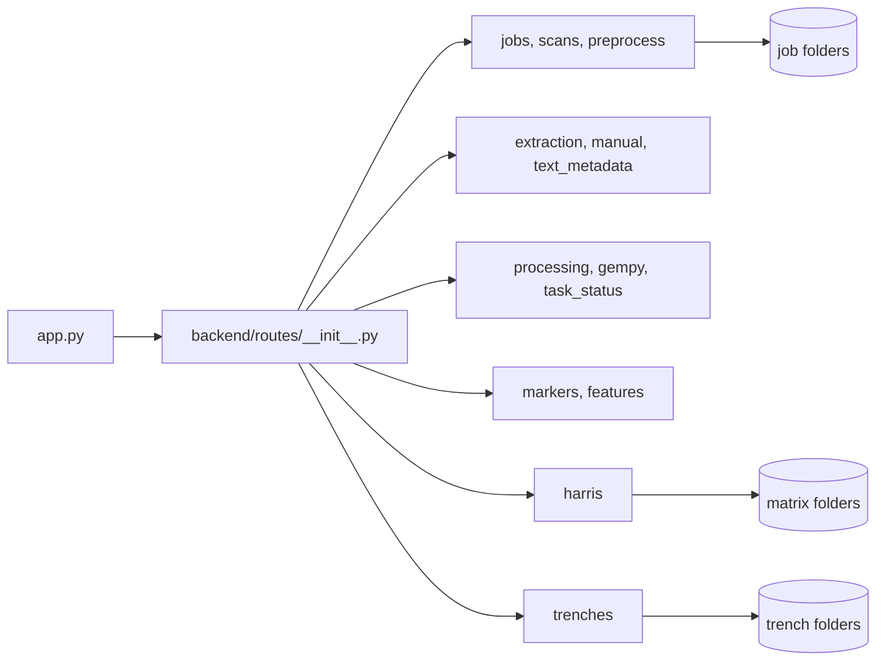

# Backend architecture

The Flask backend is the runtime layer that serves pages, handles job storage, routes workflow requests, and coordinates the pipeline modules.

*One blueprint per concern; the route layer owns persistence.*

## Responsibilities

- Create and configure the Flask application and attach the blueprint-based route registration.
- Serve the HTML shell and the visualizer assets for the browser.
- Expose per-job endpoints for upload, preprocessing, extraction, normalization, validation, conversion, and model building.
- Provide a consistent error shape for HTTP failures and unexpected exceptions.

## Inputs

- HTTP requests from the browser.
- Job identifiers and file paths inside the job workspace.
- Optional environment values such as GEMINI_API_KEY for the experimental AI-assisted steps.

## Outputs

- HTML pages and JSON payloads.
- File URLs and generated files inside each job folder.
- Task identifiers for long-running operations that are tracked in memory.

## Main source files

- `poggio_webapp/app.py`
- `poggio_webapp/backend/__init__.py`
- `poggio_webapp/backend/routes/__init__.py`
- `poggio_webapp/backend/routes/pages.py`
- `poggio_webapp/backend/routes/jobs.py`

## Route and service layers

Routes are being progressively extracted out of `poggio_webapp/app.py` into the
blueprint package. Two blueprints and one service module are the newest part of
that move:

- `poggio_webapp/backend/routes/editor.py` — the manual drawing editor and its
  model-build lifecycle.
- `poggio_webapp/backend/routes/finds.py` — finds logged against a job.
- `poggio_webapp/backend/services/editor_pipeline.py` — drives a finalized
  editor session through normalize → validate → convert → build. The build is
  asynchronous, and `meta.json` is updated at each step, so a browser polling
  the job's status sees progress even across a server restart.

`services/` is a layer the earlier structure did not have. It sits between the
route layer, which owns request handling and persistence, and the pipeline
modules, which stay focused on transformation. Work that chains several
pipeline stages together belongs here rather than in a route.

## Failure boundaries

- Missing or invalid paths in a request lead to 400 or 404 responses rather than a silent fallback.
- Import failures for optional dependencies are returned as 400 responses with a clear error message.
- The app-level error handlers prevent raw traceback leakage and convert unexpected exceptions into JSON errors.
- The server does not automatically recover from failed background tasks because the task registry is in-memory only.

## Related tests

- `tests/test_editor_routes.py`
- `tests/test_editor_status.py`
- `tests/test_finds_routes.py`

## Related workflow pages

- [Add a drawing](../workflows/01-add-drawing.md)
- [Check for problems](../workflows/05-check-problems.md)
- [View and download](../workflows/08-view-and-download.md)

## Under the hood

The active application factory in `poggio_webapp/backend/__init__.py` creates a Flask instance and registers the current blueprints enumerated in `poggio_webapp/backend/routes/__init__.py`. The repository still contains alternate or historical files such as `poggio_webapp/app.legacy.py` and `poggio_webapp/backend/routes/__init__.py.before_manual_first`, but the current server entry point uses the modern modules above.

This is also where the distinction between user-facing availability and backend capability matters. A route may be implemented in the backend and still not be presented as a primary beginner feature in the current UI, or it may be surfaced only through a later workflow step.
