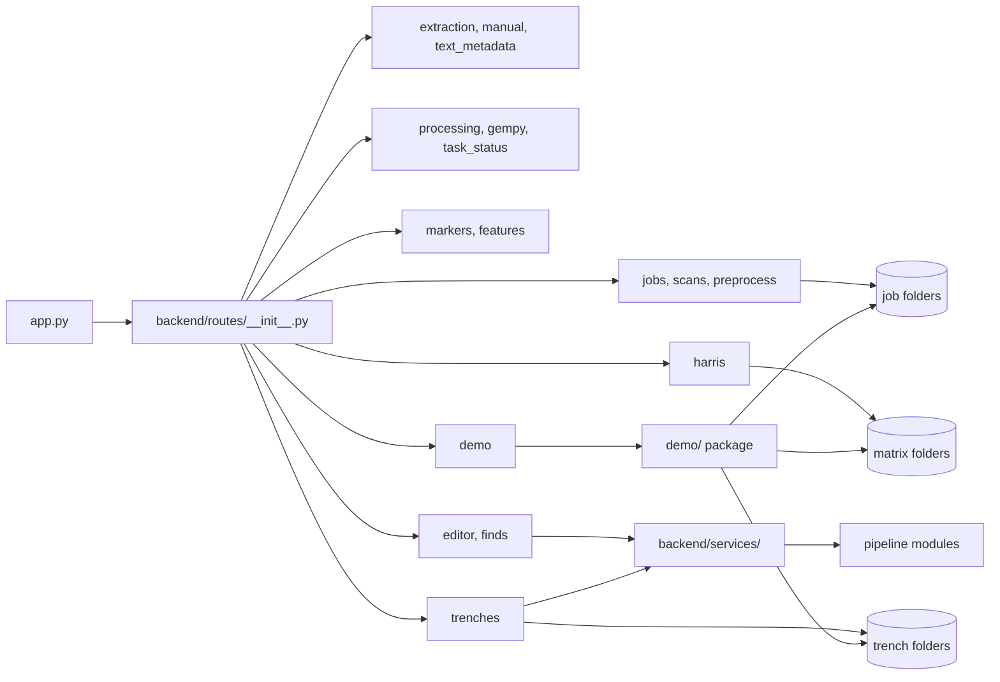

# Backend architecture

The Flask backend is the runtime layer that serves pages, handles job storage, routes workflow requests, and coordinates the pipeline modules.

*One blueprint per concern; the route layer owns persistence.*

## Responsibilities

- Create and configure the Flask application and attach the blueprint-based route registration.
- Serve the HTML shell and the visualizer assets for the browser.
- Expose per-job endpoints for upload, preprocessing, extraction, normalization, validation, conversion, and model building.
- Provide a consistent error shape for HTTP failures and unexpected exceptions.

## Inputs

- HTTP requests from the browser.
- Job identifiers and file paths inside the job workspace.
- Optional environment values such as GEMINI_API_KEY for the experimental AI-assisted steps.

## Outputs

- HTML pages and JSON payloads.
- File URLs and generated files inside each job folder.
- Task identifiers for long-running operations, tracked in memory except for the editor build, which also records durable progress into the job's `meta.json`.

## Main source files

- `poggio_webapp/app.py`
- `poggio_webapp/backend/__init__.py`
- `poggio_webapp/backend/routes/__init__.py`
- `poggio_webapp/backend/routes/pages.py`
- `poggio_webapp/backend/routes/jobs.py`
- `poggio_webapp/backend/routes/editor.py`
- `poggio_webapp/backend/routes/finds.py`
- `poggio_webapp/backend/routes/demo.py`
- `poggio_webapp/backend/services/editor_pipeline.py`
- `poggio_webapp/backend/services/harris_workspace.py`
- `poggio_webapp/backend/services/trench_builder.py`
- `poggio_webapp/backend/services/viewer_files.py`

## Route and service layers

The extraction of routes out of `poggio_webapp/app.py` is complete.
`app.py` now only builds the application and runs it. It defines no routes at
all, and its module docstring says that anything you are about to add there
belongs in a blueprint instead. These blueprints and the four service modules
are the newest part of that structure:

- `poggio_webapp/backend/routes/editor.py`: the manual drawing editor and its
  model-build lifecycle.
- `poggio_webapp/backend/routes/finds.py`: finds logged against a job.
- `poggio_webapp/backend/routes/demo.py`: seeds and removes the
  demonstration trenches through the `poggio_webapp/demo/` package. Seeding is
  fast enough to answer in the request; the build is deliberately left to the
  operator on the trenches page, because watching one trench refuse and the
  other build is the demonstration.
- `poggio_webapp/backend/services/editor_pipeline.py`: drives a finalized
  editor session through normalize → validate → convert → build. The build is
  asynchronous, and `meta.json` is updated at each step, so a browser polling
  the job's status sees progress even across a server restart.
- `poggio_webapp/backend/services/harris_workspace.py`: read-modify-write
  transactions against a stored matrix: load at an expected revision,
  transform, save at that same revision. The domain work already lived in the
  pipeline and store modules; what was still inside the view functions was the
  *sequence*, and both flows are optimistic-concurrency transactions.
- `poggio_webapp/backend/services/trench_builder.py`: groups per-wall jobs by
  their shared trench label, runs the merge layer over their normalized
  extractions, and hands the result to the model builder.
- `poggio_webapp/backend/services/viewer_files.py`: reads and validates a
  job's 3D viewer manifest. A manifest that is malformed, points outside the
  job directory, or names artifacts that are not there degrades to a smaller
  payload rather than handing the browser a broken reference.

`services/` is a layer the earlier structure did not have. It sits between the
route layer, which owns request handling and persistence, and the pipeline
modules, which stay focused on transformation. Work that chains several
pipeline stages together belongs here rather than in a route.

## Failure boundaries

- Missing or invalid paths in a request lead to 400 or 404 responses rather than a silent fallback.
- Import failures for optional dependencies are returned as 400 responses with a clear error message.
- The app-level error handlers prevent raw traceback leakage and convert unexpected exceptions into JSON errors.
- The server does not automatically recover from failed background tasks: the task registry in `backend/tasks.py` is an in-process dictionary. The editor build is the exception, recording its progress into `meta.json` so `GET /api/jobs/<job_id>/status` still answers after a restart.

## Related tests

- `tests/test_editor_routes.py`
- `tests/test_editor_status.py`
- `tests/test_finds_routes.py`
- `tests/test_demo_routes.py`

## Related workflow pages

- [Add a drawing](../workflows/01-add-drawing.md)
- [Check for problems](../workflows/05-check-problems.md)
- [View and download](../workflows/08-view-and-download.md)

## Under the hood

The active application factory in `poggio_webapp/backend/__init__.py` creates a Flask instance and registers the current blueprints enumerated in `poggio_webapp/backend/routes/__init__.py`. The historical `app.legacy.py` and the `.before_manual_first` snapshots have since been removed; the blueprint package is now the only server entry point.

This is also where the distinction between user-facing availability and backend capability matters. A route may be implemented in the backend and still not be presented as a primary beginner feature in the current UI, or it may be surfaced only through a later workflow step.
