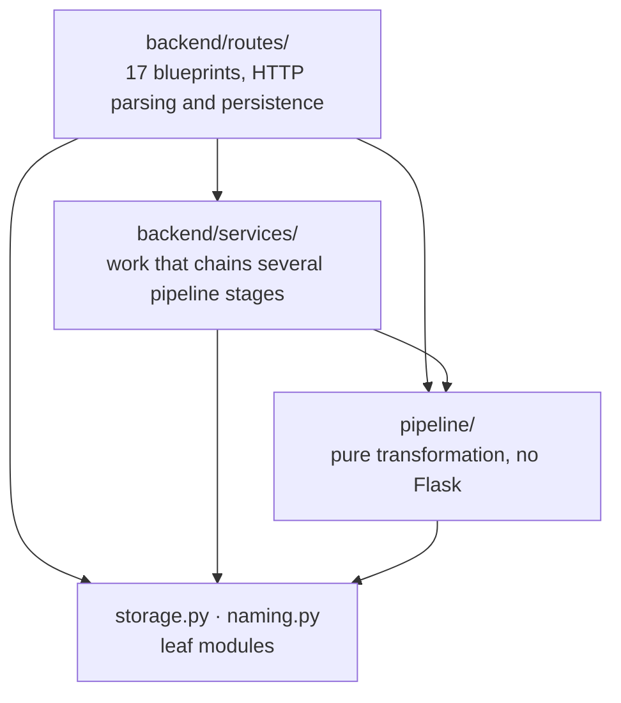

# Codebase review

An architectural read of the whole repository: what the structure is, what it
does unusually well, and the register of problems found, including the ones
already fixed and how.

This page exists because a review that lives in a chat log is a review nobody
can act on six months later.

## The structure



The direction is enforced, not aspirational: no module under `pipeline/`
imports Flask. That is what lets `trench_builder.build()` be tested without an
application, and it is why the refusal rules are unit-testable at all. See
[layered architecture](../cs/index.md).

Since this review was written the repository has grown a `poggio_webapp/demo/`
package, which sits beside the route layer and obeys the same direction: it
drives the real pipeline and stores through the seeder rather than through
private shortcuts, and it too imports no Flask.

## What this repository does well

### It states constraints where they are violated

`storage.py` documents why you must write `storage.JOBS_DIR` and never
`from storage import JOBS_DIR`: the `from` form binds at import time, which
previously left four modules holding private copies a test could not redirect.
That constraint would normally live in one person's head and be broken within a
quarter.

`naming.py` keeps two functions that look interchangeable and are not
(`safe_filename` is path-safe, `clean_label` explicitly is not), with a
documented exploit as the reason.

### It refuses rather than guesses

| Situation | What it does |
|---|---|
| Walls contradict each other on layer order | `ValueError` naming the surfaces on the [cycle](../cs/cycle-detection.md) |
| Two walls within 10° of parallel | Emits no true-dip orientation and says why |
| Grid config still on starter placeholders | Refuses the merged build outright |
| A face missing from the grid config | `ValueError`: `convert()` would silently drop that wall |

### It hunts for the signature of its own past failures

The [coefficient of variation](../cs/coefficient-of-variation.md) and
constant-offset checks in `validator.py` exist because an extraction prompt
already forbade fabrication and fabrication happened anyway. The checks are
skipped for manual tracing, because a human working on a grid legitimately
produces regular spacing, a non-obvious exemption that shows the rule was
thought through rather than copied.

### Determinism is treated as a requirement

Heaps for tie-breaking, sorted iteration, content-addressed identifiers, stable
sorts, and a CI step that regenerates every diagram and fails on any diff. The
[Union-Find](../cs/union-find.md) representative is chosen by `min()` rather
than by tree height specifically so the same matrix always renders identically.

### Optional dependencies are genuinely isolated

`gempy` is imported inside functions in three places, each with a comment
saying everything above that line must work without it. The whole pipeline
through coordinate conversion runs on a machine that has never seen GemPy.

### The documentation has mechanical guarantees

Four checkers run in CI: links and front matter, module coverage, the visual
manifest, and README synchronisation. `check_coverage.py` requires a module's
**full path** to appear in the corpus, with the reason recorded: matching a
bare name would let ordinary English cover a module by accident, "which is
exactly how multi-wall trench support reached `main` with no page describing
it."

[Capability status](../project/capability-status.md) labels every capability
and cites a source. Very little research software tells you what it cannot do.

## Findings register

### Fixed

| Finding | Severity | Resolution |
|---|---|---|
| **Path traversal in `/api/jobs/<job_id>/file`** | High | `job_dir()` now resolves the candidate and requires its parent to be the jobs root |
| Recursive cycle search failed on deep matrices | Medium | `_find_cycle` rewritten with an explicit stack, identical traversal order |
| `start_task` introspected `fn.__code__.co_varnames` | Medium | Uses `inspect.signature`; partials and callable objects now work |
| `TASKS` grew without bound | Low | Bounded at 200, evicting finished tasks oldest-first, never a running one |
| Upload filename used unsanitised | Low | `secure_filename`, with the extension already validated |
| `export_meshes` truncated silently | Low | Logs which surfaces got no mesh |
| No-op `reshape().ravel()` in the lithology writer | Cosmetic | The endianness rationale is now documented; the reshape/ravel round-trip itself survives, folded into one expression |
| `is_placeholder` false-positive undocumented | Cosmetic | Documented as deliberate, with the reasoning |

#### The traversal, in detail

`job_id` arrives straight off the URL. A Flask string converter rejects a
slash but not a dot, so `job_id = ".."` resolved `JOBS_DIR / ".."` to the
application root, and `safe_job_path()` then measured containment against that
*already-escaped* base, so its own check passed.

```
before:  GET /api/jobs/../file?path=storage.py      → 200, application source
after:   GET /api/jobs/../file?path=storage.py      → 404
         GET /api/jobs/<real-id>/file?path=meta.json → 200, unchanged
```

Reachable scope was bounded to the application directory, because the
join-then-resolve in `safe_job_path` still stopped a second escape. But it
exposed every job's files regardless of the requested id.

The instructive part: this is the *same* escape `naming.py` documents having
already closed for `/api/trenches/<label>/file`. The fix was applied to one
route and never generalised. Full treatment in
[path traversal and containment](../cs/index.md).

### Open

| Finding | Severity | Note |
|---|---|---|
| Registration placeholders accepted on single-sheet builds | Design | Documented in [capability status](../project/capability-status.md); the merged path already refuses them |
| AI extraction has no end-to-end test | Design | Needs a key and network access |
| Marker and feature detection are backend-only | Design | Routes exist and are tested; no browser control reaches them |
| Task state lost on restart | Design | Files already written survive |
| Fabrication detection is statistical, not evidential | Design | Overlap with actual ink pixels would be direct evidence; on the [roadmap](../project/roadmap.md) |

Every open item is a stated design position rather than an oversight, and each
already appears in the project's own capability record.

## Verdict

For a research and heritage codebase this sits well above the norm, closer to
a well-run product team's standards than to typical academic software. The
layering is real, the determinism is deliberate, the tests are fast and
meaningful, and the documentation has mechanical guarantees rather than good
intentions.

The distinguishing quality is epistemic discipline. `assign_markers` refuses to
let a language model touch geometry. `true_dip` refuses to emit an orientation
it cannot justify. `merge_walls` refuses to order contradictory walls. The
README lists what does not work. Few systems that produce confident-looking
output are this careful about the line between measurement and interpretation.

## Related concepts

- [Pipeline walkthrough](pipeline-walkthrough.md): the stage-by-stage tour.
- [System overview](system-overview.md) and [backend](backend.md): the
  structure in normal documentation form.
- [Capability status](../project/capability-status.md): the authoritative
  per-capability record.
- [Computer science concepts](../cs/index.md): every technique named above.
