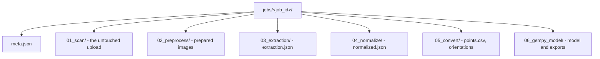

# Files and artifacts

The repository stores job artifacts in numbered subfolders so each stage leaves a visible trail of intermediate files.



*Each stage writes into its own subfolder, so one failure cannot erase earlier output.*

## Responsibilities

- Keep uploaded and generated files inside the job directory instead of in an unrelated temporary location.
- Preserve stage-specific artifacts such as scans, preprocessed images, extraction JSON, validation output, converted CSVs, and model files.
- Make the current job's artifacts reachable through the backend's file-serving routes.

## Inputs

- File uploads from users.
- Outputs from the preprocessing, extraction, normalization, conversion, and model-building steps.
- Existing job identifiers that the server uses to resolve the correct folder.

## Outputs

- Job folders with subfolders such as 01_scan, 02_preprocess, 03_extraction, 04_normalize_validate, 05_convert_coords, and 06_gempy_model.
- File URLs that the browser can load or download.
- Metadata entries in meta.json that reference the current files.
- Independent matrix folders containing one versioned `matrix.json`.

## Main source files

- `poggio_webapp/backend/routes/jobs.py`
- `poggio_webapp/backend/routes/scans.py`
- `poggio_webapp/backend/routes/preprocess.py`
- `poggio_webapp/backend/routes/processing.py`
- `poggio_webapp/backend/routes/manual.py`
- `poggio_webapp/backend/routes/pages.py`
- `poggio_webapp/backend/harris_store.py`
- `poggio_webapp/pipeline/harris_import.py`
- `poggio_webapp/app.py`

## Failure boundaries

- If an expected artifact is missing, later steps can fail with a clear 400 error or an empty result rather than silently proceeding.
- The file-serving route refuses paths that escape the job directory, so the server does not expose unrelated files.
- The metadata file can point to a file that no longer exists, which is an important limitation of the current storage model.
- The editor flow uses a separate set of files and does not automatically mirror all upload-based artifacts.
- Matrix and source identifiers are validated before filesystem access.
  Source metadata paths that escape their job folder are ignored.

## Related tests

- `tests/test_editor_routes.py`
- `tests/test_editor_status.py`
- `tests/test_finds_routes.py`
- `tests/test_harris_store.py`
- `tests/test_harris_import.py`

## Related workflow pages

- [Prepare the image](../workflows/02-prepare-image.md)
- [View and download](../workflows/08-view-and-download.md)
- [Build and review a Harris Matrix](../workflows/harris-matrix.md)

## Harris Matrix storage

Matrices are not job artifacts and do not live in a numbered job stage:

```text
poggio_webapp/matrices/
└── <12-lowercase-hex-matrix-id>/
    └── matrix.json
```

`matrix.json` is the version 1 Harris Matrix record. Each save validates the
Pydantic schema and collapsed graph, checks the expected revision, increments
the revision, and atomically replaces the file. JSON and SVG downloads are
generated from the saved record and do not create additional server files.

Imported source references contain only job ID, supported schema type, face,
zero-based layer index, and original source label. They contain no absolute
path. The importer reads job artifacts but never writes a source job's
`meta.json`, extraction or normalized JSON, editor state, finds, converted
coordinates, or GemPy output.

## Under the hood

The directory layout is created when a new job is created in `poggio_webapp/backend/routes/jobs.py` and later reused by the route modules that write outputs. The file-serving endpoint in `poggio_webapp/backend/routes/jobs.py` resolves a requested path relative to the job folder and rejects escape attempts. That gives the system a simple and auditable artifact model, even though it is not a general-purpose distributed storage layer.

The numbered folders are a useful map for developers even when the current workflow is not fully linear. Some steps produce artifacts for later review, while others only create a working copy for the next step.
