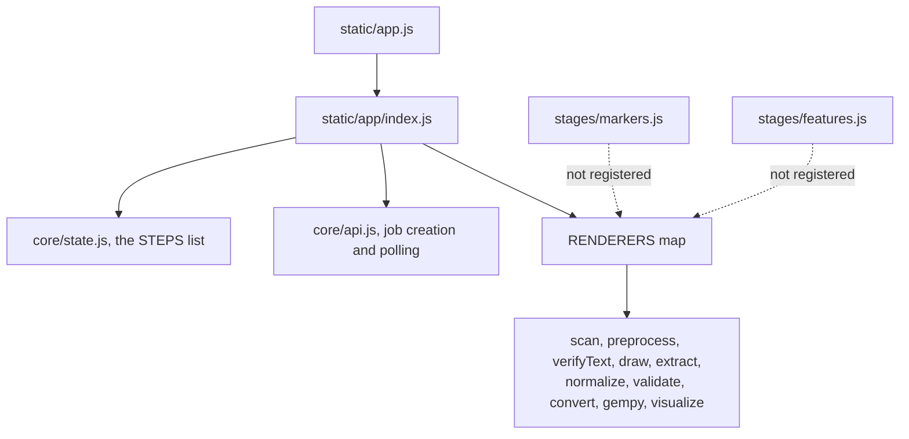

# Frontend architecture

The frontend is a step-based browser application that drives the backend with a small state machine and a renderer-per-step architecture.

*Stages reach the user only when registered in the renderer map. Several are not.*

## Responsibilities

- Present the workflow stages for input, preprocessing, tracing, validation, conversion, and model building.
- Keep the current step, completed steps, and the current job identifier in browser state.
- Invalidate downstream state when a previous step changes so the UI does not keep stale results.

## Inputs

- The current URL and the current job identifier in browser state.
- User actions such as file upload, calibration clicks, feature review, and stage completion.
- Server responses from the Flask API routes.

## Outputs

- Updated stage content in the page.
- Requests to backend endpoints for upload, preprocessing, extraction, normalization, conversion, and model building.
- State updates that are reflected in the step navigation and result cards.

## Main source files

- `poggio_webapp/static/app/index.js`
- `poggio_webapp/static/app/core/state.js`
- `poggio_webapp/static/app/core/api.js`
- `poggio_webapp/static/app/stages/scan.js`
- `poggio_webapp/static/app/demo-card.js`
- `poggio_webapp/static/app/demo-mode.mjs`

## Failure boundaries

- If the browser cannot start the module bundle, the frontend shows an error panel rather than crashing silently.
- If a request fails, the stage-specific UI surfaces the server error message and leaves the surrounding workflow state intact.
- The UI enforces prerequisite order in state, but that is a client-side convenience rather than a guarantee that the backend will reject every out-of-order request.

## Related tests

- `tests/test_editor_routes.py`
- `tests/test_editor_status.py`

## Related workflow pages

- [Add a drawing](../workflows/01-add-drawing.md)
- [Prepare the image](../workflows/02-prepare-image.md)
- [Trace the layers](../workflows/03-trace-layers.md)

## Under the hood

The renderer switchboard in `poggio_webapp/static/app/index.js` selects the current stage component. The shared state module in `poggio_webapp/static/app/core/state.js` defines the step order, prerequisites, and the invalidation rules that clear downstream data when an earlier step changes. The API helper in `poggio_webapp/static/app/core/api.js` wraps fetch calls and provides the polling helper used by the asynchronous task flow.

The landing page also loads `poggio_webapp/static/app/demo-card.js` as its own module, outside the renderer map: the sidebar card that seeds and removes the demonstration trenches. It is wiring only: every sentence the card renders comes from `poggio_webapp/static/app/demo-mode.mjs`, which holds the state logic and is tested without a browser. That split is the repo-wide layering rule enforced by `poggio_webapp/static/module-layering.test.mjs`: `*.mjs` modules hold pure logic with no browser dependency and are the only side the headless suite imports, `*.js` files are the glue that wires them to the DOM, and only two named glue files (`shared/model3d-viewer.js`, `visualizer/volume3d.js`) may import three.js.

This frontend is user-facing and should be read as the visible workflow. Its backend calls are separate from the current UI availability labels: the browser can expose a step as supported, experimental, or optional depending on what the current UI renders, even when the backend route exists independently.
