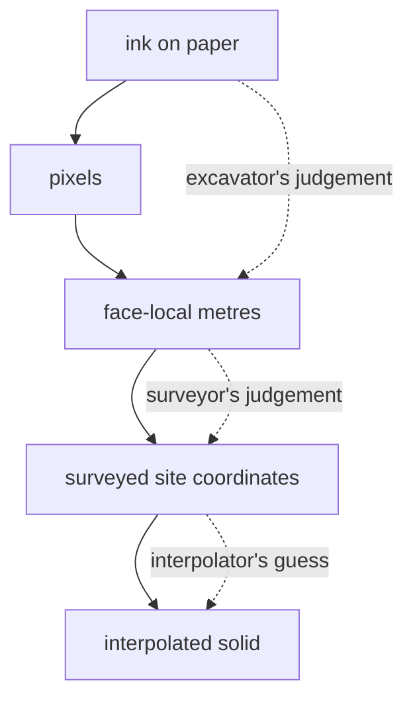

# Pipeline walkthrough

A stage-by-stage reading of the pipeline, for someone who has never seen it:
what each stage decides, what it refuses to decide, and which technique it
reaches for.

[Pipeline architecture](pipeline.md) gives the map. This page is the tour.
Every technique named here has its own page under
[computer science concepts](../cs/index.md).

## The shape of the whole thing



The dotted arrows matter more than the solid ones. Each is a place where the
data stops being a measurement and starts being an interpretation, and the
pipeline is built to keep those two things distinguishable. See
[interpolation versus measurement](../cs/index.md).

## Two source dialects, one code path

| | `ArchaeologicalDiagram` | `FieldWallProfile` |
|---|---|---|
| Source | Archival illustrator sheet | Modern field sheet on graph paper |
| Units keyed by | Layer name and hatch pattern | [Locus](../archaeology/locus.md) number, with the Munsell colour kept as a display label |
| Faces per sheet | Several | Exactly one wall |
| Coordinate keys | `xCoordinateMeters`, `yCoordinateMeters` | `xMeters`, `depthMeters` |

`convert_coords.fieldwall_to_profiles()` adapts the second into the first's
shape, so all site-coordinate arithmetic downstream is a single code path.
That is the most consequential structural decision in the repository: without
it every later stage would carry two branches forever.

## 01 · Ingest

`backend/routes/scans.py`. Extension allowlist, sheet-type gate, and a cheap
dimension probe that reads the header without decoding pixels, so the upscale
recommendation costs nothing. The recommendation is explicitly non-fatal:
"a nicety, not required to proceed."

The uploaded filename is passed through `secure_filename` before it is joined
onto a storage root. See [input sanitisation](../cs/index.md).

## 02 · Preprocess

`pipeline/preprocess.py`. A classical document-imaging chain, in an order that
matters:


1. [Grayscale conversion](../cs/grayscale-conversion.md) discards colour the
   later stages never use.
2. Deskew runs [Canny](../cs/canny-edge-detection.md) →
   [Hough](../cs/hough-line-transform.md) → the
   [median](../cs/median-and-robust-statistics.md) near-horizontal angle →
   an [affine rotation](../cs/affine-transforms.md). Median, not mean, so a few
   diagonal strokes cannot drag the estimate.
3. [Homomorphic illumination correction](../cs/homomorphic-illumination-correction.md)
   divides the image by a heavily blurred copy of itself, removing paper tone
   and lighting gradient so faint ink is evenly dark.
4. [Lanczos resampling](../cs/lanczos-resampling.md) upscales, preserving thin
   ink lines that nearest-neighbour would break.
5. [CLAHE](../cs/clahe.md) equalises contrast locally rather than globally.
6. [Unsharp masking](../cs/unsharp-masking.md) sharpens.

`recommend_upscale()` targets roughly 3000 px on the long side *because
extraction caps at 3072 anyway*. The two stages are tuned against each other
so preprocessing never does work a later stage immediately undoes.

`high_contrast()` uses [adaptive thresholding](../cs/adaptive-thresholding.md)
and is labelled "BOUNDARY TRACING ONLY (destroys fine fills)", a warning
placed at the point of danger rather than in a document nobody reads.

## 03 · Extraction

Three routes into the same schema, with very different trust properties.

### Manual tracing: the supported path

`pipeline/manual_extraction.py`. Three calibration clicks plus one real
measurement define a [2D similarity transform](../cs/similarity-transforms.md):

```python
u = (ref − origin) / ‖ref − origin‖          # along-wall unit vector
v = (−u.y, u.x)                              # perpendicular
if (lowest − origin) · v < 0: v = −v         # sign fixed by the third click
px_per_m = ‖ref − origin‖ / ref_meters
```

Because the *drawn* top edge defines horizontal rather than the image's raster
rows, a photograph taken at a tilt is corrected for free. The same construction
appears three times (Python manual, Python CV, and the browser visualizer)
and is pinned by tests across all three.

See [unit vectors](../cs/unit-vectors-and-normalisation.md),
[dot product](../cs/dot-product.md), and
[orthonormal bases](../cs/orthonormal-bases.md).

### CV marker detection

`pipeline/detect_markers.py`. The premise is stated in the module docstring:
*computer vision cannot fabricate a marker that is not on the paper.*

[Adaptive thresholding](../cs/adaptive-thresholding.md) combined with
[colour-channel arithmetic](../cs/colour-channel-arithmetic.md) isolates dark
non-red ink; [morphological opening](../cs/morphological-opening.md) separates
vertex dots from the lines they touch;
[contour tracing](../cs/contour-tracing.md) finds candidates; and four shape
predicates filter them:

| Predicate | Rejects |
|---|---|
| [Circularity](../cs/circularity.md) | line fragments, hatching |
| [Solidity](../cs/solidity.md) | stone outlines, concave blobs |
| [Fill ratio](../cs/extent-and-fill-ratio.md) | rings, unfilled circles |
| Diameter band | paper texture below, sheet contour above |

[Greedy](../cs/greedy-algorithms.md)
[non-maximum suppression](../cs/non-maximum-suppression.md) removes nested
contour duplicates. Size limits are given in **paper millimetres** and
converted through the grid square, so the tuning is in units a person holding
the drawing can reason about.

### Gemini assignment

`pipeline/assign_markers.py` is the part worth studying. The division of labour
is enforced by construction, not by instruction:

- coordinates come from CV and pass through **verbatim**;
- the model only *classifies* fixed points and transcribes labels;
- `_assemble()` builds the output dict exclusively from `markers`.

There is no code path by which the model can invent, move, or drop a vertex. A
misassignment puts a real point on the wrong boundary, which the validator's
spacing checks can still see. See
[human-in-the-loop review](../cs/index.md) and
[provenance and data lineage](../cs/index.md).

`_extract_common.generate_with_retry()` uses
[exponential backoff](../cs/index.md) bounded by **both** an attempt cap and a
wall-clock budget, because every retry re-sends the whole image and spends the
user's quota.

## 04 · Normalize

`pipeline/normalizer.py`. A recursive tree walk that turns `"null"`, `"none"`,
and `"n/a"` strings into real nulls, plus two deduplications keyed on rounded
coordinate tuples. Formatting only, never geometry. Every action appends to a
log the interface shows.

## 05 · Validate

`pipeline/validator.py`. Errors block; warnings do not. See
[error taxonomies](../cs/index.md).

The stratigraphic checks use
[piecewise-linear interpolation](../cs/piecewise-linear-functions.md) to compare
one boundary against another at arbitrary x. A bottom above the previous bottom
is an **error**: layers crossing is physically impossible. A top far from the
previous bottom is a **warning**: a void or overlap can be real.

The fabrication detectors exist because the extraction prompt already forbade
fabrication and it happened anyway:

- [Coefficient of variation](../cs/coefficient-of-variation.md) of vertex
  spacing. Real traced boundaries sit near 0.20; fabricated ones at 0.00.
- Constant-offset comparison. Two layers with identical x-stations whose
  depth differences barely vary are one boundary copied down.

Both are skipped when `source == "manual_editor"`, because a human tracing on a
grid legitimately produces regular spacing.

## 06 · Convert coordinates

`pipeline/convert_coords.py`. Four registered values per face define a rigid
transform:

```
X = X0 + x·sin θ
Y = Y0 + x·cos θ
Z = Z0 − depth
```

`sin` on X and `cos` on Y because θ is a **compass bearing**, not a
mathematical angle. See
[compass bearings versus mathematical angles](../cs/compass-bearings-vs-mathematical-angles.md).
The convention is honoured identically in `merge_walls.face_endpoints`,
`true_dip._grouped`, and `_dip_from_normal`.

Orientation seeds use
[ordinary least squares](../cs/ordinary-least-squares.md) over every point
rather than the endpoints. The docstring records that this was silently lost in
a folder reorganisation and later restored, a regression story kept where it
prevents recurrence.

## 07 · Merge walls

`pipeline/merge_walls.py`. One rule shapes the module: **GemPy fuses interface
points into a surface by exact string match on the surface name.** The same
locus on two walls must get an identical name; different deposits must never
collide.

Five ordered phases, each with its position justified: correlation renames →
Munsell disagreement reporting (surfaces are identified as `Locus N`, so a
colour that differs between walls is surfaced, never rewritten) → adapt to
faces → collision prefixing (decided on *pre-prefix* names so ordering cannot
matter) → duplicate check.

`merged_series_order()` derives one young-to-old order by
[topological sorting](../cs/topological-sorting.md) over the union of per-face
constraints, using a [heap](../cs/index.md) of first-seen indices so ties break
deterministically. A [cycle](../cs/cycle-detection.md) means the walls
contradict each other, and it **refuses**, because guessing there would invent
stratigraphy.

`check_trench_grid_config()` uses [Union-Find](../cs/union-find.md) to group
walls meeting at a corner and flags any wall left outside the largest
[component](../cs/connected-components.md), the trench itself.

## 08 · True dip

`pipeline/true_dip.py`. On one wall you can only measure *apparent* dip, which
is always shallower than the truth. Two non-parallel walls determine the plane
exactly, via the [cross product](../cs/cross-product.md) of their trace
directions and the resulting [plane normal](../cs/plane-normals.md).

Wall pairs are scored by `|sin(Δbearing)|` (1 for perpendicular, 0 for
parallel) and refused below 10°. The merged trench build applies the solve
automatically after conversion (`apply_true_dip`); a single sheet never can.
Where no solve is available, nothing is emitted:

> A plausible-looking invented orientation would be worse than the apparent
> dips already in the CSV, because it would look like an improvement.

## 09 · Build

`pipeline/build_gempy.py`. GemPy does the
[spatial interpolation](../cs/spatial-interpolation-and-kriging.md); this
module owns the contract around it, and that part is strict. Shape, element
count, dtype, finiteness, integrality, and range are all validated *before* a
byte is written; mesh face indices are bounds-checked against the vertex array;
and the lithology block is pinned little-endian so the browser decode is
host-independent.

`wall_traces()` emits the actually-traced polylines, so a viewer can show a
reader which parts of the model are data and which are the interpolator's
guess. The same honesty applies to the stack itself:
`poggio_webapp/pipeline/series_order.py` records *where* the young-to-old
order came from (a supplied order, the trench's Harris matrix, the recorded
layer sequence, or a mean-elevation assumption), and the build log and viewer
manifest carry that label, along with any adjacent pairs the record never
actually ordered.

## Related concepts

- [Pipeline architecture](pipeline.md): the module map.
- [Codebase review](code-review.md): what is strong here, and what is not.
- [Algorithm index](algorithm-index.md): techniques by module.
- [Computer science concepts](../cs/index.md): one page per technique.
