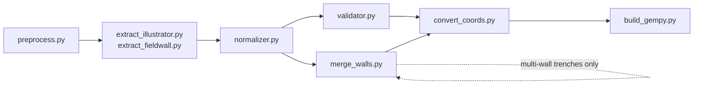

# Pipeline architecture

The pipeline modules turn a drawing into normalized geometry, converted coordinates, and optionally a 3D model. They are organized by family rather than by a single monolithic step.

*Where each module runs, including the merge step that only multi-wall trenches use.*

## Stage explorer

Each stage, with the module that implements it, what it consumes, what it
writes, and the route that triggers it. With JavaScript enabled these
become a navigable list; without it, every stage is listed below in order.

#### Preprocess

<dl>
<dt>Module</dt><dd><code>pipeline/preprocess.py</code></dd>
<dt>Input</dt><dd>The uploaded scan or PDF</dd>
<dt>Output</dt><dd>A clean working image, and optionally a high-contrast copy</dd>
<dt>Route</dt><dd><code>POST /api/jobs/&lt;job_id&gt;/preprocess</code></dd>
</dl>

#### Extract

<dl>
<dt>Module</dt><dd><code>pipeline/extract_illustrator.py, pipeline/extract_fieldwall.py</code></dd>
<dt>Input</dt><dd>The prepared image</dd>
<dt>Output</dt><dd>extraction.json, in one of the two schemas</dd>
<dt>Route</dt><dd><code>POST /api/jobs/&lt;job_id&gt;/extract, or the manual tracing route</code></dd>
</dl>

#### Normalize

<dl>
<dt>Module</dt><dd><code>pipeline/normalizer.py</code></dd>
<dt>Input</dt><dd>extraction.json</dd>
<dt>Output</dt><dd>The same document with null-like strings and padding cleaned</dd>
<dt>Route</dt><dd><code>POST /api/jobs/&lt;job_id&gt;/normalize</code></dd>
</dl>

#### Validate

<dl>
<dt>Module</dt><dd><code>pipeline/validator.py</code></dd>
<dt>Input</dt><dd>The normalized extraction</dd>
<dt>Output</dt><dd>A report of errors and warnings; errors block the next step</dd>
<dt>Route</dt><dd><code>POST /api/jobs/&lt;job_id&gt;/validate</code></dd>
</dl>

#### Merge walls

<dl>
<dt>Module</dt><dd><code>pipeline/merge_walls.py</code></dd>
<dt>Input</dt><dd>One normalized extraction per wall of a trench</dd>
<dt>Output</dt><dd>merged.json — one multi-face document, plus notes</dd>
<dt>Route</dt><dd><code>POST /api/trenches/&lt;label&gt;/build (no browser control)</code></dd>
</dl>

#### Convert coordinates

<dl>
<dt>Module</dt><dd><code>pipeline/convert_coords.py</code></dd>
<dt>Input</dt><dd>The normalized or merged document, plus a grid config</dd>
<dt>Output</dt><dd>points.csv and points_orientations.csv in site coordinates</dd>
<dt>Route</dt><dd><code>POST /api/jobs/&lt;job_id&gt;/convert</code></dd>
</dl>

#### Solve true dip

<dl>
<dt>Module</dt><dd><code>pipeline/true_dip.py</code></dd>
<dt>Input</dt><dd>Interface points and each face's bearing</dd>
<dt>Output</dt><dd>One true dip and azimuth per surface, where two walls allow it</dd>
<dt>Route</dt><dd><code>none — implemented and tested, but called by nothing</code></dd>
</dl>

#### Build the model

<dl>
<dt>Module</dt><dd><code>pipeline/build_gempy.py</code></dd>
<dt>Input</dt><dd>The converted point and orientation CSVs</dd>
<dt>Output</dt><dd>The model, its meshes, and section images</dd>
<dt>Route</dt><dd><code>POST /api/jobs/&lt;job_id&gt;/gempy</code></dd>
</dl>

## Responsibilities

- Preprocess the source image or PDF into a working copy for later stages.
- Extract structured drawing data from either illustrator-style or field-wall-style sheets.
- Normalize and validate the extracted data before coordinate conversion.
- Convert the validated geometry into coordinate CSVs and, where available, build a GemPy model.
- Merge several single-wall extractions into one multi-face document before conversion.
- Support the newer editor flow with its own session metadata, structural validation, and find logging.

### Where the merge layer sits

`poggio_webapp/pipeline/merge_walls.py` runs **between normalization and
coordinate conversion**, and only for multi-wall trenches. Everything
downstream of extraction — grid config, conversion, and the model build — is
already multi-face, while a `FieldWallProfile` sheet is single-wall, so the
merge has to happen before conversion rather than after it.

It reads each wall's normalized extraction and returns one `trenchProfiles`
document plus a list of human-readable notes. Inputs are never mutated.

The constraint that shapes the module: GemPy fuses interface points into a
surface by exact string match on the surface name, so the same locus recorded
on two walls must produce one identical name. Because field-sheet surface names
embed a Munsell reading, and readings of the same locus differ slightly between
sheets, the merge canonicalizes Munsell values per locus number across the
trench and feeds them into the existing adapter rather than building surface
strings itself.

Series order is derived by topologically sorting the ordering constraints from
every face, with ties broken by first-seen order. Contradictory walls raise
rather than resolving to a guess.

## Inputs

- An uploaded scan or PDF.
- A chosen sheet type and any calibration or registration values entered by the user.
- Previously generated extraction or normalization outputs that later stages need.

## Outputs

- Working images and intermediate JSON files in the job folders.
- Normalized JSON, validation reports, and coordinate CSV outputs.
- Optional model files and meshes when the GemPy build step succeeds.

## Main source files

- `poggio_webapp/pipeline/preprocess.py`
- `poggio_webapp/pipeline/extract_illustrator.py`
- `poggio_webapp/pipeline/extract_fieldwall.py`
- `poggio_webapp/pipeline/normalizer.py`
- `poggio_webapp/pipeline/validator.py`
- `poggio_webapp/pipeline/convert_coords.py`
- `poggio_webapp/pipeline/merge_walls.py`
- `poggio_webapp/pipeline/true_dip.py` — solves one true dip per surface from
  its traces on two non-parallel walls. Implemented and tested, but called by
  nothing; see
  [combine walls into one trench](../workflows/09-multi-wall-trench.md).
- `poggio_webapp/pipeline/build_gempy.py`
- `poggio_webapp/pipeline/editor.py`

## Failure boundaries

- Each stage writes into its own subfolder so a failure in one stage does not erase the earlier outputs.
- AI extraction and GemPy build depend on optional dependencies and credentials that are not part of the baseline runtime.
- Validation and coordinate conversion can fail when the input structure is incomplete or the registration values are not usable.
- The editor pipeline has its own validation logic and is not interchangeable with the older upload-based extraction path.

## Related tests

- `tests/test_editor_routes.py`
- `tests/test_editor_status.py`
- `tests/test_finds_routes.py`
- `tests/test_merge_walls.py`
- `tests/test_merge_integration.py`

See [running the tests](../reference/running-the-tests.md) for the full suite.

## Related workflow pages

- [Prepare the image](../workflows/02-prepare-image.md)
- [Clean up the data](../workflows/04-clean-data.md)
- [Place on site](../workflows/06-place-on-site.md)
- [Combine walls into one trench](../workflows/09-multi-wall-trench.md)

## Under the hood

The Flask routes in `poggio_webapp/backend/routes/preprocess.py`, `poggio_webapp/backend/routes/extraction.py`, `poggio_webapp/backend/routes/processing.py`, and `poggio_webapp/backend/routes/gempy.py` call the pipeline modules with the current job directory and metadata. The modules themselves stay focused on transformation logic and file output; the route layer remains responsible for request handling and persistence state.

The current documentation should therefore describe the pipeline as a set of families that compose into a workflow, not as a single fully automated path. Some pieces are supported by the visible UI, while others remain optional or backend-only depending on the runtime environment and the current frontend wiring.
