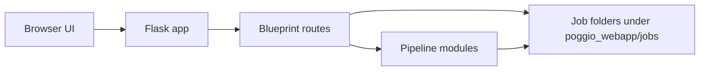

# System overview

This page maps the current runtime from the browser to the Flask backend, the pipeline modules, and the job folders on disk.

## Responsibilities

- Provide the browser entry point for the main trench-workflow experience.
- Route requests between the user-facing UI and the backend modules that read or write job data.
- Keep job folders as the shared place where extracted data, normalized data, converted coordinates, and model artifacts are stored.

## Inputs

- Browser requests from the step-based workflow in the static frontend.
- File uploads, JSON payloads, and optional API keys for the experimental extraction paths.
- Job identifiers that the server resolves to a folder under the repository job workspace.

## Outputs

- HTML pages and JSON responses for the browser.
- File URLs for images, JSON exports, CSV conversions, and generated model artifacts.
- Updated metadata in each job's meta.json and, for the editor flow, editor_meta.json.

## Main source files

- `poggio_webapp/app.py`
- `poggio_webapp/backend/__init__.py`
- `poggio_webapp/backend/routes/__init__.py`
- `poggio_webapp/static/app/index.js`

## Failure boundaries

- If a requested job folder does not exist, the server returns a 404 instead of creating a new one.
- Optional AI or GemPy steps can fail when the required dependency or credentials are missing.
- The backend can still serve the earlier workflow steps even when later stages have not run yet.
- The editor workflow and the older upload-based workflow share the same overall job workspace, but they are handled by different entry points and should not be treated as identical features.

## Related tests

- `tests/test_editor_routes.py`
- `tests/test_editor_status.py`
- `tests/test_finds_routes.py`

## Related workflow pages

- [Add a drawing](../workflows/01-add-drawing.md)
- [Create the model](../workflows/07-create-model.md)
- [View and download](../workflows/08-view-and-download.md)

## Under the hood

The current app starts from the Flask factory in `poggio_webapp/app.py`, which registers backend blueprints before handling requests. The frontend entry point in `poggio_webapp/static/app/index.js` selects a renderer for each workflow step, but the Flask server remains the authority for persistence and file output.

A simplified view of the current flow is:

User-facing availability and backend capability are distinct here. The UI currently exposes manual tracing and the blank-canvas editor as visible starting points, while the backend also supports additional route-driven operations such as feature detection, marker detection, and model build steps.
