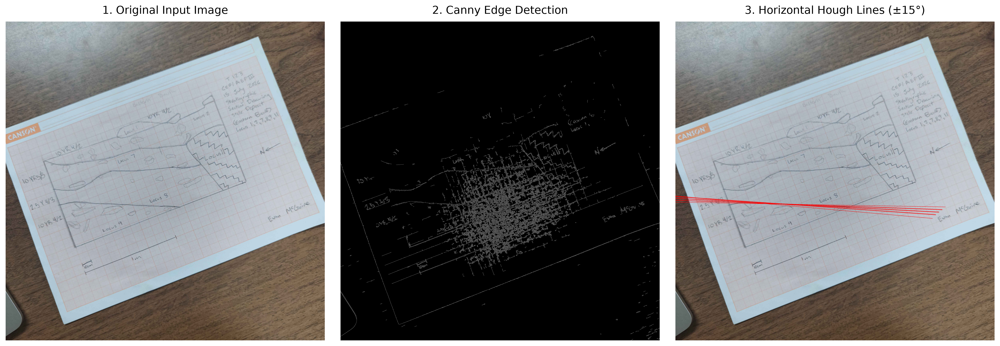

# Geometric normalization (deskewing)

Geometric normalization, or **deskewing**, estimates a small whole-image
rotation and corrects it before a scanned drawing is traced or extracted.

## Why it matters here

The correction helps horizontal stratigraphic layers and drawn grid lines
align with the pixel grid, reducing rotational distortion during later
boundary work.

When a document is scanned slightly off-axis, its image matrix contains a
global rotational error. The pipeline isolates straight lines, analyzes their
angles to find the dominant horizontal baseline, and rotates the whole image
to flatten it.

Preprocessing is `supported` in the current application. Deskewing is optional:
the **Prepare the image** step requests it only when the operator selects the
straightening control. If the image contains no detectable near-horizontal
lines, the system safely leaves it unrotated instead of introducing an
artificial correction.

## Example

*Figure: The existing deskew diagnostic shows the original input, detected
edges, and filtered horizontal lines used to estimate the rotation.*

## How the repository represents it

The `deskew_flag` parameter in `pipeline/preprocess.py` controls this operation.
The implementation uses a sequence of computer-vision operations provided by
OpenCV.

### 1. Canny edge detection

Before lines can be mathematically identified, the image matrix must be reduced to its structural boundaries. The pipeline first applies a Canny edge detector to the grayscale image. This algorithm computes the intensity gradient of the image and suppresses non-maximum pixels, returning a binary matrix where only sharp edges remain active.

### 2. Hough line transform

With the edges isolated, the pipeline uses the `cv2.HoughLines` algorithm to
detect linear structures. It applies an accumulator threshold of 200, then
considers at most the first 200 returned lines.

The standard Cartesian equation for a line ($y = mx + b$) fails for vertical lines because the slope $m$ approaches infinity. To solve this, the Hough transform maps the image space $(x, y)$ into a polar parameter space $(\rho, \theta)$ using the following equation:

$$\rho = x\cos(\theta) + y\sin(\theta)$$

Where:

* $\rho$ is the perpendicular distance from the origin to the line.
* $\theta$ is the angle formed by this perpendicular line and the horizontal axis.

Every edge pixel in the image "votes" for the $(\rho, \theta)$ pairs that could pass through it. The local maxima in this accumulator space represent the most dominant continuous lines in the drawing.

### 3. Angle filtering

Because archaeological drawings contain both horizontal and vertical grid lines, as well as angled layer boundaries, the raw Hough output contains excessive noise. To find the true rotational skew of the paper, the pipeline focuses exclusively on the horizontal baseline.

The pipeline processes the $\theta$ values to determine how many degrees each line is offset from horizontal. It then applies a strict threshold filter, retaining only the lines that fall within a $\pm 15^\circ$ tolerance of a perfect horizontal axis.

### 4. Skew estimation (median calculation)

To determine the final angle of rotation, the pipeline must aggregate the surviving horizontal lines into a single scalar value.

Crucially, the pipeline calculates the **median** angle of these lines rather than the mean. The mathematical median is inherently robust against extreme outliers; this intentional design choice ensures that a handful of near-vertical lines or steep stratigraphic boundaries that slip through the filter do not artificially drag the estimated skew angle.

> **Fallback Condition:** If no lines survive the $\pm 15^\circ$ tolerance filter, the calculated skew is reported as $0.0$, and the image matrix passes through the remainder of the stage unrotated.
>
>

### 5. Affine transformation

Once the median skew angle ($\theta_{\text{skew}}$) is identified, the pipeline flattens the image by applying a single `cv2.warpAffine` rotation.

To prevent the image from shifting off-canvas, the rotation is executed exactly around the image center $(c_x, c_y)$. The 2D affine rotation matrix $R$ is constructed as:

$$R = \begin{bmatrix} \cos(\theta_{\text{skew}}) & -\sin(\theta_{\text{skew}}) & c_x(1 - \cos(\theta_{\text{skew}})) + c_y\sin(\theta_{\text{skew}}) \\ \sin(\theta_{\text{skew}}) & \cos(\theta_{\text{skew}}) & c_y(1 - \cos(\theta_{\text{skew}})) - c_x\sin(\theta_{\text{skew}}) \end{bmatrix}$$

This transformation matrix is multiplied against every pixel coordinate in the image. To maintain image fidelity during this sub-pixel spatial shift, the pipeline employs **cubic interpolation**. Furthermore, to prevent black voids from appearing in the corners of the rotated matrix, the pipeline uses **edge-replicated borders**, extending the outermost pixels to fill the resulting empty space.

## Related concepts

- [Drawing guidelines](../reference/drawing-guidelines.md) explain how a clear,
  well-aligned source reduces ambiguity before processing.
- [Markers, features, and finds](markers-features-and-finds.md) explains the
  different kinds of evidence the later stages represent.
