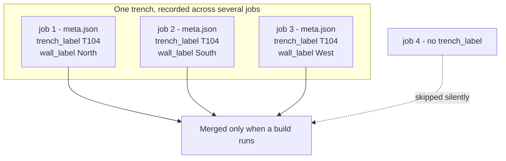

# Jobs, sheets, and trenches

A **job** is one working session over one drawing. A **sheet** is that drawing.
A **trench** is the real hole in the ground, which usually takes several sheets
to record.

These three are easy to blur together, and blurring them is the single most
common source of confusion about why the application is shaped the way it is.



*A trench is not a record. It is a label several independent jobs share.*

## Why it matters here

The rule is: **one job holds one sheet.**

A job is a folder under `poggio_webapp/jobs/`, containing that sheet's scan,
its extraction, and a `meta.json`. Every workflow step from
[add a drawing](../workflows/01-add-drawing.md) through
[view and download](../workflows/08-view-and-download.md) operates on exactly
one job.

But a trench has walls, and how many sheets that takes depends on which kind of
drawing you have:

- An **illustrated trench sheet** may already record several faces on one
  sheet. Its `ArchaeologicalDiagram` document carries a list of faces under
  `trenchProfiles`, so one job can cover a whole trench.
- A **hand-drawn field sheet** records exactly one wall. Its
  `FieldWallProfile` document describes that single wall through `loci` and
  `layers`. A four-walled trench needs four sheets, so four jobs.

See [source drawing types](source-drawing-types.md) for why the two formats
differ.

That asymmetry is why [combining walls into one
trench](../workflows/09-multi-wall-trench.md) exists at all. For illustrator
sheets, the multi-face document arrives ready-made. For field sheets, it has to
be assembled from several jobs first.

## Example

Three field sheets recording the north, south, and west walls of trench T104
produce three independent jobs:

```
poggio_webapp/jobs/
  <job-1>/   meta.json → trench_label: "T104", wall_label: "North"
  <job-2>/   meta.json → trench_label: "T104", wall_label: "South"
  <job-3>/   meta.json → trench_label: "T104", wall_label: "West"
```

Nothing links them except the shared `trench_label`. There is no trench record,
no database row, and no parent folder. The grouping is derived by reading every
job's `meta.json` on demand.

A fourth job uploaded without a trench label simply does not participate. It is
not an error — most jobs are single sheets that were never assigned to a
trench, so unlabelled jobs are skipped silently.


*Correct registration is what turns four independent drawings into one trench.*

## How the repository represents it

### The job

The storage half of `poggio_webapp/backend/jobs.py` is a handful of short
helpers over a directory:

- `job_dir()` resolves the folder and returns `404` for an unknown id, or
  for one that would escape the jobs root.
- `load_meta()` / `save_meta()` read and write `meta.json`.
- `rel_url()` builds the `/api/jobs/<id>/file?path=…` URL for a file inside
  the job.
- `safe_job_path()` resolves a relative path under the job directory and
  refuses to escape it.

The rest of the module assembles the job records the API lists — status,
artifact URLs, the `demo` provenance block carried through verbatim — by
re-reading those same folders on demand. There is no job model, no ORM, and
no index. A job is a folder, and its `meta.json` is the only state.

### The labels

Both labels are optional form fields on upload, written into `meta.json` only
when non-empty. The wall label is tidied by `clean_label()`; the trench label
goes through `canonical_trench()`, which rewrites it into the site's required
form — `T104`, never `T-104` — because two spellings would otherwise build two
trenches, each holding half the walls. Grouping canonicalizes on read too, so
jobs recorded before the rule existed still land in the right trench:

| Field | Meaning | Set at |
|---|---|---|
| `trench_label` | Which trench this sheet belongs to | Upload, or editor creation |
| `wall_label` | Which wall of that trench this sheet records | Upload, or editor creation |
| `sheet_type` | `illustrator` or `fieldwall` | Upload |
| `normalized_path` | Where the cleaned extraction landed | Normalization |

Upload can also record a `season`, a `locus_epoch` and a `site_grid`, which
the multi-wall build checks before it will merge sheets, and jobs seeded by
the demo carry a `demo` block so the interface can badge demonstration data.

Wall labels matter more than they look. They become **face names**, and GemPy
fuses faces by exact name — so two walls sharing a label would collide into
one surface. The build treats duplicates as fatal rather than guessing, and
derives a label from the sheet type and job id when one is missing, recording
that in its notes.

### The trench

`poggio_webapp/trenches/<safe-label>/` holds merged output, plus a stored
registration in `grid_config.json` when one has been derived for the trench —
the demo seeder writes one, and `GET /api/trenches/<label>/registration`
serves it back so the interface can prefill real values instead of the
starter placeholders. The directory is created by the build or the seeder,
not by any upload, and its contents are derived: delete it and the next
build, or the next seed, recreates it. The jobs remain the source of truth.

The three writable roots, all defined in `poggio_webapp/storage.py` and created
on import:

| Directory | Holds | Source of truth? |
|---|---|---|
| `jobs/` | One folder per sheet | Yes |
| `trenches/` | Merged output and derived registration | No — derived |
| `matrices/` | Harris matrices | Yes |

`storage.py` is deliberately a leaf module: it imports nothing from `backend`
or `pipeline`, so both layers can depend on it without inverting the dependency
direction. Read the paths through the module — `storage.JOBS_DIR`, never
`from storage import JOBS_DIR`. The `from` form binds the value at import time,
which previously left several modules holding private copies that a test could
not redirect.

## Related concepts

- [Source drawing types](source-drawing-types.md) — why one format is
  multi-face and the other is not.
- [Coordinate spaces](coordinate-spaces.md) — what a face name is registered
  against.
- [Files and artifacts](../architecture/files-and-artifacts.md) — what each
  stage writes into a job folder.
- [Combine walls into one trench](../workflows/09-multi-wall-trench.md) — the
  workflow this model exists to support.
