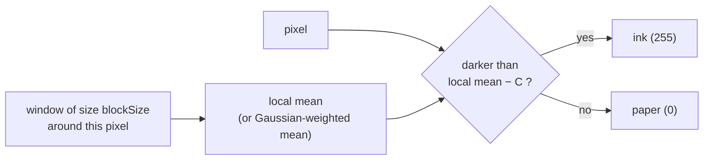

# Adaptive thresholding

Comparing each pixel against its own neighbourhood instead of against a single
number for the whole image. The binarisation this project actually uses, in
both places it binarises.

## What it is

A [global threshold](global-thresholding.md) asks "is this pixel darker than
130?" An adaptive threshold asks **"is this pixel darker than its
surroundings?"**

For each pixel, compute a local reference from a window of size `blockSize`
around it, then compare:

```
out(x, y) = 255  if  in(x, y) < local_reference(x, y) − C   else 0
```

Two ways to compute the reference:

- **`ADAPTIVE_THRESH_MEAN_C`** — the plain mean of the window. Fast, one box
  filter, and treats every neighbour equally.
- **`ADAPTIVE_THRESH_GAUSSIAN_C`** — a [Gaussian-weighted](gaussian-blur.md)
  mean. Nearby pixels count more, so the reference is smoother and less prone
  to blocky artefacts.

`C` is a constant subtracted from the reference. It is the margin: without it,
a pixel in blank paper that is one level below its neighbours' average would be
called ink, and the output would be pure noise. `C` says *how much* darker than
its surroundings a pixel must be before it counts.

Because the reference tracks the illumination, the method is inherently immune
to lighting gradients. A shadowed corner has a dark reference; ink there only
needs to be darker than that.

## The picture

The same badly lit row that defeats a global threshold:

```
position          left ──────────────────────► right
paper             240   225   190   160   130   110
ink               120   112    95    80    65    55

global T = 130 →  paper on the right misread as ink ✗

local mean        235   220   185   155   125   105
minus C = 10      225   210   175   145   115    95
ink vs reference  120<225 ✓  112<210 ✓  95<175 ✓  80<145 ✓  65<115 ✓  55<95 ✓
paper vs ref      240>225 ✓  225>210 ✓  190>175 ✓ 160>145 ✓ 130>115 ✓ 110>95 ✓
```

Every pixel classified correctly, with no image correction required.



## Where this project uses it

### Ink isolation for marker detection

`poggio_webapp/pipeline/detect_markers.py`:

```python
def _ink_mask(img, block_px, C=10):
    """Dark-and-not-red ink, adaptively thresholded so light pencil and
    uneven phone-photo lighting don't fragment the strokes."""
    gray = cv2.cvtColor(img, cv2.COLOR_BGR2GRAY)
    b, g, r = cv2.split(img.astype(np.int32))
    redness = r - (g + b) / 2.0
    ad = cv2.adaptiveThreshold(gray, 255, cv2.ADAPTIVE_THRESH_MEAN_C,
                               cv2.THRESH_BINARY_INV, block_px, C)
    return cv2.bitwise_and(ad, (redness < 25).astype(np.uint8) * 255)
```

The module docstring names this as a deliberate change from the earlier CLI
tool:

> **ADAPTIVE** thresholding for ink isolation (a fixed gray<130 threshold
> fragments light pencil and breaks under phone-photo lighting)

The most interesting detail is that `block_px` is **not a constant**. It is
derived from the physical scale of the paper:

```python
ink = _ink_mask(img, block_px=max(11, int(2.0 * mm_px) | 1))
```

`mm_px` is pixels per paper millimetre, computed from the user's calibration
clicks. So the window is *two millimetres of paper* — comfortably larger than
any pencil stroke, small enough to track lighting — regardless of camera
resolution or how close the photo was taken. The `| 1` forces an odd number,
which OpenCV requires so the window has a centre pixel, and `max(11, ...)` sets
a floor for very low-resolution input.

That is the same principle as
[area-averaging downsampling](area-averaging-downsampling.md): express
thresholds in units of the subject, not units of the sensor.

### High-contrast output for boundary tracing

`poggio_webapp/pipeline/preprocess.py`:

```python
def high_contrast(gray, upscale=2):
    """Aggressive binarization for BOUNDARY TRACING ONLY (destroys fine fills)."""
    flat = flatten_background(gray)
    if upscale and upscale != 1:
        flat = cv2.resize(flat, None, fx=upscale, fy=upscale,
                          interpolation=cv2.INTER_LANCZOS4)
    binimg = cv2.adaptiveThreshold(
        flat, 255, cv2.ADAPTIVE_THRESH_GAUSSIAN_C,
        cv2.THRESH_BINARY, blockSize=25, C=10)
    return binimg
```

Note that this runs *after*
[background flattening](homomorphic-illumination-correction.md), which has
already removed the gradient. Belt and braces: flattening *estimates* the
illumination rather than measuring it, and a residual gradient costs nothing
under a local threshold. It also uses the Gaussian variant, whose smoother
reference suits an image a human will look at.

## Why this and not something else

| Alternative | How it would work here | Why it lost |
|---|---|---|
| **Fixed global threshold** | `gray < 130` | Documented as failing on real input: fragments light pencil, breaks under uneven lighting. |
| **[Otsu](otsu-thresholding.md)** | Compute one `T` per image automatically | Removes the magic number and keeps the one-threshold-per-image assumption, which is the assumption that actually breaks. |
| **[Flatten](homomorphic-illumination-correction.md) then global** | Correct the image, then one `T` fits | Genuinely viable, and it is half of what `preprocess.py` does. It produces a corrected grayscale image as a by-product, which adaptive alone does not — so the two are complementary rather than competing. |
| **Sauvola or Niblack binarisation** | Local threshold using mean **and** standard deviation | The state of the art for degraded historical documents, and measurably better on faded text. It needs a second local statistic and two tuning parameters, and OpenCV does not ship it. For a drawing that has already been flattened, the gain over mean-C is small. |
| **Adaptive thresholding** *(chosen)* | Local reference per pixel | Directly addresses the spatial problem, one extra filter pass, two intuitive parameters, and available everywhere. |

The parameter that decides quality is `blockSize`, and its rule is the same as
[Gaussian blur's σ](gaussian-blur.md): **larger than any feature you want to
keep, smaller than the illumination variation you want to ignore.** This project
gets that right by expressing it in millimetres of paper rather than pixels —
the one detail that makes it work across a 12 MP and a 40 MP camera alike.

## What it costs

O(n) with a box filter for the mean variant, O(n·k) — or O(n) with a separable
implementation — for the Gaussian variant. In practice one extra pass over the
image.

Two known weaknesses:

- **Large uniform regions become noise.** With no ink in the window, the local
  mean *is* the paper, and pixels a hair below it get called ink. `C` is the
  defence, and it is why `C = 10` rather than 0.
- **Very thick strokes hollow out.** If a stroke is wider than the window, the
  interior's own neighbourhood is all ink, so the reference is dark and the
  interior reads as paper. Sizing the window at 2 mm — far wider than a pencil
  line — avoids this entirely here.

## Where else you meet it

- **Phone document scanners.** The crisp black-on-white output of any "scan"
  mode is adaptive thresholding.
- **OCR preprocessing**, universally, for photographed rather than scanned
  pages.
- **Licence-plate and sign recognition**, where part of the plate is often in
  shadow.
- **Astronomy**, where source detection thresholds against a locally estimated
  sky background — the same idea under a different name.

## Related pages

- [Global thresholding](global-thresholding.md) — what this replaces, and where
  it is still correct here.
- [Otsu's method](otsu-thresholding.md) — the automatic global alternative.
- [Homomorphic illumination correction](homomorphic-illumination-correction.md) —
  the complementary fix, applied to the image instead of the rule.
- [Binary masks and bitwise operations](binary-masks-and-bitwise-operations.md) —
  what the output feeds.
- [Morphological opening](morphological-opening.md) — the next step in
  `detect_markers.py`.
